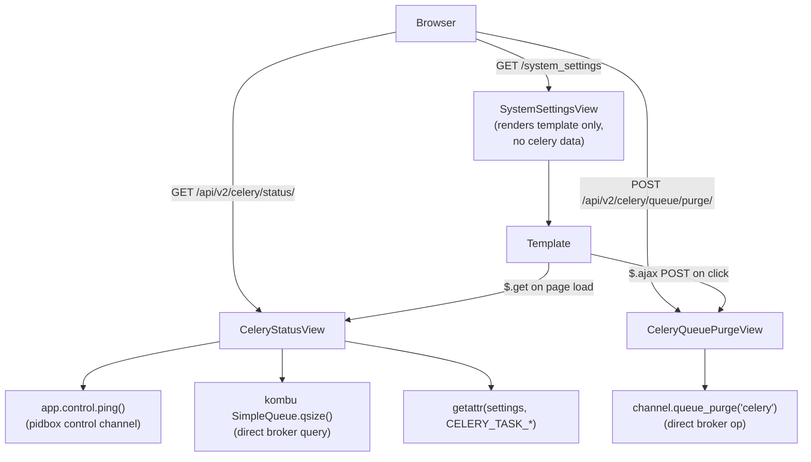

# Celery Queue Status UI Improvements

All celery status data moves from server-side Django view rendering to two new REST API endpoints. The system settings page fetches data via AJAX on load and uses a JS-driven purge button. This makes the same endpoints reusable by dojo-pro.

## Architecture

## Files changed

1. `dojo/utils.py` — fixed `get_celery_worker_status()` to use `app.control.ping()`; added `purge_celery_queue()`
2. `dojo/settings/settings.dist.py` — added `DD_CELERY_TASK_TIME_LIMIT`, `DD_CELERY_TASK_SOFT_TIME_LIMIT`, `DD_CELERY_TASK_DEFAULT_EXPIRES`
3. `dojo/api_v2/serializers.py` — added `CeleryStatusSerializer`
4. `dojo/api_v2/views.py` — added `CeleryStatusView` and `CeleryQueuePurgeView`
5. `dojo/urls.py` — registered the two new API views
6. `dojo/system_settings/views.py` — removed server-side celery status rendering
7. `dojo/templates/dojo/system_settings.html` — replaced server-rendered celery panel with AJAX-driven panel
