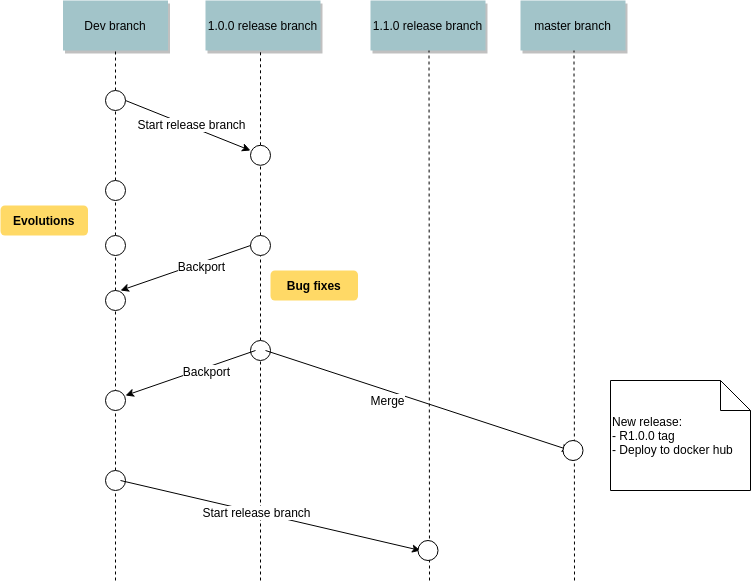
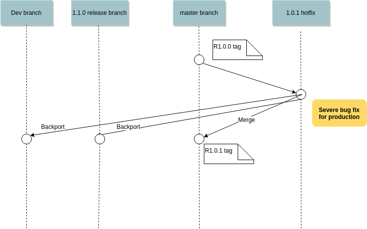

# Introduction
This section describes
- how branches are handled
- defectdojo release cycle

Please be careful to submit your pull requests to the correct branch: 
- bugfix: latest release branch
- evolutions: dev branch

If in doubt please use dev branch.

# Release model

- Start a release x.x.x branch off dev branch
- Commit only bug fixes on this branch (and merge those fixes back to dev)
- Dev keeps living with further evolutions
- Every 4-8 weeks, merge the release branch to master and tag: this is when the new release is out.

# Hotfix model

- In case of major issue found after releasing, issue a hotfix branch which is merged to master, dev, and the next release branch

(Schemes created with draw.io)

(This model is inspired by https://nvie.com/posts/a-successful-git-branching-model/ but without feature branches.)