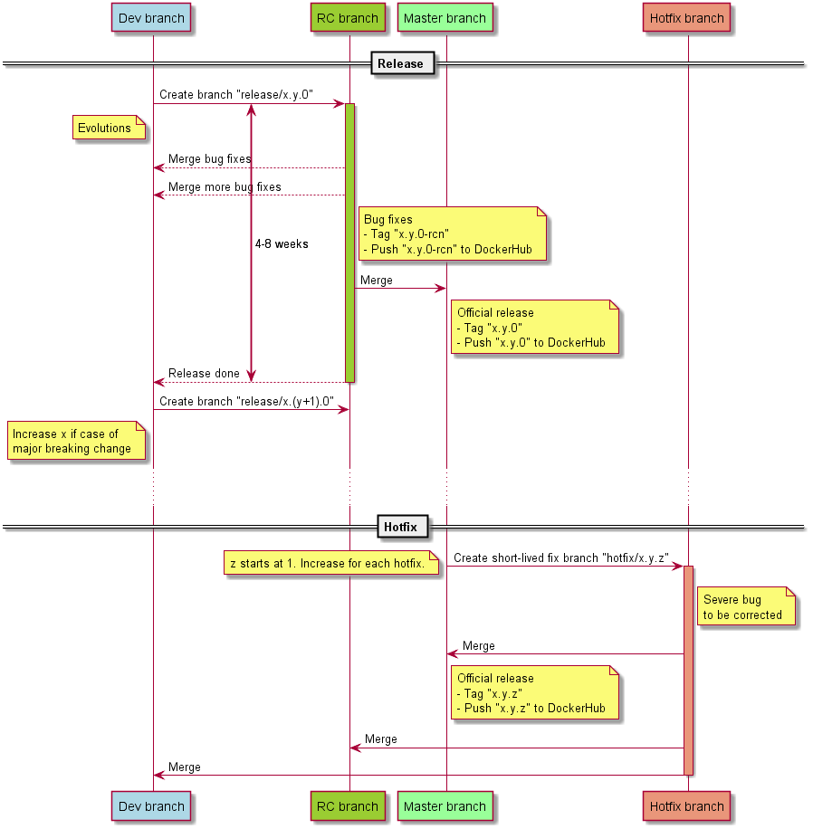

# Introduction
This section describes
- how branches are handled
- defectdojo release cycle

# Release and hotfix model

## Releasing
- Start a release/x.y.0 release branch off dev branch
- Commit only bug fixes from `dev` branch onto this branch
- Dev branch keeps living with further evolutions
- Every 4-8 weeks, merge the release branch to master and tag x.y.0: this is when the new release is out: x.(y+1).0

# Issuing a hotfix
- In case of major issue found after releasing, and fixed in `dev`:
  - Issue a hotfix branch (first is x.y.1) holding this fix
  - Merge to `master` and the next release branch

Diagrams created with https://www.planttext.com

This model is close to gitflow https://www.atlassian.com/git/tutorials/comparing-workflows/gitflow-workflow, https://nvie.com/posts/a-successful-git-branching-model/ with the feature branch being made in each contributor repository.