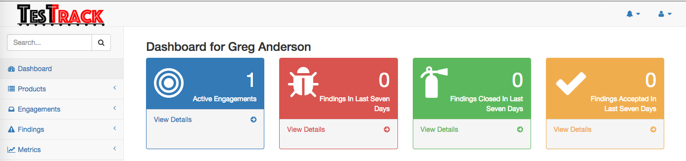

# Description

DefectDojo is a security program and vulnerability management tool. DefectDojo allows you to manage your application security program, maintain product and application information, schedule scans, triage vulnerabilities and push findings into defect trackers. Consolidate your findings into one source of truth with DefectDojo.

# Demo

If you'd like to check out a demo of DefectDojo before installing it, you can
check out our [PythonAnywhere demo site](http://defectdojo.pythonanywhere.com/).

You can log in as an administrator like so:

You can also log in as a product owner / non-staff user:

# Additional Documentation

For additional documentation you can visit our [Read the Docs site](http://defectdojo.readthedocs.io/).

# Once Click Installations

Deploy to Docker Cloud. (<b>Login first to Docker Cloud before clicking the install button.</b>)

# Installation Options

### [Debian or RHEL-based Install Script](./doc/install_bash.md)
Detailed guide for setting up DefectDojo on
[Ubuntu 14.04](https://github.com/rackerlabs/django-DefectDojo/wiki/DefectDojo-Installation-Guide---Ubuntu-Desktop-14.04).

### [Docker](http://defectdojo.readthedocs.io/en/latest/getting-started.html#docker-local-install)

### [Vagrant (deprecated)](./doc/install_vagrant.md)

# Getting Started

We recommend checking out the [about](./doc/about.md) document to learn the
terminology of DefectDojo, and the
[getting started guide](./doc/getting_started.md) for setting up a new
installation. We've also created some example [workflows](./doc/workflows.md)
that should give you an idea of how to use DefectDojo for your own team.

# DefectDojo Client API's

- DefectDojo Python API: `pip install defectdojo_api` or clone the [repository](https://github.com/aaronweaver/defectdojo_api).

# Getting Involved

  
<b> [Get Access.](https://owasp.herokuapp.com/)  </b> Realtime discussion is done in the OWASP Slack Channel, #defectdojo.

 
  
The [DefectDojo Twitter Account](https://twitter.com/defect_dojo)  tweets project updates and changes.

# Available Plugins

[Engagement Surveys](https://github.com/grendel513/defectDojo-engagement-survey) - A plugin that adds answerable surveys to engagements.

[LDAP Integration](https://pythonhosted.org/django-auth-ldap/)

[SAML Integration](https://pypi.python.org/pypi/djangosaml2/)

# About Us

DefectDojo is maintained by:

- Greg Anderson ([@\_GRRegg](https://twitter.com/_GRRegg))
- Charles Neill ([@ccneill](https://twitter.com/ccneill))
- Jay Paz ([@jjpaz](https://twitter.com/jjpaz))
- Aaron Weaver ([@weavera](https://twitter.com/weavera))

# Contributing

We greatly appreciate all of our [contributors](https://github.com/devGregA/django-DefectDojo/graphs/contributors).

We would also like to highlight the contributions from Michael Dong and Fatimah Zohra who contributed to DefectDojo before it was open source.

### Swag Rewards
<b>If you fix an issue with the 'Swag Reward' tag we'll send you a shirt</b>

# Support

Proceeds are used for testing, infrastructure, etc.

 <b>[Stickers](https://www.stickermule.com/en/marketplace/tags/defectdojo)</b>

# Sponsors

Interested in becoming and sponsor and having your logo displayed? Please email greg.anderson@owasp.org

# License

DefectDojo is licensed under the [BSD Simplified license](LICENSE.md)
