# Getting Started with DefectDojo

DefectDojo is designed to make tracking testing engagements simple and
intuitive. The [about page](./doc/about.md) will help you understand
the terminology we use below, so we recommend taking a look at that first.

## Create a new Product Type

The first step to using DefectDojo is to create a Product Type. Some examples
might be "Mobile Apps" or "New York Office." The idea is to make it easy to
divide your Products into logical categories, based on your organizational
structure, or just to divide internal and external aplications.

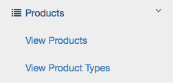

> Select "View Product Types" from the "Products" dropdown in the main menu.

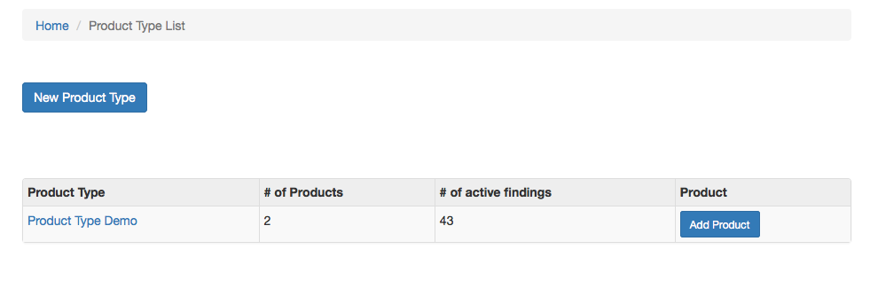

> Click the "New Product Type" button at the top.

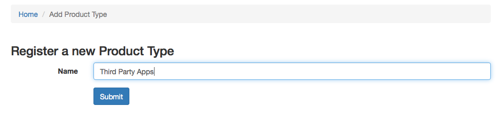

> Enter a name for your new Product Type.

## Create a new Test Type

Test Types will help you differentiate the scope of your work. For instance,
you might have a Performance Test Type, or a specific type of security testing
that you regularly perform.

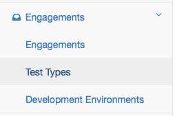

> Select "Test Types" from the "Engagements" dropdown in the main menu.

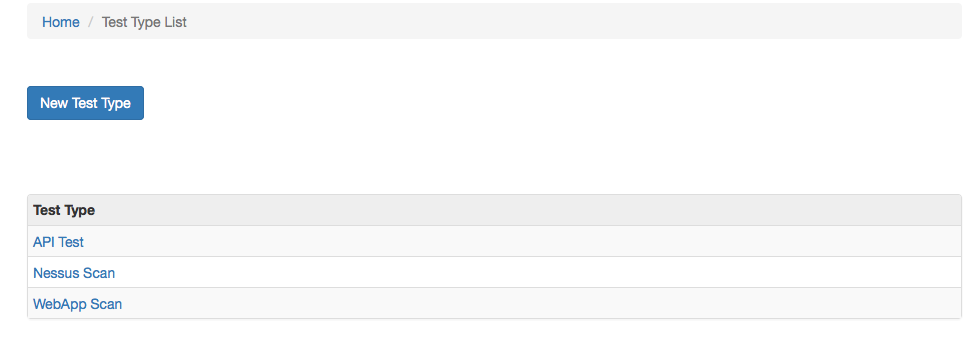

> Click the "New Test Type" button at the top.

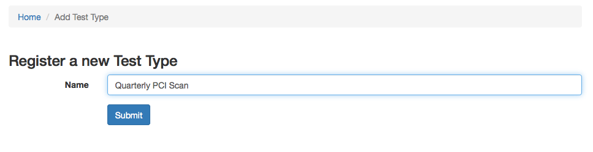

> Enter a name for your new Test Type.

## Create a new Development Environment

Development Environments are for tracking distinct deployments of a particular
Product. You might have one called "Local" if you deploy the Product on your
own computer for testing, or "Staging" or "Production" for official deployments.

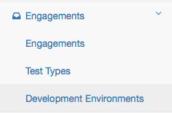

> Select "Development Environments" from the "Engagements" dropdown in the main
menu.

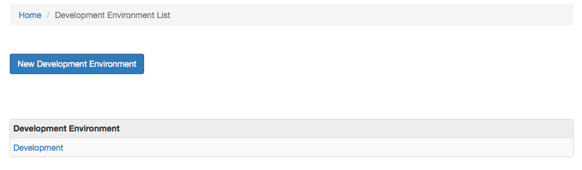

> Click the "New Development Environment" button at the top.

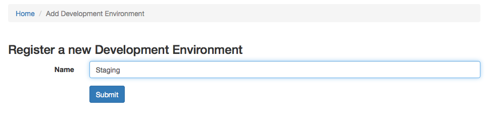

> Enter a name for your new Development Environment.

## Create a new Engagement

Engagements are useful for tracking the time spent testing a Product.
They are associated with a Product, a Testing Lead, and are comprised of one or
more Tests that may have Findings associated with them. Engagements also show
up on your calendar.

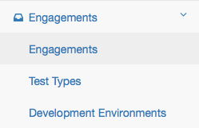

> Select "Engagements" from the "Engagements" dropdown in the main menu.

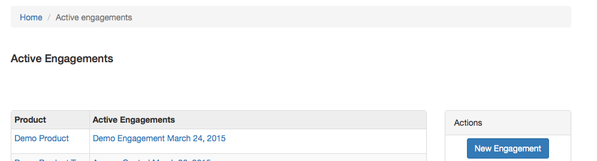

> Click the "New Engagement" button on the right.

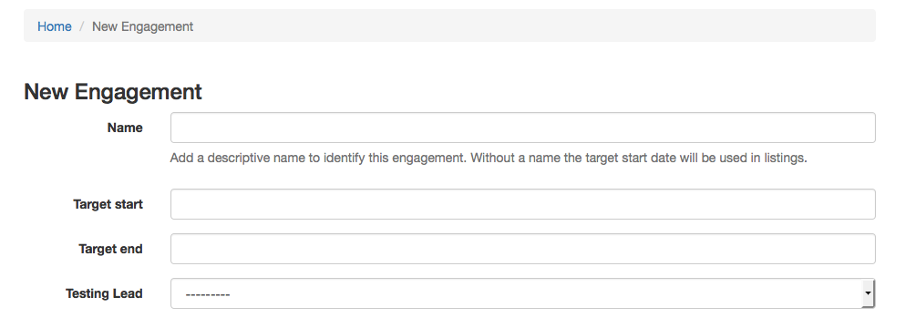

> Enter the details of your Engagement.

## Adding Tests to an Engagement

From the Engagement creation page, you can add a new Test to the Engagement.
You can also add a Test to the Engagement later from that Engagement's main
page. Tests are associated with a particular Test Type, a time, and an
Environment.

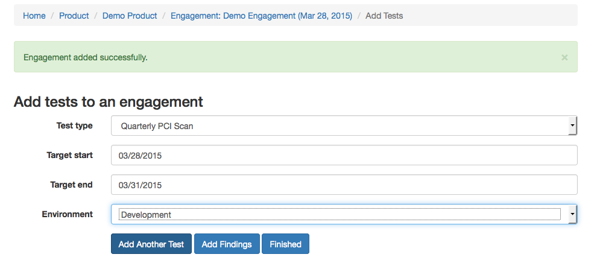

> Enter the details of your Test.

## Adding Findings to a Test

Findings are the defects or interesting things that you want to keep track of
when testing a Product during a Test/Engagement. Here, you can lay out the
details of what went wrong, where you found it, what the impact is, and your
proposed steps for mitigation. You can also reference
[CWEs](http://cwe.mitre.org/), or add links to your own references.

Templating findings allows you to create a version of a finding that you can
then re-use over and over again, on any Engagement.

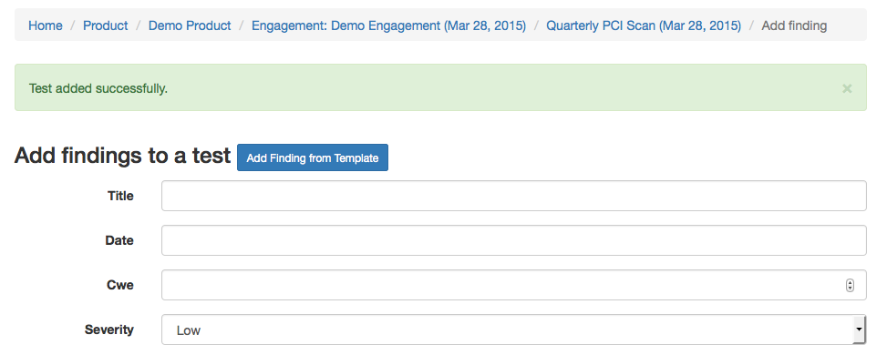

> Enter the details of your Finding, or click the "Add Finding from Template"
button to use a templated Finding.

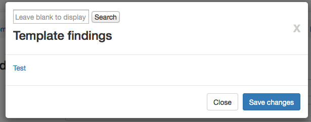

> From the "Add Finding Template" popup, you can select finding templates from
the list, or use the search bar. Templates can be used across all Engagements.

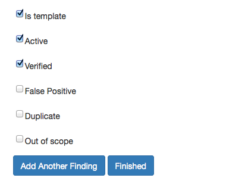

> Define what kind of Finding this is. Is it a false positive? A duplicate? If
you want to save this finding as a template, check the "Is template" box.

## Viewing an Engagement

Most of the work of an Engagement can be done from that Engagement's main page.
You can view the Test Strategy or Threat Model, modify the Engagement dates,
view Tests and Findings, add Risk Acceptance, complete the security Check List,
or close the Engagement.

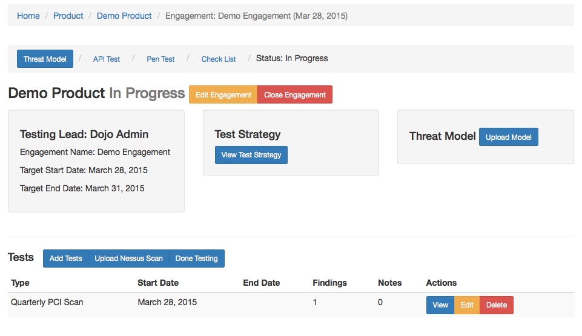

> This page lets you do most of the common tasks that are associated with an
Engagement

## Tracking your Engagements in the calendar

The calendar can help you keep track of what Engagements your team is currently
working on, or determine the timeline for past Engagements.

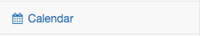

> Select "Calendar" in the main menu.

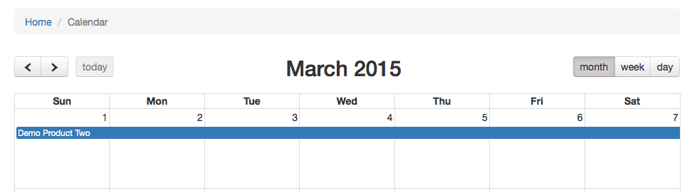

> Here you can view the current engagements for the month, or go back in time.

## Tracking metrics for your Products

Tracking metrics for your Products can help you identify Products that may
need additional help, or highlight a particularly effective member of your
team.

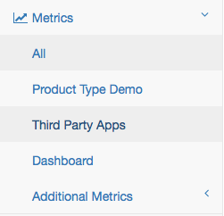

Select "All" from the "Metrics" drop-down in the main menu to get an overview
of all the Products you've tested. You can also select one of the Product Types,
or select the Dashboard view for a page that scrolls automatically, showing
off the results of your testing. This can be useful if you want to show off
your team's work in public without showing specific details.

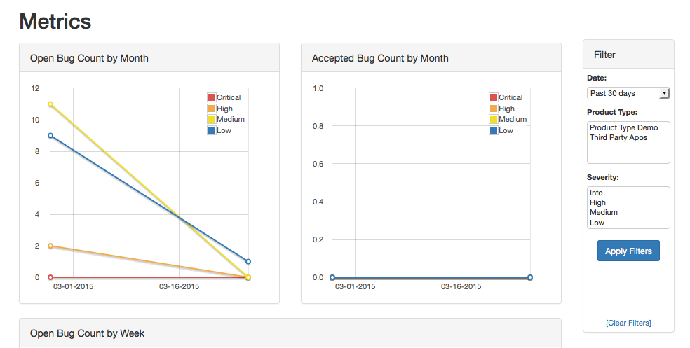

> Here you can see graphs of various metrics, with the ability to filter your
results by time, Product Type, and severity.

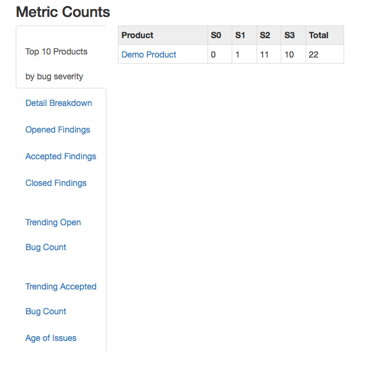

> At the bottom of the Metrics page, you can see granular data about your work,
such as a breakdown of the most severe bugs by Product, lists of open, accepted,
and closed Findings, and trends for each week, as well as the age of all current
open Findings.
