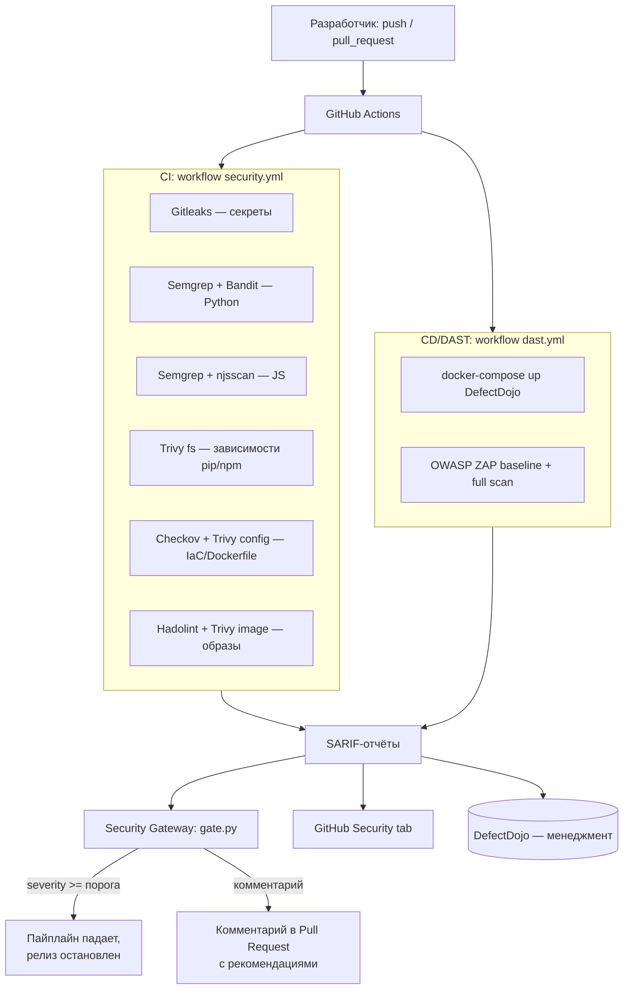

# DevSecOps-пайплайн для DefectDojo

Дипломная работа по профессии «Специалист по информационной безопасности», трек DevSecOps.

Документ описывает архитектуру безопасного CI/CD-конвейера, обоснование выбора инструментов,
матрицу покрытия проверками, политику Security Gateway и зоны роста.

---

## 1. Объект защиты

**Целевой проект:** [DefectDojo](https://github.com/DefectDojo/django-DefectDojo) — открытая
платформа управления уязвимостями (OWASP).

Проект выбран потому, что удовлетворяет всем требованиям задания: это полноценный веб-сервис
с несколькими языками и фреймворками, реляционной СУБД и кешем.

| Компонент | Технология |
|---|---|
| Веб-фреймворк | Django (Python) |
| Фронтенд | HTML-шаблоны, JavaScript, Vue-компоненты, SCSS |
| База данных | PostgreSQL |
| Кеш / брокер | Redis |
| Очереди задач | Celery (worker + beat) |
| Веб-сервер | nginx (reverse proxy) |
| Упаковка | Docker / docker-compose |

Дополнительный плюс выбора: DefectDojo сам является системой менеджмента уязвимостей, поэтому
для этапа «выгрузка результатов в систему менеджмента» поднимается **отдельный** инстанс
DefectDojo (не тот, что тестируется), куда через REST API стекаются все отчёты сканеров.
Это разделяет роли «мишень» и «хаб управления» и исключает конфликт интересов.

---

## 2. Архитектура пайплайна

Единый формат обмена — **SARIF** (Static Analysis Results Interchange Format). Все сканеры,
где это возможно, выводят SARIF; это позволяет одним gate-скриптом агрегировать результаты
и одновременно загружать их во вкладку GitHub Security через `codeql-action/upload-sarif`.

---

## 3. Обоснование выбора инструментов

Принцип отбора: приоритет open-source инструментам с активным сообществом, поддержкой SARIF,
готовыми парсерами в DefectDojo и удобным запуском в CI. Для требования «ни один язык не должен
быть пропущен» базовым выбран мультиязычный Semgrep, усиленный язык-специфичными анализаторами.

### Этап 2 — SAST

| Инструмент | Роль | Почему он | Рассмотренные альтернативы |
|---|---|---|---|
| **Semgrep** | Основной мультиязычный SAST | Один инструмент покрывает Python, JS/TS и др.; правила OWASP/CWE; нативный SARIF; парсер в DefectDojo | CodeQL (мощнее, но тяжелее и заточен под GitHub), SonarQube (нужен сервер) |
| **Bandit** | Углублённый SAST для Python | Специализирован на Python-специфике (небезопасная десериализация, `subprocess`, слабая криптография) | pylint-security |
| **njsscan** | SAST для JavaScript | Быстрые проверки Node/JS-паттернов, дополняет Semgrep | ESLint + eslint-plugin-security |
| **Trivy (fs)** | SCA — анализ зависимостей | Единый инструмент для pip и npm; база уязвимостей CVE/GHSA; SARIF | Grype, OWASP Dependency-Check, Snyk (коммерческий) |

### Этап 3 — DAST

| Инструмент | Роль | Почему он | Альтернативы |
|---|---|---|---|
| **OWASP ZAP** | Динамический анализ развёрнутого сервиса | Отраслевой стандарт; baseline (пассивный) + full (активный) сканы; Automation Framework для аутентифицированных сканов; парсер в DefectDojo | Nikto (проще, слабее), Nuclei (шаблонный), Burp (коммерческий) |

### Этап 4 — Security Checks

| Инструмент | Роль | Почему он | Альтернативы |
|---|---|---|---|
| **Gitleaks** | Поиск секретов в коде и истории | Быстрый, CI-native, настраиваемые правила, поддержка pre-commit | TruffleHog, detect-secrets |
| **Hadolint** | Линтер Dockerfile | Ловит небезопасные и неоптимальные инструкции Dockerfile | dockerfilelint |
| **Trivy (image)** | Скан собранных образов | ОС-пакеты и уязвимости слоёв; один вендор с SCA | Grype, Clair |
| **Trivy config / Checkov** | Проверка IaC и docker-compose на мисконфиги | Правила по CIS и best practices для Docker/compose | kics, terrascan |

### Этап 5 — Security Gateway

| Компонент | Роль |
|---|---|
| **gate.py** (собственный скрипт) | Агрегирует SARIF, считает находки по severity, роняет пайплайн при превышении порога |
| **GitHub PR API** | Оставляет в Pull Request комментарий со сводкой и рекомендациями по исправлению |
| **DefectDojo API** | Дедупликация, тренды, жизненный цикл уязвимостей, отчётность |

---

## 4. Матрица покрытия

Требование задания — покрыть каждый язык и фреймворк проекта. Соответствие:

| Технология в проекте | SAST | SCA | Прочее |
|---|---|---|---|
| Python / Django | Semgrep, Bandit | Trivy (requirements) | — |
| JavaScript / Vue | Semgrep, njsscan | Trivy (package.json) | — |
| Dockerfile | Trivy config | — | Hadolint |
| docker-compose / IaC | Checkov, Trivy config | — | — |
| Собранные образы | — | Trivy image | — |
| Секреты (все файлы) | — | — | Gitleaks |
| Запущенный сервис (HTTP/API) | — | — | OWASP ZAP |

Таким образом ни один язык, фреймворк или артефакт сборки не остаётся без проверки.

---

## 5. Политика Security Gateway

Гейт реализован в `security/gate.py`. Логика:

1. Собирает все файлы `*.sarif` из отчётов сканеров.
2. Нормализует severity: числовой `security-severity` (шкала CVSS 0–10) → Critical/High/Medium/Low;
   при его отсутствии используется `level` (error → High, warning → Medium, note → Low).
3. Сравнивает с порогом `GATE_FAIL_ON` (по умолчанию `HIGH`): наличие находок этого уровня и выше
   останавливает пайплайн (exit code 1) — **триггер на остановку релиза**.
4. Формирует markdown-сводку: пишет в `$GITHUB_STEP_SUMMARY` и оставляет комментарий в Pull Request
   через GitHub API, включая правило, файл, строку и ссылку на рекомендацию (`helpUri`).

Пороги настраиваются через переменные окружения и позволяют разную строгость для веток
(например, `HIGH` для feature-веток и `MEDIUM` для `main`/релизов).

---

## 6. Требуемые секреты и переменные (GitHub → Settings → Secrets)

| Имя | Назначение |
|---|---|
| `DOJO_URL` | URL инстанса DefectDojo-менеджмента (например `https://<vps>:8080`) |
| `DOJO_TOKEN` | API-токен DefectDojo (Profile → API v2 Key) |
| `GITHUB_TOKEN` | Стандартный токен Actions (даётся автоматически) для комментариев в PR |

Для аутентифицированного DAST дополнительно: `ZAP_USER`, `ZAP_PASSWORD` (тестовая учётка).

---

## 7. Зоны роста

Реалистичные направления развития, которые стоит вынести в защиту как «что дальше»:

- **SBOM и цепочка поставок:** генерация CycloneDX/SPDX через Syft, подпись образов cosign,
  верификация артефактов (SLSA).
- **Policy-as-Code:** вынести правила гейта в OPA/Conftest вместо императивного скрипта.
- **Аутентифицированный DAST:** полноценный обход защищённых страниц DefectDojo через
  ZAP Automation Framework (шаблон приложен в `.zap/zap-auth.yaml`).
- **IAST/интерактивное тестирование** во время функциональных тестов.
- **Runtime-безопасность:** Falco/Tetragon на VPS для контроля поведения контейнеров.
- **Baseline и подавление шума:** ведение baseline ложных срабатываний, триаж в DefectDojo,
  SLA на устранение по severity.
- **Пиннинг GitHub Actions к commit SHA** вместо тегов — защита от компрометации тегов действий.

---

## 8. Как это отвечает критериям задания

| Этап | Критерий | Реализация |
|---|---|---|
| 1. CI/CD | Настроенный пайплайн, облако, документация | GitHub Actions, VPS-раннер/облачные раннеры, этот документ |
| 2. SAST | Покрытие, успешные проверки, выгрузка | Semgrep/Bandit/njsscan/Trivy → SARIF → GitHub Security + DefectDojo |
| 3. DAST | Покрытие сервиса, все методы, выгрузка | ZAP baseline+full → DefectDojo |
| 4. Security Checks | Секреты, конфигурации/образы | Gitleaks + Hadolint + Trivy image/config + Checkov |
| 5. Security Gateway | Остановка релиза, комментарии, рекомендации | gate.py: exit-код + комментарий в PR с `helpUri` |
