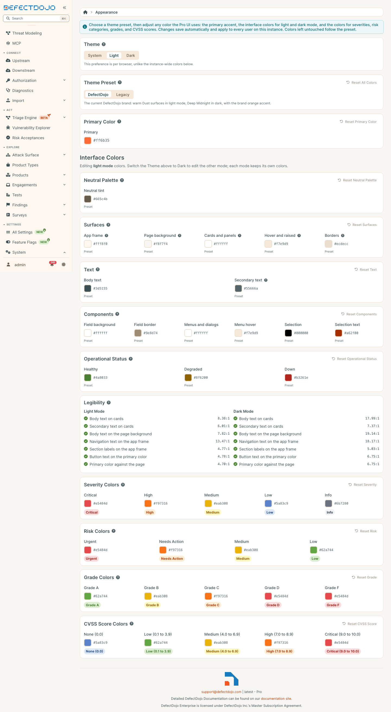

The Appearance page sets how the Pro UI looks for every user on your instance. You start from a **theme preset**, then customize any color on top of it. Changes save automatically and apply to everyone.

Open it from **Settings > System > Appearance**.

## Theme

The **Theme** control at the top of the page chooses between **System**, **Light**, and **Dark**. Unlike everything else on this page, it is a personal preference for your browser only. **System** follows your operating system, including when it switches between light and dark on its own.

It also decides which mode you are editing: the Interface Colors section changes the mode that is currently on screen. Switch the Theme to edit the other one.

## Theme preset

The preset is the starting point for every color on the page.

* **DefectDojo** is the current DefectDojo look: warm surfaces in light mode, deep teal in dark mode, and an orange accent.
* **Legacy** is the previous blue and gray look.

Colors you have customized are kept when you switch presets. **Reset All Colors** clears every customized color and returns to the preset, without changing which preset is selected.

## Primary color

The primary color is used for buttons, links, highlights, and focus states. You pick one color and a full range of lighter and darker shades is generated from it for both modes.

The text shown on buttons is chosen for you so that it stays readable against the primary color you pick, in both light and dark mode.

## Interface colors

Interface colors are set separately for light mode and dark mode, so each mode can have its own look. The page edits whichever mode is on screen.

| Group | What it changes |
| --- | --- |
| **Neutral Palette** | One tint that every shade of gray is built from. Components, borders, and hover states follow it, and so does the navigation frame unless you set a surface color below. |
| **Surfaces** | The navigation frame, the page background, cards and panels, hover and raised areas, and borders. |
| **Text** | Body text, and the quieter secondary text used for labels, captions, and navigation section headings. |
| **Components** | Form field background and border, menus and dialogs, menu hover, and selection. |
| **Operational Status** | The live status indicators on the Command Center: healthy, degraded, and down. These are separate from finding severity colors. |

Each color shows **Preset** until you change it. Select **Use preset** under a customized color to return it to the preset, or use the reset button on a group to clear the whole group for the mode you are editing.

## Legibility

The **Legibility** section checks that text stays readable with your colors, in both light and dark mode. It measures the contrast between text and the surface it sits on against the WCAG 2.1 AA guidelines: at least 4.5:1 for text, and 3:1 for the primary color against the page.

If a change would make text hard to read, the page still previews it, but does not save it. A banner at the top of the page explains why, and the failing check is marked in the Legibility section. Adjust the flagged colors and your changes save automatically. If you leave the page instead, the UI goes back to the last saved colors.

Only problems your changes introduce stop a save. A preset's own default colors are shown in the Legibility section for reference but never block you.

## Metric colors

The severity, risk, grade, and CVSS score colors are the same in light and dark mode. They are used on tags, charts, and gauges throughout the Pro UI. Each group has its own reset button.

## Automating appearance settings

The same settings are available through the API as the `ui_color_theme` field of `/api/v2/system_settings/{id}/`. It is a partial object: include only what you want to customize, and send an empty object to return to the preset defaults. The API applies the same readability rule to text and surface colors stored together.
