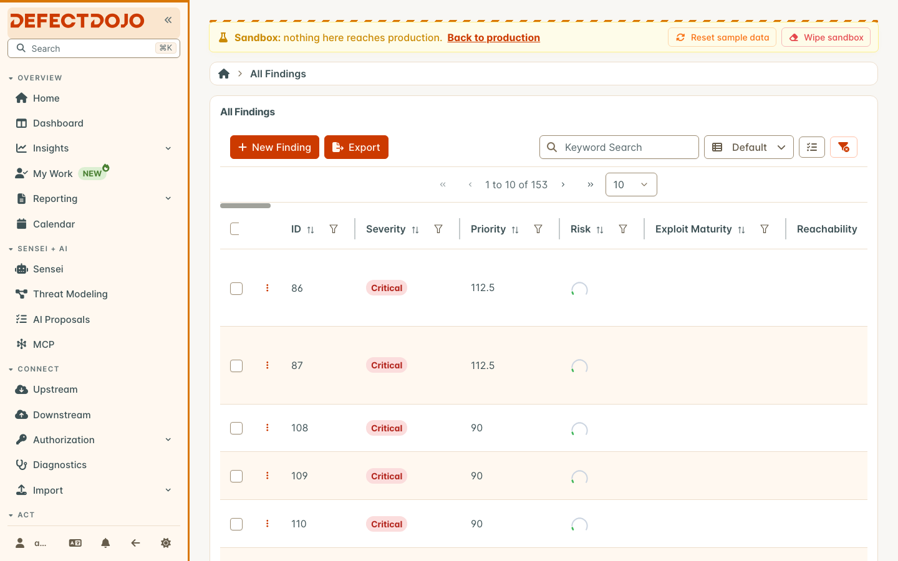
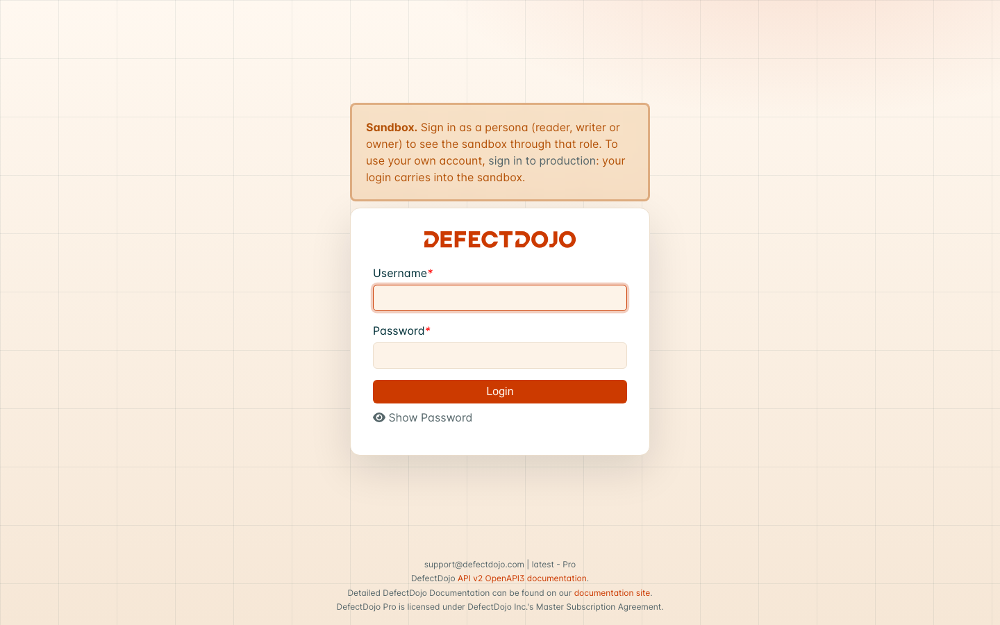
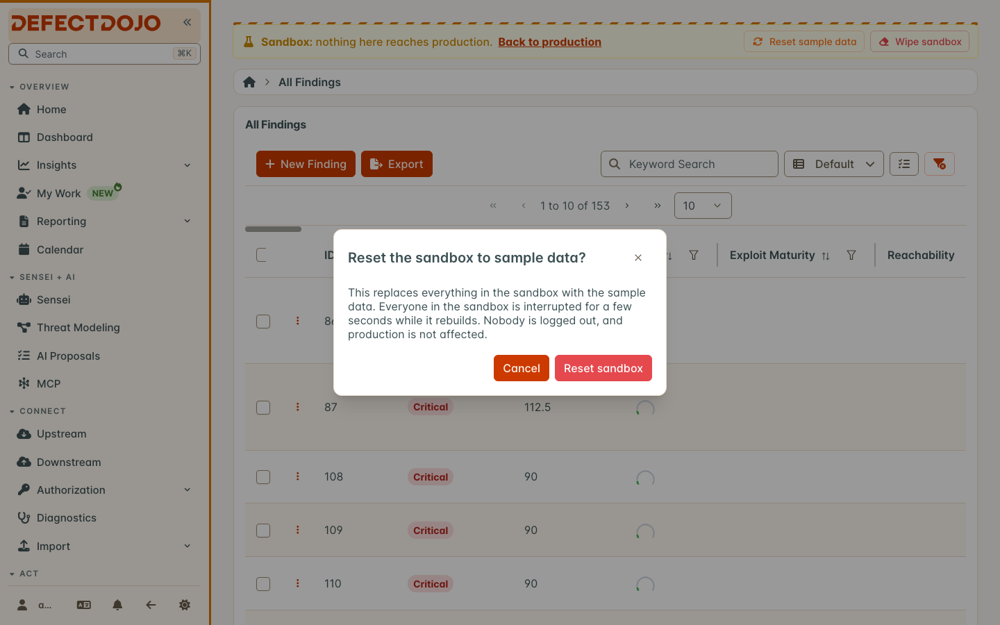

The sandbox is a practice copy of DefectDojo Pro under `/sandbox/` on your own instance. It has its own database, preloaded with sample data, so you can try imports, rules, reports and workflows, train new people, or rehearse a change without touching production. Nothing done in the sandbox reaches production, and nothing in it leaves the instance.

The sandbox is a **DefectDojo Pro** feature. On DefectDojo Cloud it is turned on by DefectDojo; on a self-hosted instance an administrator turns it on (see [Turning the sandbox on](#turning-the-sandbox-on)).

## Opening the sandbox

When the sandbox is on, a **Production/Sandbox** switch appears in the footer of the sidebar. Select it to open the same page in the sandbox, and select it again to go back. You stay signed in: one login covers both.

In the sandbox:

* a striped banner across the top says you are in the sandbox, with a link back to the same page in production;
* the browser tab title starts with `[Sandbox]`, and the sidebar and favicon turn amber;
* every address starts with `/sandbox/`, so a link copied from the sandbox opens the sandbox.

A record that exists in only one of the two shows that page's normal not-found message: the sandbox and production do not share records.

## Who you are in the sandbox

The first time you open the sandbox, DefectDojo creates a sandbox account matching your production account, with the **Owner** global role. That gives you full access to the sample data without any setup. Superusers stay superusers.

Changes to production users carry into the sandbox, never the other way:

* a profile change, a rename, deactivation, or a change to superuser status in production updates the matching sandbox account;
* deleting a production user deletes the matching sandbox account;
* roles are the sandbox's own: changing a role in the sandbox does not change production, and production roles are not copied in.

### Personas

To see DefectDojo through a specific role, sign out of your own account in the sandbox and sign in at `/sandbox/login` as one of the three personas: **reader**, **writer** or **owner**. Each has the global role its name says. The banner shows which persona is active, with a button to sign out of it. Personas exist only in the sandbox.

Personas sign in with a shared password set by the instance administrator. Without one, personas cannot sign in, and the sandbox is used through your own account only.

## Resetting the sandbox

Superusers see two buttons in the banner:

* **Reset Sample Data** replaces everything in the sandbox with a fresh copy of the sample data;
* **Wipe Sandbox** empties it, leaving no sample data, for practicing an import from scratch.

Either takes a few seconds. While it runs, everyone in the sandbox sees a "rebuilding" notice, and the page reloads by itself when it is done. Nobody is signed out, and production is not affected.

## What the sandbox blocks

The sandbox can practice everything that stays inside DefectDojo. Anything that would reach outside it is turned off:

* **Outbound calls** are refused: Jira, outbound webhooks, Slack and Microsoft Teams, connectors, and anything else that calls another system.
* **Email** is not sent.
* **Integration settings are read-only**: connectors, downstream integrations, Jira, notification channels and webhooks, email settings, tool configurations, and the sign-in settings (SAML, OIDC, LDAP, OAuth, SCIM, login and MFA), which belong to the whole instance and are managed in production. These pages open, with a notice, but cannot be saved.
* **Inbound webhooks are off**: webhook receivers are read-only, and receiver addresses under `/sandbox/` do not exist, so a real system pointed at one reaches nothing.
* **Offboarding exports** are made in production only.

## The API

The sandbox has its own API at `/sandbox/api/v2/`. API tokens belong to one side: a production token is refused in the sandbox, and a token created in the sandbox (it starts with `sbx`) is refused in production. Create a sandbox token from your profile while in the sandbox.

## How the sandbox counts against your license

The sandbox shares your license with production. Your license capacity is one total for both: with a license for 30,000 Findings and 20,000 in production, the sandbox can hold up to 10,000 more.

* The **sample data never counts**: only what you add to the sandbox does.
* The license usage bar (on the License page, in the usage window, and in the Usage widget) shows production, sandbox and available capacity as one bar.
* Warnings and limits apply to the combined total, the same way they apply to production alone.
* The sandbox has the same licensed features as production, and no others.

## Turning the sandbox on

**DefectDojo Cloud:** the sandbox is turned on by DefectDojo. Ask DefectDojo Support to enable it on your instance. Nothing needs to be set up on your side.

**Self-hosted:** an administrator sets one flag; see [Sandbox Mode (self-hosted)](/get_started/pro/onprem/sandbox_mode/).

The switch appears only once the sandbox has been fully set up. If the sandbox is on but the switch does not appear, the instance could not prepare it; the self-hosted page explains how to find out why.

## Frequently asked questions

**Can I copy something from the sandbox to production?** Not today. The sandbox is deliberately one-way: production users flow in, nothing flows out.

**Does the sandbox slow down production?** The sandbox runs in the same processes and only uses resources while someone is using it. A reset is a fast copy inside the database server.

**Is sandbox data in my backups?** On DefectDojo Cloud, yes, with the rest of your instance. On a self-hosted instance, the sandbox lives in databases next to your production database; include them if you want to keep sandbox work.
