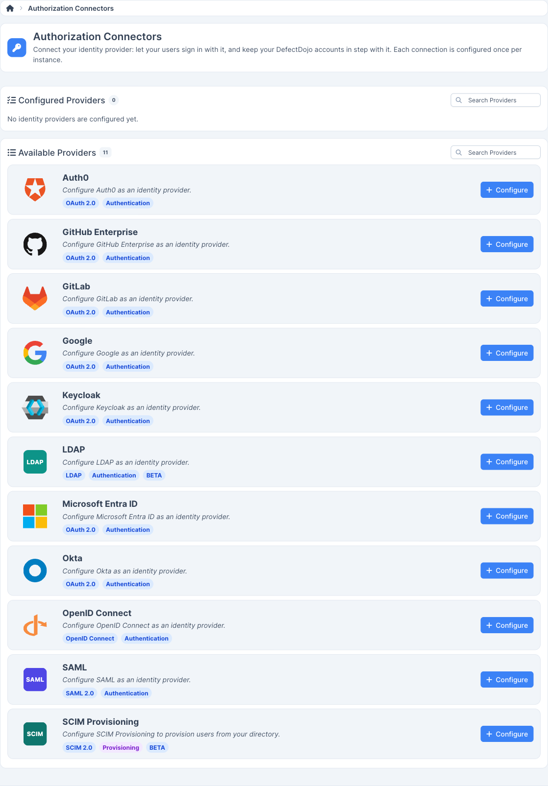
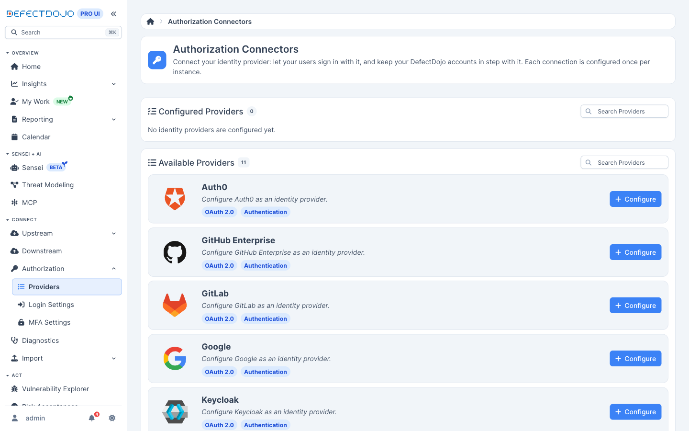

Authorization Connectors é uma única página que lista todos os provedores de identidade compatíveis com
o DefectDojo Pro, o estado em que cada um se encontra e qual protocolo utiliza. Antes de essa página existir,
cada provedor tinha seu próprio formulário de configurações, e não havia como responder "o que está
configurado nesta instância?" sem abrir todos eles.

Authorization Connectors é um recurso do **DefectDojo Pro**. Encontre-o em **Connect > Authorization**.
Somente um **Superuser** pode visualizar ou alterar a configuração dos provedores de identidade.

## Como a página está organizada

Os provedores são divididos em duas seções, e cada seção é listada em ordem alfabética com uma contagem ao
lado do título:

* **Configured Providers** — provedores que já foram configurados nesta instância, estejam ativados ou não
  no momento.
* **Available Providers** — provedores que são compatíveis, mas ainda não foram configurados.

A divisão é feita propositalmente por *configurado*, e não por *ativado*. Um provedor que foi configurado e
depois desativado permanece em Configured Providers, porque é ali que a pessoa que o configurou vai
procurá-lo. O estado dele fica indicado no card.

Cada card mostra:

| | |
| --- | --- |
| **Logo and name** | O provedor, nomeado sem o seu protocolo |
| **Protocol tag** | `SAML 2.0`, `OAuth 2.0`, `OpenID Connect`, ou `LDAP` |
| **Status tag** | `Enabled`, `Disabled`, ou `Not configured` |
| **`BETA` tag** | Presente em provedores que ainda estão em beta |
| **Action** | **Manage Configuration** para um provedor configurado, **Configure** para um disponível |

Ambas as seções têm uma caixa de pesquisa que corresponde ao nome do provedor e ao protocolo, então
pesquisar `oauth` restringe a página aos provedores OAuth.

## Uma configuração por provedor

As configurações de provedor de identidade são um único conjunto de valores por provedor por instância —
uma aplicação Okta, um provedor de identidade SAML, um diretório LDAP. Os cards deixam isso claro, e não
existe a opção "adicionar outro": para alterar como um provedor está configurado, você edita a configuração
que já existe.

É isso que diferencia o Authorization Connectors das [galerias de conectores](/connectors/upstream/about/),
onde uma ferramenta pode ter várias configurações lado a lado.

## Os três estados, e o que significam

| Status | Significado | O que fazer em seguida |
| --- | --- | --- |
| **Enabled** | Configurado e aceitando logins | Nada a fazer |
| **Disabled** | Configurado, mas desativado — seu botão não aparecerá na página de login | Reative-o a partir da sua configuração quando quiser tê-lo de volta |
| **Not configured** | Compatível, mas nada foi preenchido ainda | **Configure** para configurá-lo |

Selecionar um provedor abre diretamente o formulário de configurações daquele provedor. Não há um seletor
intermediário de provedores.

## Provedores compatíveis

| Provider | Protocol | Setup guide |
| --- | --- | --- |
| Auth0 | OAuth 2.0 | [Auth0](/admin/sso/pro__auth0/) |
| GitHub Enterprise | OAuth 2.0 | [GitHub Enterprise](/admin/sso/pro__github_enterprise/) |
| GitLab | OAuth 2.0 | [GitLab](/admin/sso/pro__gitlab/) |
| Google | OAuth 2.0 | [Google](/admin/sso/pro__google/) |
| Keycloak | OAuth 2.0 | [KeyCloak](/admin/sso/pro__keycloak/) |
| LDAP | LDAP | [LDAP](/admin/sso/pro__ldap/) |
| Microsoft Entra ID | OAuth 2.0 | [Azure Active Directory](/admin/sso/pro__azure_ad/) |
| Okta | OAuth 2.0 | [Okta](/admin/sso/pro__okta/) |
| OpenID Connect | OpenID Connect | [OIDC](/admin/sso/pro__oidc/) |
| SAML | SAML 2.0 | [SAML](/admin/sso/pro__saml/) |

A página informa qual é o *estado* da configuração de um provedor. Ela nunca retorna os segredos da
configuração — client secrets, bind passwords e certificados não fazem parte dos dados por trás desta
página, e não podem ser lidos a partir dela.

## Quando um provedor não consegue se conectar

Authorization Connectors informa o que está configurado; ele não mostra tentativas de login que falharam.
Essas são registradas em [Diagnostics](/admin/diagnostics/pro__diagnostics/), onde SSO, SAML e LDAP relatam
cada um suas próprias tentativas com o motivo da rejeição — uma assinatura de assertion inválida, um bind
rejeitado, um atributo incompatível. Essas linhas são de nível de instância e, portanto, exclusivas para
superusuários.

Mantenha pelo menos uma conta de superusuário com nome de usuário e senha como alternativa, e lembre-se de
que `/login?force_login_form` retorna o formulário de login padrão caso um provedor de identidade pare de
funcionar. Veja [Single Sign-On](/admin/sso/) para ambos.

## Conteúdo relacionado

* [Single Sign-On](/admin/sso/) — os guias de configuração por provedor e as configurações de login
* [Diagnostics](/admin/diagnostics/pro__diagnostics/) — por que uma tentativa de login falhou
* [Connectors](/connectors/upstream/about/) — a galeria upstream na qual esta página é baseada
