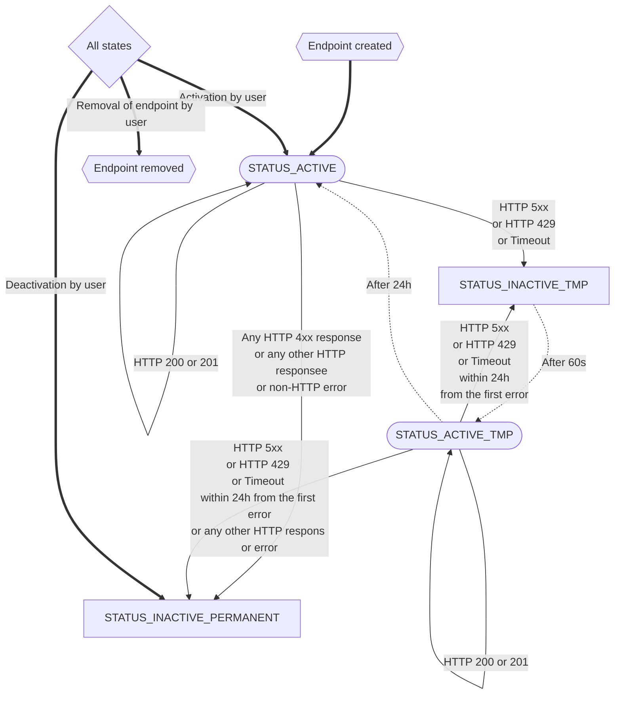

## Transition graph:

Notes: 

1. Transitions:
    - bold: manual changes by user
    - dotted: automated by celery
    - others: based on responses on webhooks
1. Nodes:
    - Stadium-shaped: Active - following webhook can be send
    - Rectangles: Inactive - performing of webhook will fail (and not retried)
    - Hexagonal: Initial and final states
    - Rhombus: All states (meta node to make graph more readable)
