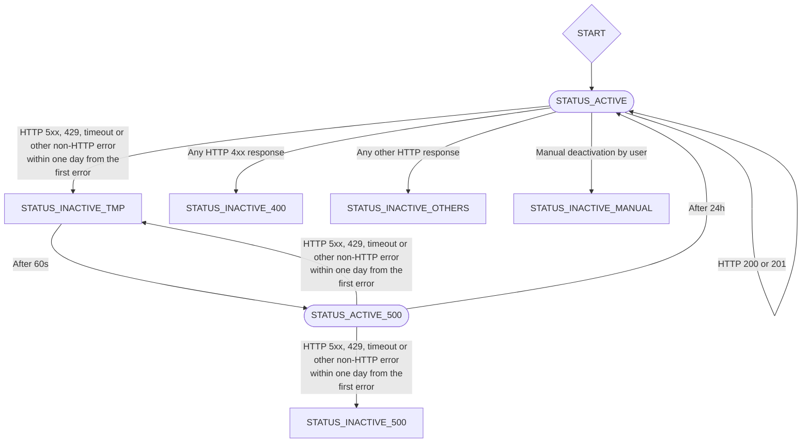

## Transition graph:

```mermaid
flowchart TD

    START{START}
    STATUS_ACTIVE([STATUS_ACTIVE])
    STATUS_INACTIVE_TMP
    STATUS_INACTIVE_400
    STATUS_ACTIVE_500([STATUS_ACTIVE_500])
    STATUS_INACTIVE_500
    STATUS_INACTIVE_OTHERS
    STATUS_INACTIVE_MANUAL

    START --> STATUS_ACTIVE
    STATUS_ACTIVE --HTTP 200 or 201 --> STATUS_ACTIVE
    STATUS_ACTIVE --HTTP 5xx, 429, timeout or other non-HTTP error<br> within one day from the first error--> STATUS_INACTIVE_TMP
    STATUS_INACTIVE_TMP --After 60s--> STATUS_ACTIVE_500
    STATUS_ACTIVE_500 --HTTP 5xx, 429, timeout or other non-HTTP error<br> within one day from the first error-->STATUS_INACTIVE_TMP
    STATUS_ACTIVE_500 --HTTP 5xx, 429, timeout or other non-HTTP error<br> within one day from the first error-->STATUS_INACTIVE_500
    STATUS_ACTIVE_500 --After 24h--> STATUS_ACTIVE
    STATUS_ACTIVE --Any HTTP 4xx response--> STATUS_INACTIVE_400
    STATUS_ACTIVE --Any other HTTP response--> STATUS_INACTIVE_OTHERS
    STATUS_ACTIVE --Manual deactivation by user--> STATUS_INACTIVE_MANUAL
```