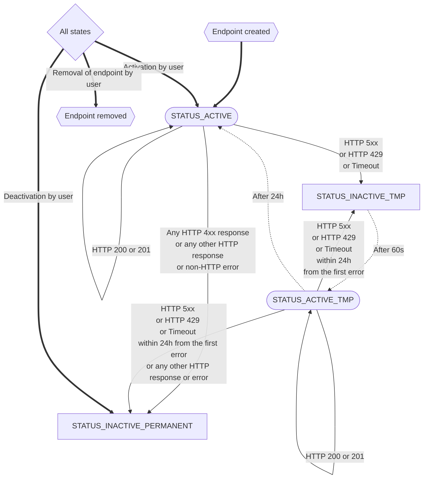

Webhooks are HTTP requests coming from the DefectDojo instance towards user-defined webserver which expects this kind of incoming traffic.

## Transition graph:

It is not unusual that in some cases webhook can not be performed. It is usually connected to network issues, server misconfiguration, or running upgrades on the server. DefectDojo needs to react to these outages. It might temporarily or permanently disable related endpoints. The following graph shows how it might change the status of the webhook definition based on HTTP responses (or manual user interaction).



Notes: 

1. Transitions:
    - bold: manual changes by user
    - dotted: automated by celery
    - others: based on responses on webhooks
1. Nodes:
    - Stadium-shaped: Active - following webhook can be sent
    - Rectangles: Inactive - performing of webhook will fail (and not retried)
    - Hexagonal: Initial and final states
    - Rhombus: All states (meta node to make the graph more readable)

## Body and Headers

The body of each request is JSON which contains data about related events like names and IDs of affected elements.
Examples of bodies are on pages related to each event (see below).

Each request contains the following headers. They might be useful for better handling of events by server this process events.

```yaml
User-Agent: DefectDojo-<version of DD>
X-DefectDojo-Event: <name of the event>
X-DefectDojo-Instance: <Base URL for DD instance>
```
## Disclaimer

This functionality is new and in experimental mode. This means Functionality might generate breaking changes in following DefectDojo releases and might not be considered final.

However, the community is open to feedback to make this functionality better and transform it stable as soon as possible.

## Roadmap

There are a couple of known issues that are expected to be implemented as soon as core functionality is considered ready.

- Support events - Not only adding products, product types, engagements, tests, or upload of new scans but also events around SLA
- User webhook - right now only admins can define webhooks; in the future also users will be able to define their own
- Improvement in UI - add filtering and pagination of webhook endpoints

## Events

<!-- Hugo automatically renders list of subpages here -->