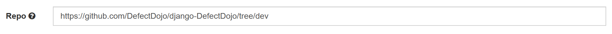
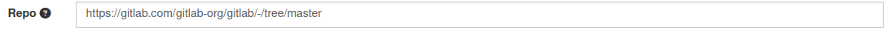
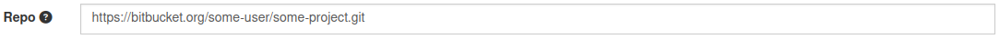
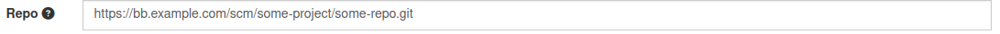
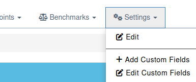
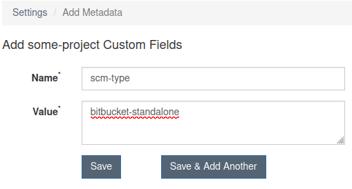
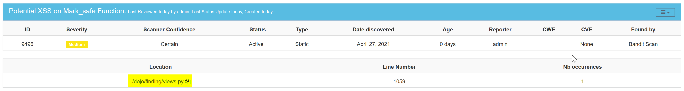
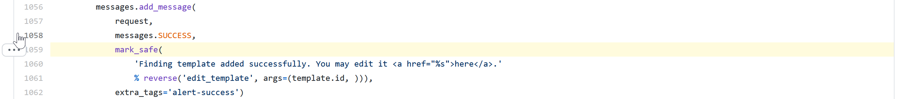

Findings can have a filepath and a line number as the location of the vulnerability. This is typically set when scanning an application with a Static Application Security Test (SAST) tool. If the repository of the source code is specified in the Engagement, DefectDojo will present the filepath as a link and the user can navigate directly to the location of the vulnerability.

## Setting the repository in the Engagement and Test

### Engagement
While editing the Engagement, users can set the URL of the specific SCM repo. 
For Interactive Engagement it needs to be the URL including the branch:
- for GitHub - like https://github.com/DefectDojo/django-DefectDojo/tree/dev

- for GitLab - like https://gitlab.com/gitlab-org/gitlab/-/tree/master

- for public BitBucket - like    (like git clone url)

- for standalone/onpremise BitBucket https://bb.example.com/scm/some-project/some-repo.git or https://bb.example.com/scm/some-user-name/some-repo.git for user public repo (like git clone url)

For CI/CD Engagement, where user could set commit hash, branch/tag and code line it should look like examples below:
- for GitHub - like https://github.com/DefectDojo/django-DefectDojo 
- for GitLab - like https://gitlab.com/gitlab-org/gitlab
- for public BitBucket - like https://bitbucket.org/some-user/some-project.git (like git clone url)
- for standalone/onpremise BitBucket https://bb.example.com/scm/some-project.git or https://bb.example.com/scm/some-user-name/some-repo.git for user public repo (like git clone url)

If user does not set commit hash or branch/tag in appropriate fields of CI/CD Engagement edit form, the URL should look like in Interactive Engagement edit form.

SCM navigation URL is composed from Repo URL using SCM Type. Github/Gitlab SCM type is default, but user could set certain SCM type in Product custom field "scm-type".

Product custom fields:

Product SCM type add:

Possible SCM types could be 'github', 'gitlab', 'bitbucket', 'bitbucket-standalone' or nothing (for default github).

## Link in Finding

When viewing a finding, the location will be presented as a link, if the repository of the source code has been set in the Engagement:

Clicking on this link will open a new tab in the browser, with the source file of the vulnerability at the corresponding line number:

