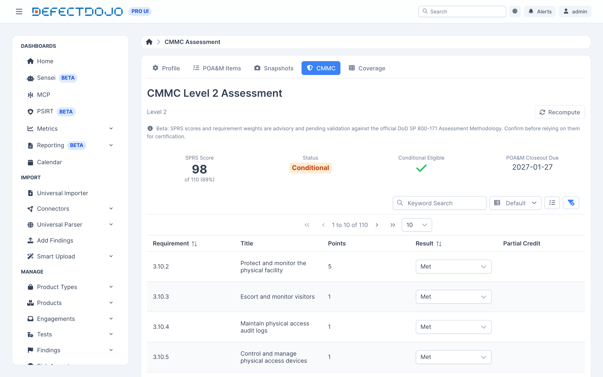
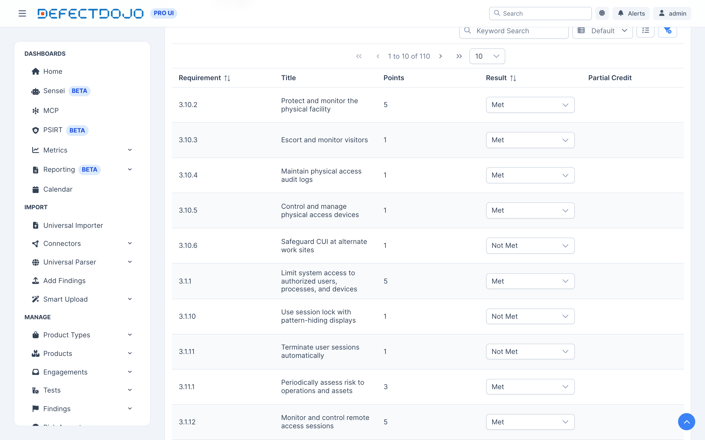

Compliance 标签页可以使用 DoD 评估方法论的分值权重，依据 NIST 800-171 Rev 2 对 CMMC 二级自评估进行评分。

**测试版：请将评分视为估算值。** 在此功能处于测试版期间，内置的分值权重及由此得出的 SPRS 评分仅供参考，尚待验证。在将任何评分用于评估提交或合同用途之前，请先对照官方的 DoD NIST SP 800-171 评估方法论进行确认。

## 记录结果

为全部 110 项要求逐一记录结果：

* **Met**（已满足）
* **Not met**（未满足）
* **Not applicable**（不适用）
* **Planned**（已计划，纳入 POA&M）

### 部分得分

少数要求存在方法论中明确记载的部分满足情形，此时按较低的扣分而非全额权重计分。如果存在这种情形，可以在 **Partial Credit**（部分得分）列中记录，该要求随后会按降低后的分值扣分。以 `3.13.11` 为例：已采用加密但未通过 FIPS 验证，此时扣 3 分而不是 5 分。

没有明确记载部分满足情形的要求，始终按全额权重扣分。

## 评估计算的内容

### SPRS 评分

以 110 分为基础，扣除每一项未满足或仅处于计划状态的要求所对应的分值。权重分为 1 分、3 分或 5 分，因此评分范围从 110 分到 -203 分不等。

根据该方法论，要求 3.12.4（系统安全计划要求）计为不适用。

### 是否可以获得有条件状态

只要评分达到至少 **88** 分（80%），且每个未解决的差距都符合纳入 POA&M 的条件，CMMC 就允许进行有条件认证。

该方法论完全禁止某些要求纳入 POA&M。在权重高于 1 分的要求中，只有 **3.13.11**（经 FIPS 验证的加密）可以被推迟处理。

### 结项倒计时

有条件评估须在 **180 天** 内完成其 POA&M 条目的结项。如果超过此期限，该评估将转为已过期状态。

## 状态

状态会从 **进行中** 变为 **有条件** 或 **最终**。有条件评估会显示其结项倒计时的剩余天数。

评估记录处于审计历史之下：每次变更都会记录操作人、操作内容和操作时间。
