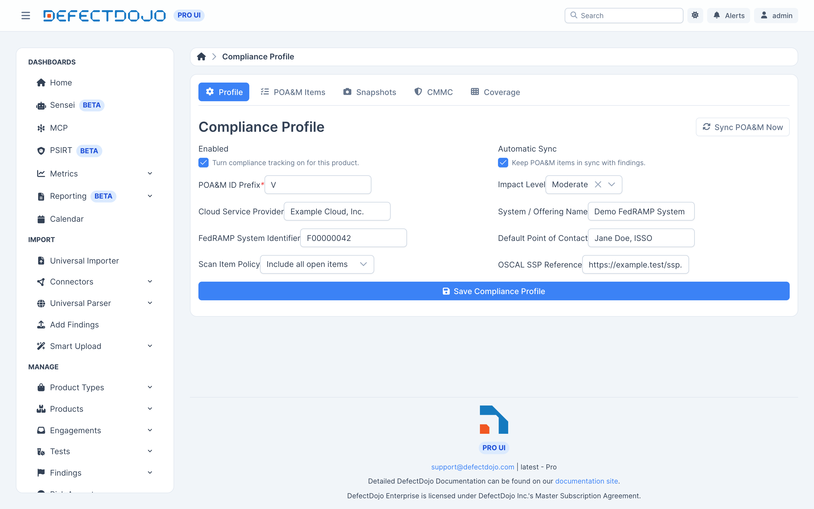

Il Profilo di conformità registra un Asset come sistema e contiene i dati che compaiono su ogni deliverable
prodotto. Apri l'Asset che rappresenta il perimetro del tuo sistema, vai alla scheda
**Compliance**, poi **Profile**.

## Campi del profilo

| Campo | Cosa fa |
| --- | --- |
| **Enabled** | Attiva il tracciamento della conformità per questo prodotto. |
| **Automatic Sync** | Mantiene sincronizzati gli elementi POA&M con i riscontri. |
| **POA&M ID Prefix** | Numerazione degli elementi. Obbligatorio. Per impostazione predefinita gli elementi sono numerati `V-1`, `V-2` e così via. |
| **Impact Level** | LI-SaaS, Low, Moderate o High. |
| **Cloud Service Provider** | Il nome del CSP, come deve comparire sui dati di copertina del POA&M. |
| **System / Offering Name** | Il nome del sistema, come deve comparire sui dati di copertina del POA&M. |
| **FedRAMP System Identifier** | L'identificativo del tuo sistema, ad esempio `F00000042`. |
| **Default Point of Contact** | Il POC applicato agli elementi che non ne hanno uno proprio. |
| **Scan Item Policy** | Include tutti gli elementi aperti, oppure solo gli elementi di scansione scaduti. |
| **OSCAL SSP Reference** | Facoltativo. Se impostato, i POA&M OSCAL generati lo referenziano tramite `import-ssp`. |

### Scegliere una scan item policy

Solo scaduti è il minimo richiesto dal ConMon FedRAMP. **Include all open items** è la scelta più
prudente, ed è quella predefinita.

## Salvataggio e sincronizzazione

**Save Compliance Profile** registra l'Asset. Il registro POA&M si popola quindi a partire dai riscontri
esistenti dell'Asset, e il resto della scheda Compliance diventa disponibile.

Con **Automatic Sync** attivo, il registro si mantiene aggiornato da solo — vedi
[Il registro POA&M](../poam_ledger). **Sync POA&M Now** esegue subito una sincronizzazione, utile
appena dopo aver modificato il profilo o importato una nuova scansione.

## Impostazioni disponibili solo tramite API

Due impostazioni del profilo non sono presenti nel form e si impostano tramite l'API di conformità:

* **Default scan controls** — i controlli attribuiti ai riscontri degli scanner che non hanno una
  propria mappatura dei controlli. `RA-5` è la scelta comune per i risultati delle scansioni di
  vulnerabilità. I riscontri che *hanno* già proprie referenze di controllo vengono invece mappati a
  partire da quelle; vedi [Copertura dei controlli](../control_coverage).
* **Configuration test types** — i tipi di test i cui riscontri vengono trattati come elementi di
  configurazione, il che determina il consolidamento CM-6 nel registro.

## Tracciabilità

I profili di conformità sono soggetti a cronologia delle modifiche: ogni modifica registra chi ha
cambiato cosa, e quando.
