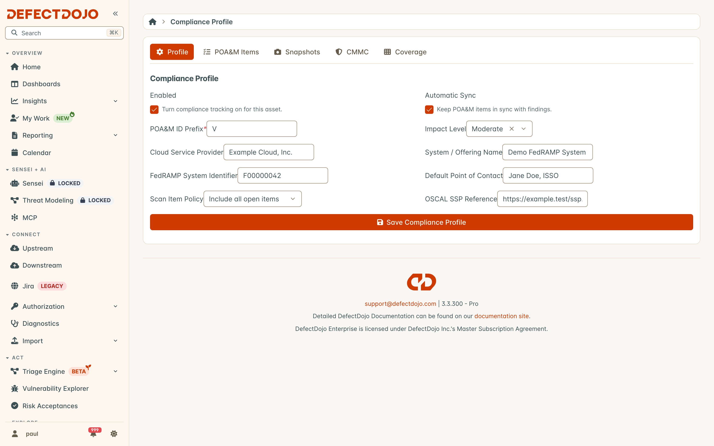

The Compliance Profile enrolls an Asset as a system and holds the facts that appear on every
deliverable it produces. Open the Asset that represents your system boundary, go to the
**Compliance** tab, then **Profile**.

## Profile fields

| Field | What it does |
| --- | --- |
| **Enabled** | Turns compliance tracking on for this Asset. |
| **Automatic Sync** | Keeps POA&M items in sync with findings. |
| **POA&M ID Prefix** | Item numbering. Required. Items are numbered `V-1`, `V-2`, and so on by default. |
| **Impact Level** | LI-SaaS, Low, Moderate, or High. |
| **Cloud Service Provider** | The CSP name, as it should appear on the POA&M cover data. |
| **System / Offering Name** | The system name, as it should appear on the POA&M cover data. |
| **FedRAMP System Identifier** | Your system's identifier, for example `F00000042`. |
| **Default Point of Contact** | The POC applied to items that do not carry their own. |
| **Scan Item Policy** | Either include all open items, or only past-due scan items. |
| **OSCAL SSP Reference** | Optional. When set, generated OSCAL POA&Ms reference it through `import-ssp`. |

### Choosing a scan item policy

Past-due-only is the FedRAMP ConMon minimum. **Include All Open Items** is the more conservative
choice, and is the default.

## Saving and syncing

**Save Compliance Profile** enrolls the Asset. The POA&M ledger then populates from the Asset's
existing findings, and the rest of the Compliance tab becomes available.

With **Automatic Sync** on, the ledger keeps itself current — see
[The POA&M Ledger](../poam_ledger). **Sync POA&M Now** runs a sync immediately, which is useful
right after you change the profile or import a new scan.

## Settings available through the API only

Two profile settings are not on the form and are set through the compliance API:

* **Default scan controls** — the controls attributed to scanner findings that carry no control
  mapping of their own. `RA-5` is the common choice for vulnerability scan results. Findings that
  *do* carry their own control references are mapped from those instead; see
  [Control Coverage](../control_coverage).
* **Configuration test types** — the test types whose findings are treated as configuration items,
  which is what drives CM-6 consolidation in the ledger. A new profile starts with the posture scan
  types selected: Wazuh SCA, Fleet policies, Elastic posture, DISA STIG Checklist, OpenSCAP, Lynis,
  kube-bench, docker-bench, Cloud Posture Scan and Cortex Cloud posture. Their failed checks roll
  into the single consolidated CM-6 item rather than one POA&M item per rule (see
  [DISA STIG Checklists](/import_data/pro/specialized_import/stig_checklists/)). Whether a scan's
  findings are configuration items is still a per-system decision, so remove any type that should
  file ordinary POA&M items for this system. A profile created before these defaults existed keeps
  the types it already had.

## Auditability

Compliance profiles are under audit history: every change records who changed what, and when.
