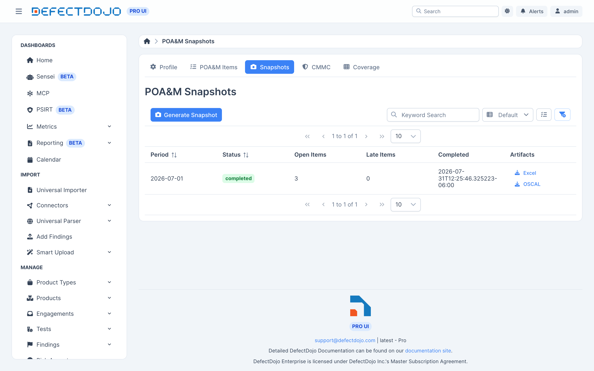

Na aba **Snapshots**, **Generate Snapshot** produz os entregáveis de um período de relatório. Um snapshot **congela o registro** naquele momento: edições posteriores nunca alteram um entregável que você já gerou.

Cada linha mostra o período, seu status, as contagens de itens abertos e atrasados, quando ele foi concluído, e links de download para os dois artefatos.

## O que um snapshot gera

Cada snapshot produz dois artefatos:

* A **planilha oficial do POA&M do FedRAMP** (versão de template 3.0), com os itens abertos, fechados e de configuração em suas planilhas próprias.
* Um documento **OSCAL plan-of-action-and-milestones**, fixado na versão OSCAL 1.0.4 — a versão que as regras de validação atuais do FedRAMP aceitam.

### O que a saída OSCAL carrega

O documento OSCAL usa o namespace de extensão do FedRAMP para os campos que as ferramentas do FedRAMP procuram: IDs de POA&M, IDs de controles impactados, estados de desvio, dependência de fornecedor e rastreamento de KEV.

Cada risco carrega:

* Facetas de probabilidade e impacto — inicial, e ajustada quando um ajuste de risco foi aprovado.
* A correção recomendada e a remediação planejada, como respostas separadas.
* Um log de risco registrando a detecção e a mais recente revisão de status.

Os documentos são verificados contra o schema oficial do NIST no momento da geração.

## Métricas mês a mês

Os snapshots também calculam os números de que um pacote de ConMon precisa: o que apareceu, o que foi resolvido, o que está atrasado, e a contagem de itens abertos por classificação de risco.

## Serviço de validação OSCAL

Para uma verificação mais rigorosa, uma implantação pode executar o **serviço validador OSCAL** incluído — um pequeno container que encapsula o `oscal-cli`, mantido pelo FedRAMP.

| Serviço validador | O que acontece na geração |
| --- | --- |
| Não configurado | Os documentos são validados contra o schema JSON do NIST. A verificação mais profunda é marcada como **skipped**. |
| Configurado | Os documentos são adicionalmente validados através do `oscal-cli`, e os resultados são armazenados junto com o snapshot. |

Para habilitá-lo, defina `DD_OSCAL_VALIDATOR_URL`, ou habilite `oscalValidator` no Helm chart.

**Mantenha a URL do `import-ssp` acessível.** O `oscal-cli` desreferencia o href do `import-ssp` durante a validação. Se o seu Compliance Profile nomear uma URL de SSP OSCAL que o container validador não conseguir alcançar, a validação é abortada em vez de simplesmente pular essa etapa. Torne a URL acessível a partir do validador, ou deixe-a não definida.

## Imutabilidade

Snapshots e seus artefatos são imutáveis por design. Regenerar um período produz um novo snapshot; ele nunca reescreve um já existente.
