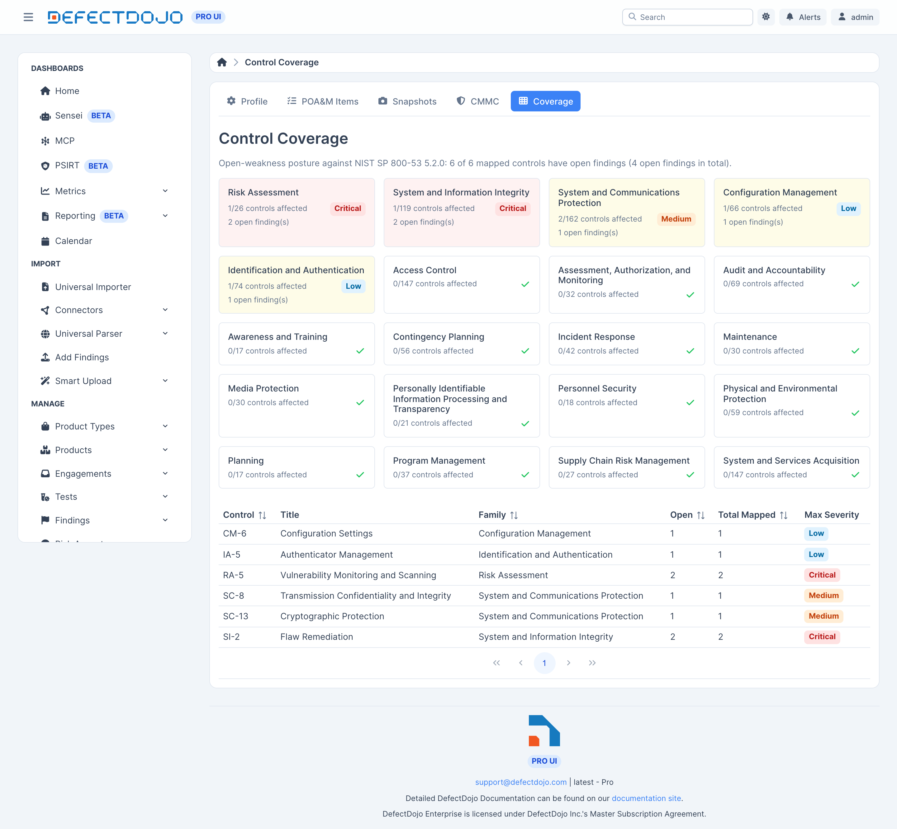

The control coverage view answers a simple question: which 800-53 controls do my scanners actually
test, and where are the open weaknesses per control?



## Where mappings come from

Many scanners already emit control references, and DefectDojo extracts them into control mappings
automatically. Among others:

* **Prowler** writes NIST 800-53 control lists into finding references, whether its report is
  imported as a file or comes from a Sensei cloud posture scan. Prowler's own `ac_2_1` spelling of
  AC-2(1) is read too.
* **Tenable** plugins carry 800-53 cross-references.
* **InSpec** and **MITRE SAF** profiles tag their checks with `nist` identifiers.
* **Wazuh SCA** tags each failed check with the controls it covers, such as `nist_800_53:AC.2`.
* The **AWS Security Hub** and **Wiz** connectors tag findings with the requirements their checks
  map to, such as `nist.800-53.r5:ac-2(1)`.

Extraction is grounded in the imported catalog, so an identifier the catalog does not recognize
never produces a mapping.

The same sources also carry PCI DSS requirements (Wazuh's `pci_dss_v4.0:2.2.4`, Prowler's
`PCI-4.0` list), which map to the bundled PCI DSS catalog and show in its coverage. A
[PCI DSS assessment](../pci_evidence_packs/) does not read these mappings: it reads the scans and
records described on that page. Only references that name PCI DSS version 4 are read: version
3.2.1 numbers the same requirements differently, so a `pci_dss_3.2.1` reference is skipped rather
than mapped to the wrong requirement. PCI DSS mappings never appear on a FedRAMP POA&M item, which
cites 800-53 controls only.

The connectors add their tags when they create a finding. A finding imported before a connector
began tagging keeps the tags it had, so it maps to no control from those tags. Findings the
connector creates from then on carry them.

Findings that carry no control references of their own are attributed to the default scan controls
on the Compliance Profile — see [Compliance Profile](../compliance_profile).

### DISA STIG checklists, through their CCIs

A STIG rule does not name an 800-53 control. It cites one or more **CCIs** (Control Correlation
Identifiers), which is DISA's own index into the control catalog — `CCI-000366`, for example, is
the configuration-settings CCI and resolves to `CM-6`.

DefectDojo crosswalks those CCIs to their controls using DISA's published CCI list, so importing a
checklist populates control coverage with no extra configuration. See
[DISA STIG Checklists](/import_data/pro/specialized_import/stig_checklists/) for the import itself.

The crosswalk covers the NIST 800-53 Rev 5 references DISA publishes, and like reference
extraction it is grounded in the imported catalog. Checklists assessed against a control set the
bundled catalog does not cover produce no mappings rather than approximate ones.

### Suggested mappings for findings without references

Some findings cite no control at all: a SAST result, a leaked secret, a finding entered by hand, or a
scanner that does not tag its checks. For those, DefectDojo can **suggest** a mapping: the NIST
800-53 control, and the PCI DSS requirement 2.2 (secure configuration) item, that the finding most
likely shows a failure of. Each suggestion appears in the finding's **Security Controls** panel,
marked **Suggested**, with the model's confidence.

A suggestion is a proposal for you to review. Until someone confirms it, it does not count as
evidence anywhere: it is not cited on a POA&M item, and it does not appear in control coverage, in
an assessment or in an evidence pack. From the row's menu in the Security Controls panel:

* **Confirm Suggestion** turns it into a mapping set by hand, attributed to you, which then counts
  everywhere a mapping does.
* **Reject Suggestion** removes it, and that control is never suggested for that finding again.

Confirming or rejecting needs edit permission on the finding's Asset. A suggestion is also replaced
automatically when a scanner reference or a CCI crosswalk later maps the finding to the same control.

Suggestions are **off by default**. They send a finding's title, description, mitigation, CWE,
component, file path, tags and scanner name to the model configured in
[AI Model Settings](/sensei/ai_model_settings/), and they run only on a Claude model configured
there. A superuser turns them on through the API, setting how confident the model must be for a
suggestion to be shown:

```
PATCH /api/v2/classifier/uses/control_mapping_suggestion/
{"backend": "claude", "min_confidence": 0.8}
```

Only findings on an Asset with an enabled Compliance Profile are considered, and only open, original
findings with no NIST 800-53 or PCI DSS mapping. Each finding is asked about once, whatever the
answer, and each sync handles at most 100 of an Asset's findings, most severe first, so the cost
grows with new findings rather than with every sync. Every request is recorded in the classifier's
audit log at `/api/v2/classifier/calls/`, without the finding's content.

### When two sources disagree

A finding can pick up a control mapping from more than one source. Where they disagree, the more
authoritative one wins, in this order:

1. A mapping **you set by hand** (including a suggestion you confirmed).
2. A **CCI crosswalk** from a STIG checklist.
3. A control reference **extracted from the finding's own text**.
4. The profile's **default scan controls**.
5. A **suggested** mapping that nobody has confirmed yet.

A CCI crosswalk outranks text extraction because the CCI is published by the same authority that
wrote the checklist, where an extracted reference is read out of free-form scanner output.

### Backfilling existing findings

Mapping runs as findings arrive. To map findings that were already imported before the feature was
enabled, backfill them:

```
manage.py extract_control_mappings --product <id>
```

Use `--all` to scan every active finding instead of one Asset. Both passes — reference
extraction and the CCI crosswalk — run by default; `--skip-scanner-refs` and `--skip-crosswalk`
run one without the other. The command reports how many mappings each pass created, and it leaves
manual and suppressed mappings alone.

Re-running it is safe: a mapping that is already correct is left untouched.

## Correcting a mapping

Mappings you create or correct by hand always win over extracted ones, and a mapping you delete
stays deleted — re-imports will not resurrect it.

## What the view shows

* A **heatmap by control family**.
* Per control, the **open findings mapped to it**.

Controls come from the bundled catalogs: NIST 800-53 Rev 5 and NIST 800-171 Rev 2, both imported
on startup.

**Coverage is advisory while the feature is in beta.** Control coverage reflects what your scanners
report and what the bundled catalogs recognize. It is not an attestation that a control is
implemented or effective. Confirm coverage against your System Security Plan before relying on it
for an assessment.

## Auditability

Control mappings are under audit history. Every change records who, what, and when.
