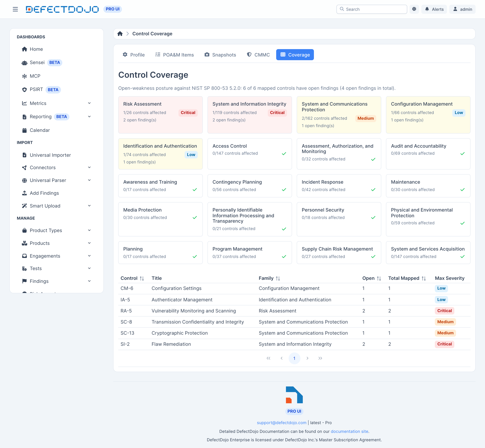

A visão de cobertura de controles responde a uma pergunta simples: quais controles do 800-53 meus scanners realmente testam, e onde estão as fraquezas abertas por controle?



## De onde vêm os mapeamentos

Muitos scanners já emitem referências de controle, e o DefectDojo as extrai automaticamente em mapeamentos de controle. Entre outros:

* O **Prowler** grava listas de controles NIST 800-53 nas referências dos achados.
* Os plugins do **Tenable** carregam referências cruzadas com o 800-53.
* Os perfis do **InSpec** e do **MITRE SAF** marcam suas checagens com identificadores `nist`.

A extração é baseada no catálogo importado, então um identificador que o catálogo não reconhece nunca produz um mapeamento.

Achados que não carregam referências de controle próprias são atribuídos aos controles de scan padrão no Compliance Profile — veja [Perfil de Conformidade](../compliance_profile).

### Preenchendo retroativamente achados existentes

A extração roda conforme os achados chegam. Para mapear achados que já haviam sido importados antes de o recurso ser habilitado, preencha-os retroativamente:

```
manage.py extract_control_mappings --product <id>
```

Use `--all` para varrer todo achado ativo em vez de um único produto. O comando reporta quantos mapeamentos ele criou, e não mexe nos mapeamentos manuais e suprimidos.

## Corrigindo um mapeamento

Mapeamentos que você cria ou corrige manualmente sempre prevalecem sobre os extraídos, e um mapeamento que você exclui permanece excluído — reimportações não vão trazê-lo de volta.

## O que a visão mostra

* Um **heatmap por família de controle**.
* Por controle, os **achados abertos mapeados a ele**.

Os controles vêm dos catálogos incluídos: NIST 800-53 Rev 5 e NIST 800-171 Rev 2, ambos importados na inicialização.

**A cobertura é consultiva enquanto o recurso está em beta.** A cobertura de controles reflete o que seus scanners reportam e o que os catálogos incluídos reconhecem. Não é uma atestação de que um controle está implementado ou é eficaz. Confirme a cobertura em relação ao seu Plano de Segurança do Sistema antes de depender dela para uma avaliação.

## Auditabilidade

Os mapeamentos de controle ficam sob o histórico de auditoria. Cada mudança registra quem, o quê e quando.
