DefectDojo Pro includes authored catalogs for vulnerability-related obligations in the Cyber
Resilience Act (CRA) and Digital Operational Resilience Act (DORA). A regulatory assessment
collects the operational facts DefectDojo already holds, gives an assessor space to document the
remaining evidence, and produces a dated evidence pack.

DefectDojo does not determine whether a regulation applies to an organization, product, or
service. The catalogs and evidence states are aids to assessment. Confirm applicability,
interpretation, and conclusions with qualified legal and compliance reviewers.

## Enable EU evidence packs

EU evidence packs require the **Compliance** feature and the beta **EU Evidence Packs** feature.
An administrator can enable both from [Feature Flags](/admin/feature_flags/pro__feature_flags/).
EU Evidence Packs depends on Compliance, so it stays off while Compliance is off.

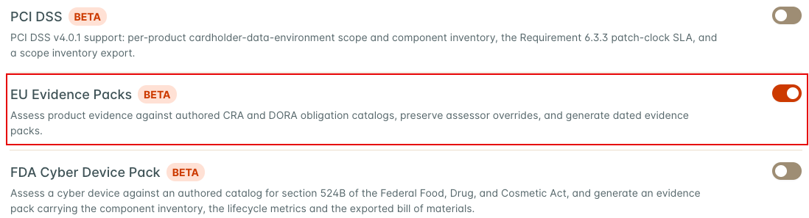

Anyone who can view an Asset can open its assessments and download its evidence packs. Starting an
assessment, recomputing evidence, saving a review, and generating a pack require edit permission
on the Asset. Users without it do not see those buttons.

## Included catalogs

The bundled catalogs contain short, authored paraphrases. Each obligation records its citation
and links to the corresponding source on EUR-Lex.

The CRA catalog covers Annex I Part II vulnerability handling, the Article 13 support period and
component due diligence requirements, and the Article 14 vulnerability and incident reporting
stages.

The DORA catalog covers ICT asset identification, vulnerability and patch management under
Commission Delegated Regulation (EU) 2024/1774, the testing types in DORA Article 25(1), and the
Article 28(3) third-party register. The third-party register obligation starts as not applicable
because the evidence pack does not manage that register.

The catalog text summarizes assessment topics and does not replace the regulations.

## Start and recompute an assessment

Assessments live on the Asset's Compliance Profile. Open the Asset, select the **Compliance** tab
in the Asset Overview, then select **Compliance Profile**.

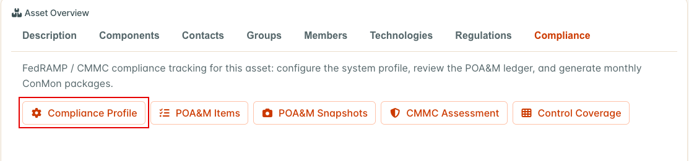

The Compliance Profile page has a **Regulatory assessments** section that lists existing
assessments, each with a **Review** button, and offers one start button for each regulatory
catalog. Those start buttons always use a period from January 1 of the current year to today. To
choose the period yourself, open the **EU Evidence** tab and select **Start Assessment**.

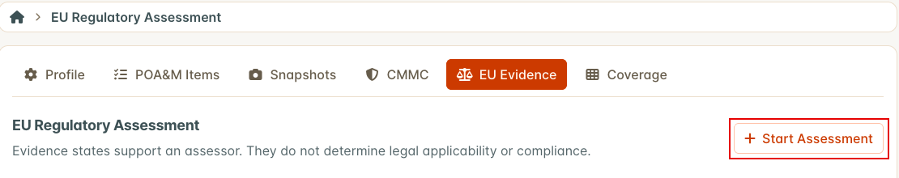

In the **Start Regulatory Assessment** dialog, pick the **Catalog**, set **Period start** and
**Period end**, add optional **Notes**, and select **Start Assessment**. The period end cannot be
earlier than the period start. Both dates are included in the period.

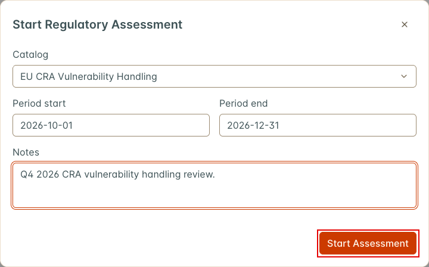

A new assessment creates an evidence result for every obligation in the catalog. Every result
starts as unknown, because nothing has been computed yet.

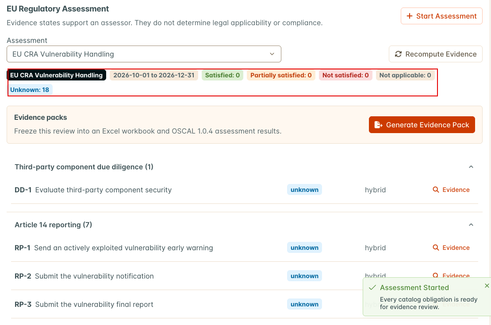

Select **Recompute Evidence** to compute the automated evidence. DefectDojo shows **Evidence
Recomputed** when it finishes, and the summary above the obligations shows how many are in each
state. Recompute again whenever the underlying data changes, and before you generate a pack.

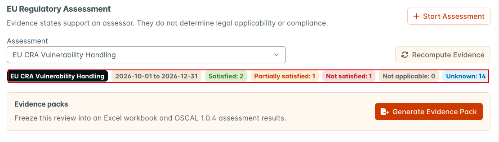

Recomputing refreshes the computed facts and the automated state of every obligation. It does not
change narratives, attachments, or any state an assessor has overridden. It runs while you wait,
so a large Asset can take a while.

The assessment uses five evidence states: satisfied, partially satisfied, not satisfied, not
applicable, and unknown. These states describe the evidence in DefectDojo. They are not legal
conclusions.

Obligations are grouped by family. Each row shows the evidence state, how the state was reached
(automated, manual, or hybrid), and an **Evidence** button.

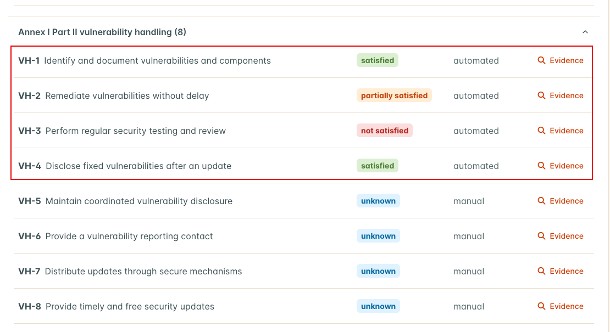

## Automated evidence

DefectDojo computes evidence only where it has suitable operational facts.

| Evidence source | Obligations it can support |
| --- | --- |
| SBOM dependency locations | CRA component and SBOM evidence; DORA third-party and open source library tracking |
| SLA settings, finding history, and risk acceptances | CRA remediation; DORA patch priority, deadlines, remediation monitoring, and vulnerability records |
| Tests and engagements in the assessment period | Regular security testing, vulnerability scanning, source code review, and penetration testing |
| EPSS and KEV enrichment runs | Trustworthy vulnerability information sources |
| Asset business criticality | ICT asset classification |
| Published PSIRT advisories | Public disclosure of fixed vulnerabilities |

Where DefectDojo holds no record for an obligation, the result stays unknown and its note names
the evidence to record. Other obligations are manual by design.

### CRA rules

The **evidence date** is the period end, or today if the period has not ended yet. Rules that
look at the state of findings or components use that date. Dates are compared in the server's
time zone.

| Obligation | Satisfied | Otherwise |
| --- | --- | --- |
| VH-1 Identify and document vulnerabilities and components | The Asset has SBOM components, and the newest component record was created inside the period. | Partially satisfied if the newest component record is older than the period. Not satisfied if the Asset has no SBOM components. |
| VH-2 Remediate vulnerabilities without delay | The Asset has an SLA configuration that enforces at least one severity, no more than 5% of the findings open on the evidence date are past their SLA, and no risk acceptance has expired without being handled. | Not satisfied if no SLA is enforced. Partially satisfied if more than 5% of open findings are past SLA or an expired risk acceptance is unhandled. |
| VH-3 Perform regular security testing and review | At least one test with a target end date inside the period is a static analysis test type, or has "scan", "vulnerability", "penetration", or "sast" in its test type name, title, or scan type. | Not satisfied. |
| VH-4 Disclose fixed vulnerabilities after an update | At least one PSIRT advisory counts toward the Asset (see below). | Unknown, with the note "No published advisories were linked in the period; confirm whether disclosure was required." |

Open findings exclude false positives, duplicates, and out-of-scope findings. VH-2 also reports
the share of findings closed within SLA during the period, the mean time to remediate by
severity, and risk acceptance counts. VH-3 also reports the longest gap between matching tests.
These extra facts are for the assessor and do not change the state.

A PSIRT advisory counts toward VH-4 for an Asset when all three of these hold:

* Its status is published, revised, or superseded. Draft, review, and approved advisories do not
  count, so in practice any advisory that has been published can count.
* Its publication date falls inside the assessment period, including the start and end dates.
* The Asset is one of its recipients, as listed in the advisory's **Recipients** panel. An Asset
  is **matched** when a live match in one of the advisory's cases names the Asset or a component
  the Asset carries. Retracted and false positive matches do not count. An Asset is **added by
  hand** when someone targets the Asset, or its whole Organization, as a recipient. An exclusion
  on the Asset or its Organization removes it from the recipients either way.

If the PSIRT Advisory Engine is unavailable, VH-4 stays unknown with the note "The PSIRT Advisory
Engine is unavailable; record disclosure evidence manually."

The remaining CRA obligations stay unknown until an assessor sets them. VH-5, VH-6, SP-1, and
RP-1 to RP-6 carry a note that says what evidence to record. VH-7, VH-8, SP-2, RP-7, and DD-1 note
that no automated check is registered for them.

### Reading the computed facts

Select **Evidence** on a row to see the obligation text, its citation, and the **Computed facts**
behind the state. The facts record when they were computed (`computed_at`), and automated facts
also record the evidence date they used (`as_of`).

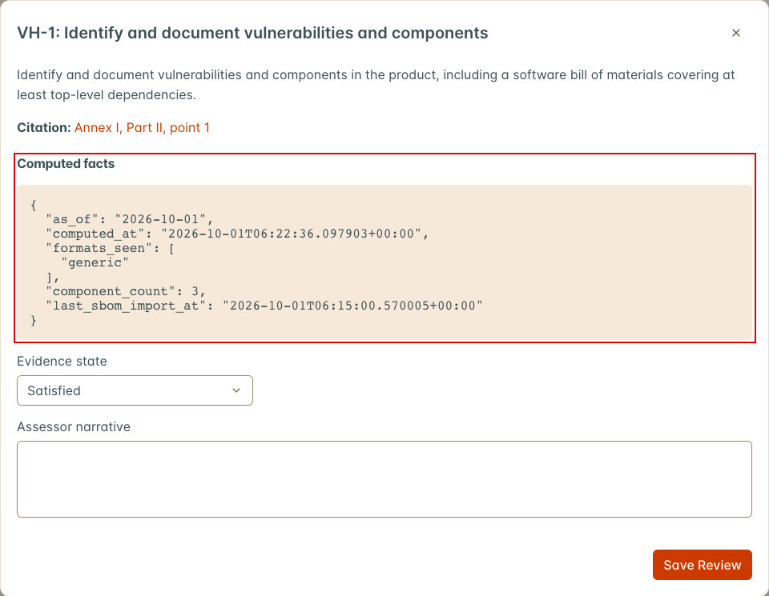

For VH-4, `published_advisory_count` is the number of advisories that count toward the Asset and
`advisory_ids` lists them. When none count, the facts also carry `manual_required: true` and the
note.

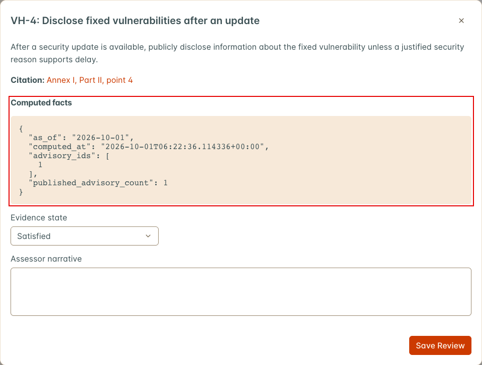

If a computation fails for one obligation, its facts say **Automated evidence is unavailable:**
followed by the error, and its state stays unknown. The other obligations are still computed.

## Narratives, attachments, and overrides

Open an obligation's **Evidence** view to inspect the computed facts and record an assessor
narrative. Select **Save Review** to keep your changes.

An assessor can override the effective evidence state. Change **Evidence state**, fill in the
**Override reason** field that appears, and select **Save Review**. A reason is required.

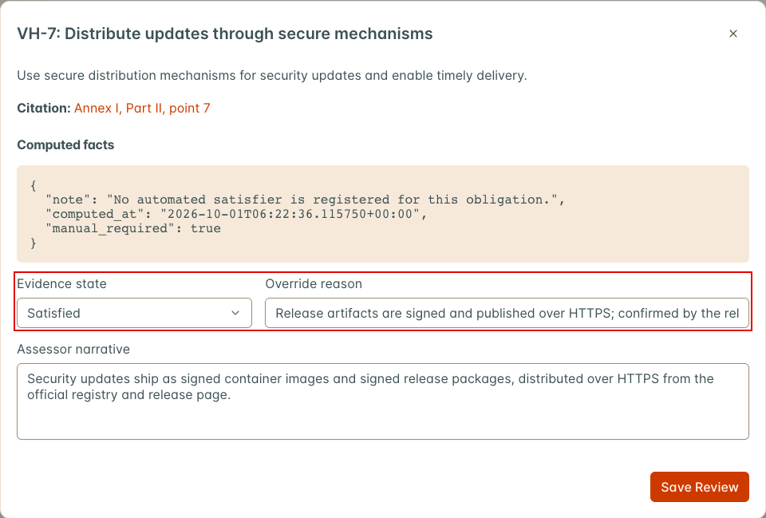

Recomputing does not replace that decision. DefectDojo retains the latest automated state beside
the effective state so reviewers can see when they differ, along with who made the override and
when. To return to the automated state, clear **Keep manual override** and select **Save Review**.

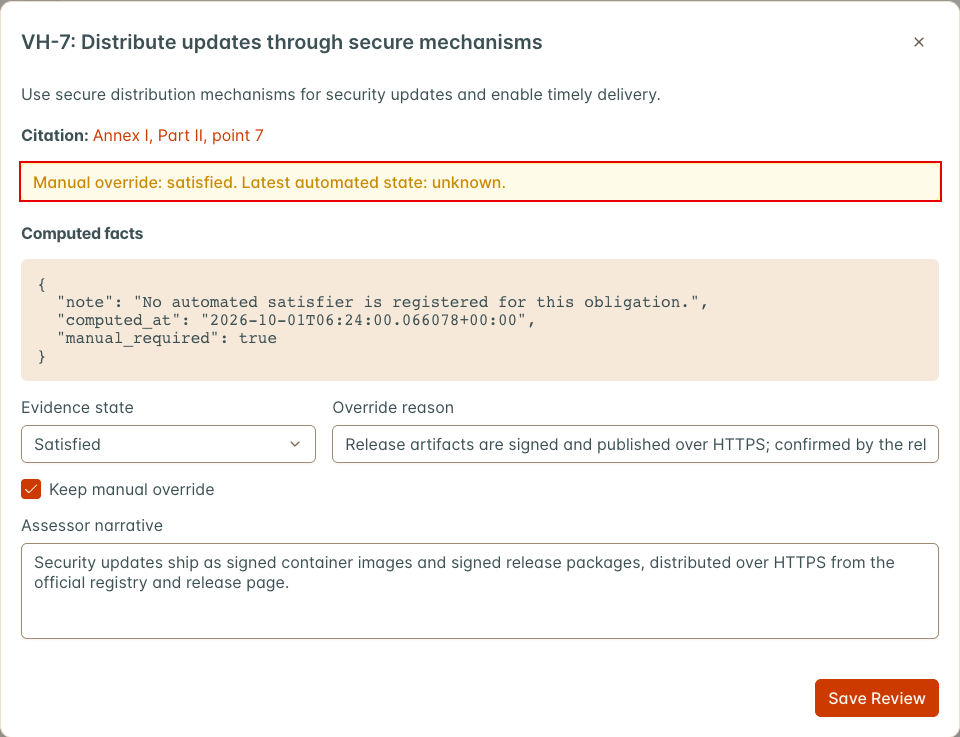

Attachments are listed in the Evidence view and exported in the evidence pack when an obligation
has them, but you cannot add an attachment from the assessment in the current release. Some
obligation notes ask you to attach a document. Record a reference to it in the **Assessor
narrative** instead, such as the document title, version, date, and where it is stored.

## Generate an evidence pack

Select **Generate Evidence Pack** from the assessment. DefectDojo queues the pack and builds it in
the background. The pack's row shows its status (pending, processing, completed, or failed) and
its generated time. When it completes, the row links to both artifacts. If generation fails, DefectDojo shows
**Evidence Pack Failed** with the error message.

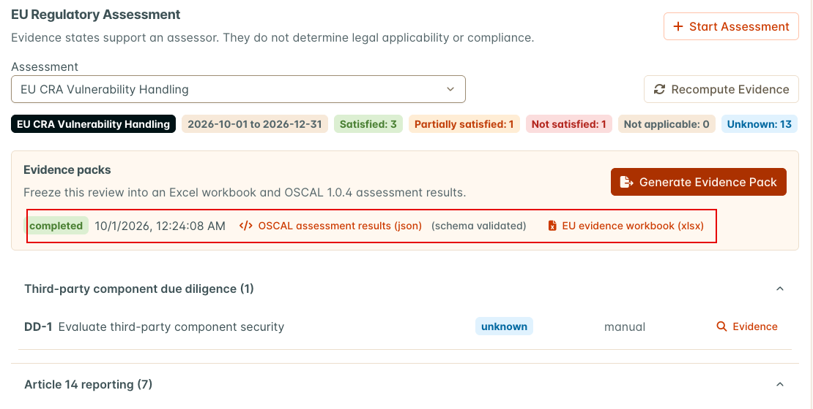

Generation freezes the assessment and its results at that point in time. It uses the stored
states and does not recompute first, so recompute before you generate.
A pack does not update after later changes, and the UI does not flag it as out of date. Recompute,
then generate a new pack. Check the snapshot's generated time.

The pack contains two downloadable artifacts:

* An Excel workbook. The **Cover** sheet shows the Asset, catalog and version, evidence period,
  assessment status, and the number of obligations in each state. Each obligation family has its
  own sheet with the obligation, title, citation, status, evidence mode, automated status,
  assessor narrative, and override reason. A **Raw Evidence** sheet adds the computed evidence and
  attachments for every obligation, and a **Shared Evidence** sheet appears when evidence is shared
  with other frameworks.
* An OSCAL 1.0.4 assessment-results JSON document. DefectDojo validates it against the vendored
  NIST schema before making it available, and the link is marked **(schema validated)**.

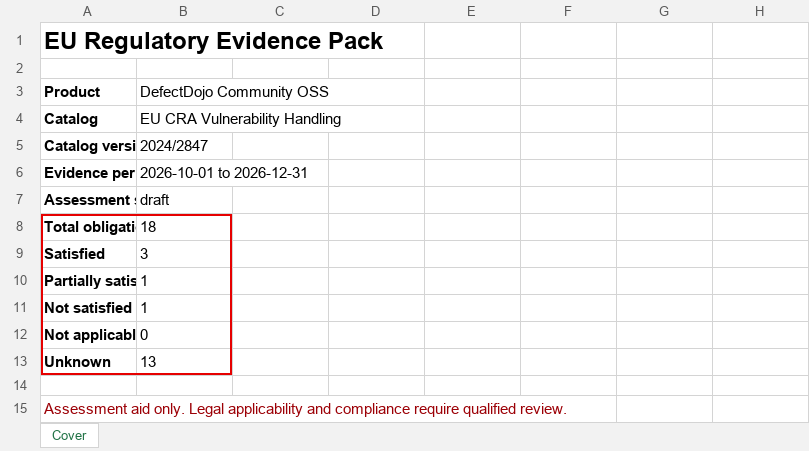

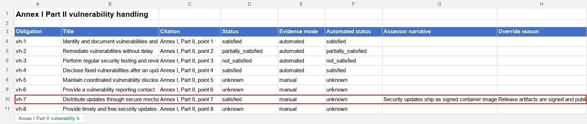

Each artifact records its file size and SHA-256 digest. The assessment page does not show them;
read them from `/api/v2/evidence_pack_artifacts/`. PDF output is not available.

## Troubleshooting

| Symptom | Cause | Fix |
| --- | --- | --- |
| No **EU Evidence** tab and no **Regulatory assessments** section | **EU Evidence Packs** or **Compliance** is off | Enable both in Feature Flags |
| No **Start Assessment**, **Recompute Evidence**, **Generate Evidence Pack**, or **Save Review** | You can view the Asset but not edit it | Ask for a role with edit permission on the Asset |
| Every obligation is unknown | Evidence has not been recomputed successfully yet | Select **Recompute Evidence** and wait for **Evidence Recomputed** |
| **Evidence Not Recomputed** | The recompute request failed | Open the browser's Network tab, recompute again, and check the status of the `recompute/` request. 403: a feature flag is off or you lack edit permission. 500: a server error, so check the application logs for a traceback. 502 or 504: a proxy or app server timeout, so raise the timeout for large Assets |
| Facts say **Automated evidence is unavailable** | That obligation's computation raised an error | Check the application logs for "Evidence satisfier for" and the obligation id |
| VH-1 is not satisfied | The Asset has no SBOM components | Import an SBOM for the Asset, then recompute |
| VH-1 is partially satisfied | Every component record was created before the period | Expected when no new components appeared in the period. Document the SBOM review in the narrative |
| VH-2 is not satisfied and `sla_configured` is false | The Asset's SLA configuration enforces no severity | Assign an SLA configuration that enforces at least one severity, then recompute |
| VH-2 is partially satisfied | More than 5% of open findings are past SLA, or an expired risk acceptance is unhandled | Check `breach_percent` and `risk_acceptances_expired_unhandled` in the computed facts |
| VH-3 is not satisfied although the Asset has tests | No test in the period matches the rule | Check the test type, title, and target end date against the VH-3 rule |
| VH-4 is unknown | No advisory counts toward the Asset: none has been published, it was published outside the period, the Asset is not among its recipients or is excluded, or PSIRT is not enabled | Open the advisory and check its status, publication date, and **Recipients** panel, then recompute. If no disclosure was needed, record why in the narrative |
| A pack stays pending or processing | Background task processing is not running | Check with your administrator |
| **Evidence Pack Not Generated** | DefectDojo refused the request, for example because the assessment has no obligations | Read the message in the notification |
| A pack shows old states | A pack is a frozen snapshot | Recompute, then generate a new pack. Check the snapshot's generated time |
| There is no way to attach a file | Attachments cannot be added from the assessment | Record the evidence reference in the **Assessor narrative** |

## Related pages

The [FDA Cyber Device Pack](../fda_cyber_device_pack) uses the same assessment screens and export
pipeline. The [Compliance Profile](../compliance_profile) page describes the rest of the Asset's
compliance settings.
