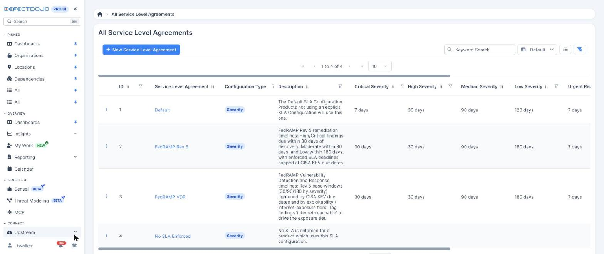
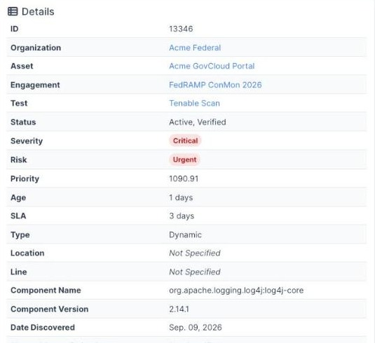
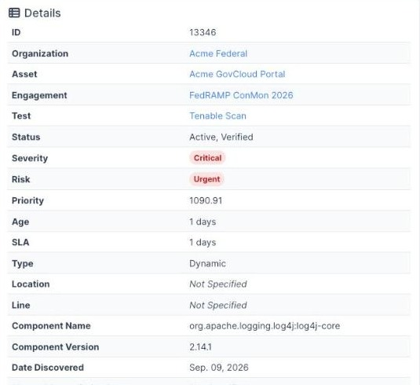
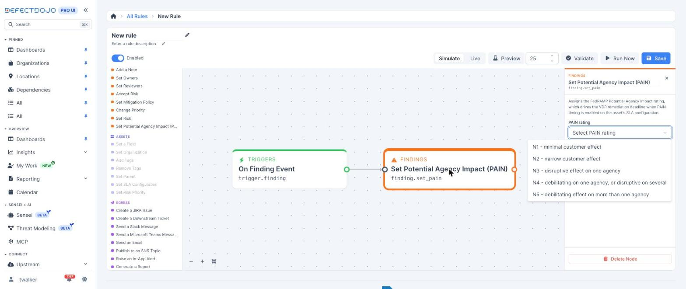
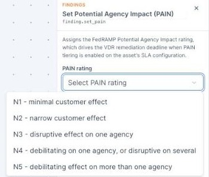
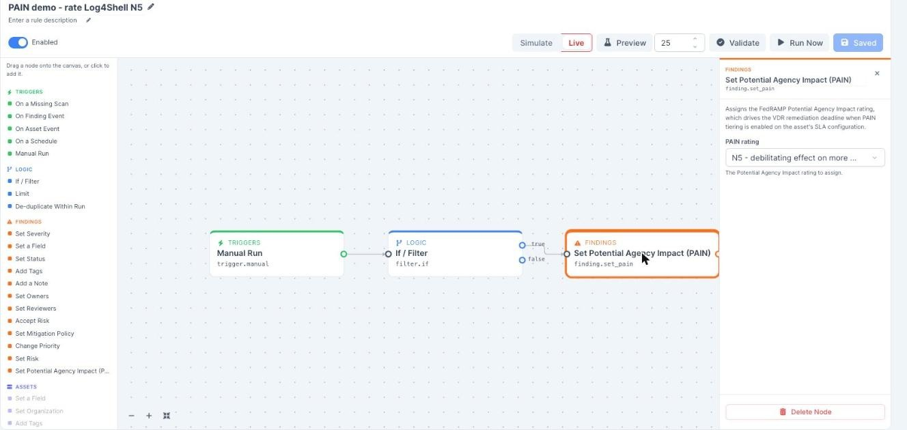
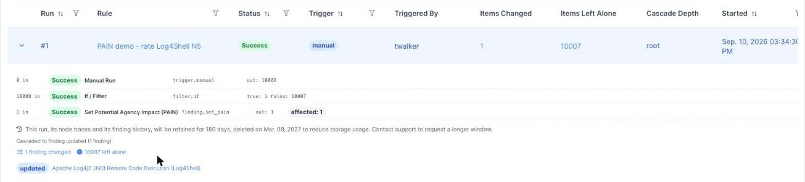
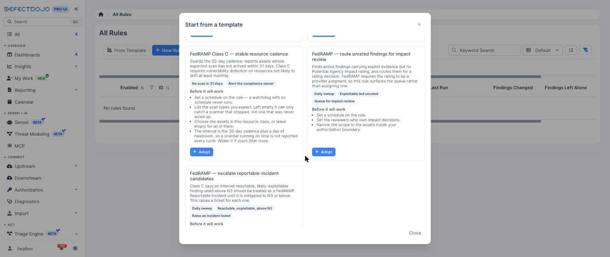
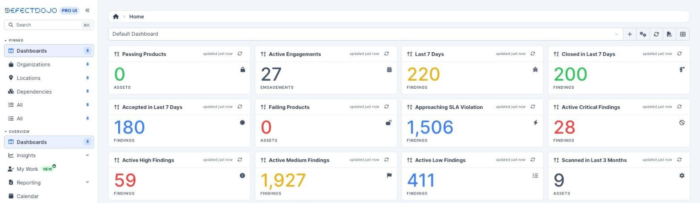
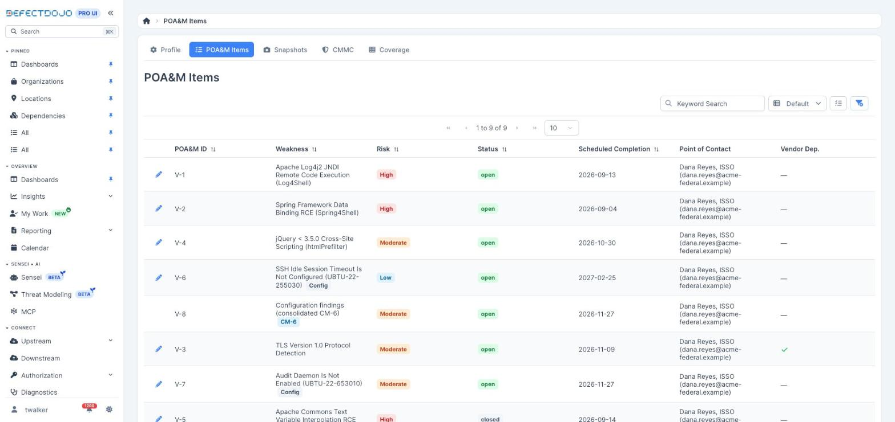

FedRAMP's Vulnerability Detection and Response standard does not set one deadline per severity. It
sets a deadline per *combination* of how exploitable a vulnerability is, whether it is reachable
from the internet, and how much damage its exploitation would do to the agencies using your service.
That third factor is the **Potential Agency Impact N-rating**, or PAIN.

This page covers the rating, how it changes a deadline, and how to assign ratings at scale. For the
SLA presets that carry the matrix, see [Remediation Deadlines](../remediation_slas).

## The N-rating scale

| Rating | What it means |
| --- | --- |
| **N5** | Debilitating effect on more than one agency |
| **N4** | Debilitating on one agency, or disruptive on several |
| **N3** | Disruptive effect on one agency |
| **N2** | Narrow customer effect |
| **N1** | Minimal customer effect |

PAIN is deliberately a person's judgment rather than a scanner output. FedRAMP asks the provider to
estimate the effect exploitation would have on its agency customers, and declines to prescribe a
method for arriving at the number. DefectDojo records the rating and a **PAIN Evaluated** timestamp
saying when it was last set, but never derives a rating for you.

A finding with no rating is unrated, and an unrated finding keeps its base deadline.

## FedRAMP's mitigation timeframes

Class C is the certification tier that replaced the Moderate baseline. Its mitigation and
remediation rule, VDR-TFR-PVR, asks you to partially mitigate, fully mitigate, or remediate each
vulnerability to a lower N-rating within these timeframes:

| PAIN rating | Likely exploitable **and** internet-reachable (LEV + IRV) | Likely exploitable, not internet-reachable (LEV + NIRV) | Not likely exploitable (NLEV) |
| --- | --- | --- | --- |
| **N5** | 2 days | 4 days | 16 days |
| **N4** | 4 days | 8 days | 64 days |
| **N3** | 16 days | 32 days | 128 days |
| **N2** | 48 days | 128 days | 192 days |

Two things about the shape of the table:

* **The third column ignores reachability.** NLEV means *not likely exploitable*, whether or not the
  finding is internet-reachable. It is wider than the reachable-only tier in the three-tier VDR
  model.
* **There is no N1 row.** FedRAMP's table starts at N2, so a finding rated N1 carries no VDR deadline
  and keeps its base window. DefectDojo does not invent a row FedRAMP has not published.

Every cell is editable. The shipped numbers are FedRAMP's published Class C values; a provider
holding a Class B or Class D certification changes the numbers, not the shape.

### When this applies

| Milestone | Date |
| --- | --- |
| Optional adoption of the VDR standard opens | July 4, 2026 |
| Required to obtain and maintain, mandated by CISA BOD 26-04 | December 7, 2026 |
| Grace period ends | March 7, 2027 |

## How a deadline is calculated

Two FedRAMP SLA configurations ship with DefectDojo Pro. **FedRAMP VDR** is the one that carries the
matrix.

Assign it to the Assets inside your authorization boundary, then turn on **Use PAIN Ratings for VDR
Deadlines**.

For each finding on an Asset using that configuration, the deadline is computed in three steps:

1. **Base SLA.** The window for the finding's severity, or its risk band when the configuration is
   risk-based — 30, 90 or 180 days.
2. **KEV cap.** A finding in the CISA KEV catalog is never scheduled past CISA's due date.
3. **VDR cap.** Exploitability (KEV-listed, or an EPSS score at or above your threshold, `0.1` by
   default) and reachability (the `internet-reachable` tag, and optionally the computed asset
   exposure verdict) select a column. The finding's PAIN rating selects a row. The matching cell
   caps the deadline.

Two invariants are worth knowing before you turn this on:

* **VDR only ever tightens a deadline.** DefectDojo takes the shorter of the base SLA and the matrix
  cell, so enabling the matrix can never push a date out.
* **PAIN tiering replaces the flat tiers rather than blending with them.** Without ratings, FedRAMP
  VDR uses three flat tiers of 4, 14 and 30 days. With PAIN tiering on, those tiers are gone: an N2
  finding gets its N2 cell, never the rating-agnostic 4-day tier it is not entitled to.

Deadlines are computed from the finding's SLA start date (its discovery date), and the PAIN
Evaluated timestamp is kept alongside for reporting on when each impact decision was made.

### A worked example

The Log4Shell finding below (CVE-2021-44228) is Critical, listed in the CISA KEV catalog, and tagged
`internet-reachable`. It sits on a FedRAMP Moderate Asset using the FedRAMP VDR configuration, and
was discovered on September 9, 2026, so its base SLA is 30 days from discovery. The screenshots were
captured the following day.

| State | Matrix cell | Deadline written to the finding |
| --- | --- | --- |
| PAIN tiering off, flat VDR tiers | Urgent, 4 days | September 13 — 3 days remaining |
| PAIN tiering on, finding not yet rated | none | October 9 — the base SLA, 29 days remaining |
| Rated **N5** | 2 days | **September 11 — 1 day remaining** |
| Rated N4, for comparison | 4 days | 4 days from discovery |
| Rated N3, for comparison | 16 days | 16 days from discovery |
| Rated N2, for comparison | 48 days | 30 days — the base SLA is shorter, so it wins |

Before rating: the flat VDR urgent tier gives this KEV-listed, internet-reachable finding a four-day
deadline, three days remaining on the day of capture.

After rating: with PAIN tiering on and the finding rated N5, the deadline moves to the matrix's
two-day cell. Nothing else about the finding changed.

## Rating findings with the Rules Engine

Ratings are assigned through **Rules Engine 2.0**. The **Set Potential Agency Impact (PAIN)** action
writes a rating to every finding that reaches it.

The rating selector offers FedRAMP's own customer-effect wording rather than bare numbers, so
whoever builds the rule sees the judgment being made.

The action behaves the way a compliance workflow needs it to:

* It writes the rating and stamps **PAIN Evaluated** in the same operation.
* It **skips findings already at the selected rating**, so a scheduled rule never re-stamps the
  evaluation time on a finding that has not changed.
* Saving the finding recalculates its SLA deadline through the same path every other deadline uses,
  so a rule-set rating and a hand-set one produce the same date.
* A rating outside 1 to 5 is rejected.
* Every run records a per-finding trace of the change, from and to — the audit trail for each impact
  decision. See [Runs](/automation/rules_engine_2/runs/).

`finding.pain_rating` is also available as a condition in any filter node, which is what makes
escalation rules such as "above N3 and internet-reachable" possible.

The rule below produced the deadline change above: a Manual Run trigger, an If / Filter node
selecting the finding, and **Set Potential Agency Impact (PAIN)** set to N5, switched to Live.

The run trace records each node's input and output counts. This run swept 10,008 findings, one
matched the filter, and one rating was written.

## FedRAMP rule templates

Two templates covering the PAIN workflow ship in the template gallery, alongside three Class C
scan-cadence watchdogs. Adopting a template creates a new rule of your own, disabled and in simulate
mode, so nothing runs until you configure and enable it.

| Template | What it does |
| --- | --- |
| **FedRAMP — route unrated findings for impact review** | A scheduled sweep for active findings that carry exploit evidence — weaponized or worse — and no PAIN rating, raising an alert to the reviewers who own impact decisions. It surfaces the queue rather than assigning a rating, which is what FedRAMP's provider-judgment requirement asks for. |
| **FedRAMP — escalate reportable-incident candidates** | A scheduled sweep for active findings rated above N3 that are likely exploitable and sit on exposed assets, raising a ticket for each. Class C treats such a finding as a FedRAMP Reportable Incident until it is mitigated to N3 or below. |

See [Building Rules](/automation/rules_engine_2/building_rules/) for how a template is adopted.

## Where the deadline shows up

Because the PAIN-driven deadline is the finding's ordinary SLA expiration date, nothing separate
needs configuring. It appears on the finding, in every findings table and filter, in SLA
notifications, in reports, and in the **Approaching SLA Violation** dashboard widget.

On the **Compliance** tab of an Asset, each POA&M item takes its **Scheduled Completion Date** from
the finding's enforced SLA deadline at the moment the item is created, and keeps that date
afterwards. In the ledger below, the Log4Shell item carries the four-day VDR deadline as its
scheduled completion date.

Monthly **Snapshots** therefore carry the PAIN-driven commitment an assessor expects to see, and
late items are measured against it. For the ledger's conventions see
[The POA&M Ledger](../poam_ledger), and for the monthly deliverables see
[ConMon Snapshots](../conmon_snapshots).

## Reference

* [FedRAMP 20x Class C, Vulnerability Detection and Response](https://www.fedramp.gov/2026/reference/20x/c/vulnerability-detection-and-response/)
  — rule **VDR-TFR-PVR** carries the mitigation timeframe table.
* FedRAMP rule **VER-EVA-EPA** (Estimate Potential Agency Impact) — the N-rating definitions.
* [Remediation Deadlines](../remediation_slas) — the FedRAMP Rev 5 and FedRAMP VDR SLA presets.
