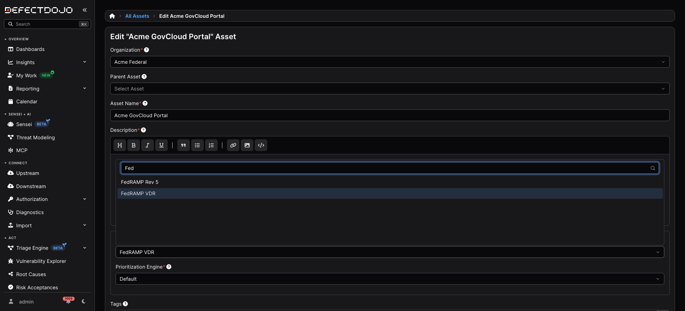
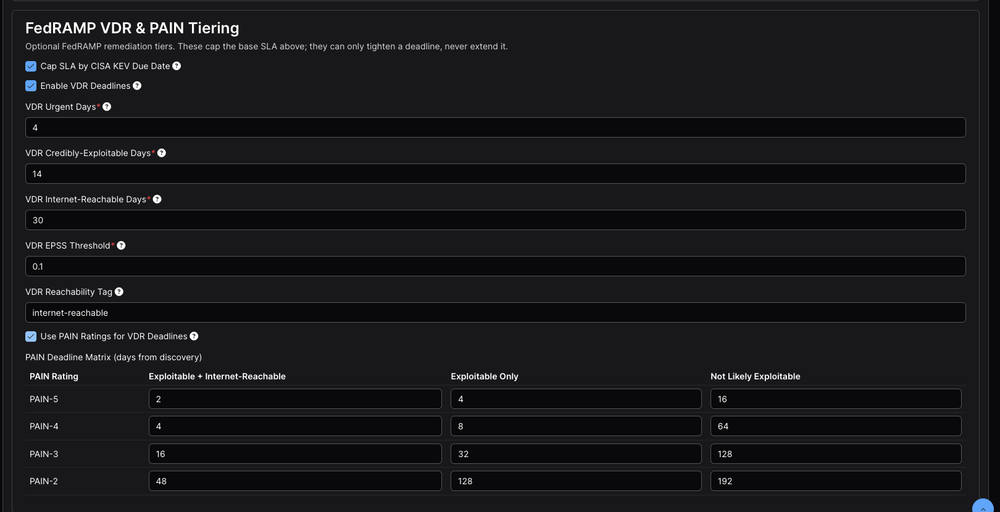
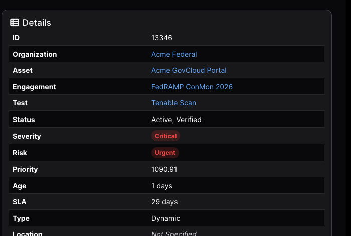
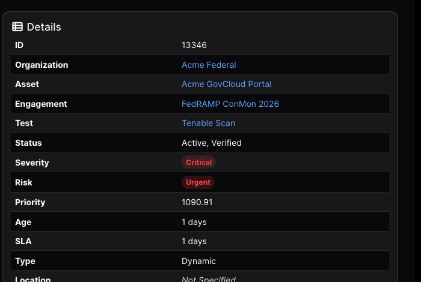
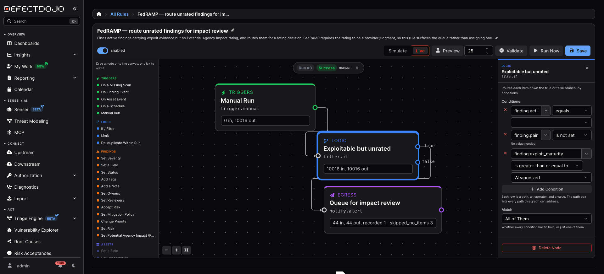

[Potential Agency Impact (PAIN) Ratings](../pain_ratings) explains what the rating is and how a
deadline is derived from it. This page is the procedure: the order to do things in, what to check at
each step, and what the deadline should read when you get there.

Work through it once, on one Asset, before you enable PAIN tiering across an authorization boundary.
It takes about 45 minutes and ends with a remediation deadline you can trace to a single cell of
FedRAMP's published table.

Throughout, **D** is a finding's discovery date. Expected results are written as `D + n days`, so
they hold whatever day you run this.

## Before you start

| Requirement | Why | How to check |
| --- | --- | --- |
| **DefectDojo Pro 3.3.100 or later** | Earlier versions carry the database field but offer no way to switch PAIN tiering on | **Use PAIN Ratings for VDR Deadlines** appears in the **FedRAMP VDR & PAIN Tiering** section of an SLA configuration |
| Feature flag `compliance` | The Compliance tab, the POA&M ledger and the FedRAMP SLA presets | [Feature Flags](/admin/feature_flags/pro__feature_flags/) |
| Feature flag `rules_engine_v2` | Ratings are assigned by a rule; without it there is no **Set Potential Agency Impact (PAIN)** node | [Feature Flags](/admin/feature_flags/pro__feature_flags/) |
| Feature flag `threat_intel` | `exploit_maturity`, which the shipped FedRAMP rule templates filter on | [Feature Flags](/admin/feature_flags/pro__feature_flags/) |
| Background task processing | Every SLA change recalculates asynchronously | On a self-hosted install, confirm the worker is running with your administrator |
| The **FedRAMP VDR** SLA configuration | It is the only preset carrying the tiers and the matrix | **Configuration > Service Level Agreements** |
| Permission to edit SLA configurations | Superuser, or the matching [configuration permission](/admin/user_management/user_permission_chart/#configuration-permission-chart) | — |

Without a background worker, every step here saves successfully and **no deadline ever moves**,
which looks exactly like the feature not working.

### Read this before you turn anything on

**Enabling PAIN tiering makes deadlines longer before it makes them shorter.**

PAIN tiering *replaces* the three flat VDR tiers rather than combining with them. A finding that has
no rating matches no cell of the matrix, so it falls back to its base severity SLA. On the FedRAMP
VDR preset, a Critical finding that was sitting on the 4-day Urgent tier moves to 30 days the moment
you tick the box, and stays there until somebody rates it.

That is correct behaviour, and it is the single most common reason people conclude the feature is
broken. It is also why the walkthrough below has you record the deadline at three points rather than
two.

## Choose a finding to watch

Which column of the matrix a finding lands in depends on whether DefectDojo considers it **likely
exploitable**, which is read from two fields:

* `known_exploited` — is it in the CISA KEV catalog?
* `epss_score` — is EPSS at or above the configuration's threshold, `0.1` by default?

For the clearest demonstration, pick a finding in the tightest column: **Critical severity,
KEV-listed, and tagged `internet-reachable`**. A Log4Shell finding (CVE-2021-44228) from any scan
import is the canonical example.

In normal operation both fields arrive from your scanners or from Finding Enrichment rather than
being entered by hand. If your imported findings have both empty, turn enrichment on at **Settings >
Finding Enrichment Settings** and enable **KEV Lookup** and **EPSS Lookup** — on DefectDojo Cloud
these are already on. With no lookup source configured, enrichment silently enriches nothing.

Confirm the finding you picked actually carries them before predicting a deadline from it. A finding
with neither is **not likely exploitable**, so it lands in the widest column of the matrix: the
mechanism still works, but the only movement you will see is 30 days to 16 at N5, which is a much
weaker check. On a test instance an administrator can set them directly:

```bash
curl -X PATCH "$DD_URL/api/v2/findings/<FINDING_ID>/" \
  -H "Authorization: Token $DD_TOKEN" -H "Content-Type: application/json" \
  -d '{"known_exploited": true, "epss_score": 0.9744, "epss_percentile": 0.9997}'
```

The deadline recalculates on save. Note the finding's **Finding ID** from its URL and its **Date
Discovered** — that date is **D**.

## Step 1 — Put the Asset on FedRAMP VDR

Open the Asset, choose **Edit**, and set **SLA Configuration** to **FedRAMP VDR**.



Only **FedRAMP VDR** carries the exploitability tiers and the PAIN matrix. **FedRAMP Rev 5** gives
you the 30/90/180 base windows and the CISA KEV cap, but no tiering at all.

Changing an Asset's SLA configuration recalculates every finding on it, and the Asset's SLA cannot
be changed again while that runs — see
[SLA Recalculation](/asset_modelling/pro_hierarchy/priority_sla/#sla-recalculation).

Then open **Configuration > Service Level Agreements**, edit **FedRAMP VDR**, and confirm it reads:

| Field | Expected |
| --- | --- |
| Critical / High / Medium / Low Finding Days | 30 / 30 / 90 / 180 |
| Enforce … Finding Days (all four) | ticked |
| Cap SLA by CISA KEV Due Date | ticked |
| **Enable VDR Deadlines** | **ticked** |
| VDR Urgent Days | 4 |
| VDR Credibly-Exploitable Days | 14 |
| VDR Internet-Reachable Days | 30 |
| VDR EPSS Threshold | 0.1 |
| VDR Reachability Tag | `internet-reachable` |
| **Use PAIN Ratings for VDR Deadlines** | **unticked**, for now |

**Enable VDR Deadlines must be ticked.** The matrix is applied *inside* the VDR calculation, so with
VDR off no cell is ever consulted and the PAIN checkbox does nothing at all.

If this configuration is already assigned to Assets outside the boundary you are working in, copy it
first and point only your test Asset at the copy. Enabling PAIN tiering re-dates every finding on
every Asset using the configuration.

## Step 2 — Record the deadline before tiering

Open your chosen finding and read the **SLA** row in the Details panel.

| Expected | Why |
| --- | --- |
| **D + 4 days** | The base SLA for a Critical is 30 days, but the finding is likely exploitable *and* internet-reachable, so the flat VDR **Urgent** tier of 4 days applies. VDR only ever tightens, so 4 wins. |


The panel above was captured the day after discovery, so **SLA** reads the days remaining rather than
the window itself.

| If you see | Cause |
| --- | --- |
| **D + 30** | The finding is not seen as exploitable or reachable. Check that Known Exploited is ticked, or EPSS is above the threshold, and that the tag reads exactly `internet-reachable` |
| Some other number | The Asset is still on a different SLA configuration. Repeat Step 1 |

## Step 3 — Turn on PAIN tiering

Edit **FedRAMP VDR** again, scroll to **FedRAMP VDR & PAIN Tiering**, and tick **Use PAIN Ratings for
VDR Deadlines**. The twelve-cell matrix appears immediately, pre-seeded with FedRAMP's published
Class C values.



| PAIN Rating | Exploitable + Internet-Reachable | Exploitable Only | Not Likely Exploitable |
| --- | --- | --- | --- |
| PAIN-5 | 2 | 4 | 16 |
| PAIN-4 | 4 | 8 | 64 |
| PAIN-3 | 16 | 32 | 128 |
| PAIN-2 | 48 | 128 | 192 |

There is deliberately no PAIN-1 row: FedRAMP's table starts at N2, so an N1 finding carries no VDR
deadline and keeps its base window.

Submit. This queues a recalculation across every finding on every Asset using the configuration —
seconds on one Asset, proportionally longer on a large boundary. **While that sweep runs the
configuration is locked, and further saves are silently reverted rather than rejected.** If a matrix
cell snaps back to its old value, that is why: wait for the sweep to finish and edit it again.

When it completes, reload the finding.

| Expected | Why |
| --- | --- |
| **D + 30 days** | The finding has no PAIN rating, so no matrix cell applies and it falls back to the base severity SLA |



The deadline has moved **outwards**, from 4 days to 30. This is the step described at the top of the
page. Nothing is wrong — continue.

## Step 4 — Assign a rating

PAIN is a judgment about the effect exploitation would have on your agency customers. DefectDojo
never derives one. Ratings are assigned with a [Rules Engine 2.0](/automation/rules_engine_2/) rule.

Go to **Rules Engine 2.0 > All Rules**, choose **New Rule**, and wire three nodes left to right:

| Order | Palette section | Node | Configuration |
| --- | --- | --- | --- |
| 1 | Triggers | **Manual Run** | Sweep Over: `Findings`. Leave scope empty. |
| 2 | Logic | **If / Filter** | One condition: `finding.id` `equals` your Finding ID. Match: `All of Them`. |
| 3 | Findings | **Set Potential Agency Impact (PAIN)** | `N5 — debilitating effect on more than one agency` |

Connect **Manual Run** to **If / Filter**, then drag from the filter's **true** output to the PAIN
node. Filtering on a single `finding.id` is the most legible thing to put on screen for a first run;
a production rule filters on severity, exploit evidence and `finding.pain_rating` `is not set`
instead.


**Simulate mode will not protect your findings.** Simulate holds back outbound sends only — alerts,
tickets, messages and webhooks. Every Finding edit in a graph happens for real in simulate mode, and
that includes this one. See [Mode: Simulate or Live](/automation/rules_engine_2/about/#mode-simulate-or-live).

That matters more here than on most nodes, because **a PAIN rating cannot be cleared**. The action
offers only N1 to N5, and `pain_rating` is not writable through the finding API, so there is no
supported way to return a finding to unrated. Treat any rule containing **Set Potential Agency Impact
(PAIN)** as live from the moment you press **Run Now**, and check the filter value before you do.

**Preview** is the safe check for a broad rule — it runs the real engine inside a transaction it then
rolls back, writing nothing. It will not help you here, though: preview caps how many items it looks
at, so a rule targeting one specific finding usually comes back empty. For a single-finding rule,
click **Validate** to confirm the graph is well-formed, then re-open the If / Filter node and read
the Finding ID back.

Set the mode to **Live**, toggle **Enabled** on, **Save**, then **Run Now**. A rule must be both
saved and enabled first: **Run Now** is greyed out while there are unsaved changes, and a disabled
rule records no run.

Open **Rules Engine 2.0 > Runs** and expand the newest run:


The trace records each node's input and output counts, and **What changed** names the finding that
was updated. Reload the finding:

| Expected | Why |
| --- | --- |
| **D + 2 days** | Rated N5, still exploitable and reachable — the matrix cell at N5 × (LEV + IRV) |
| Date Discovered still **D** | Unchanged. Only the rating moved |



## Step 5 — Walk the matrix

Optional, and worth doing once. Edit the rule's PAIN node, change the rating, **Save**, **Run Now**,
and reload the finding.

| Rating | Cell | Expected deadline | What it shows |
| --- | --- | --- | --- |
| N5 | 2 days | **D + 2** | The tightest tier |
| N4 | 4 days | **D + 4** | The same window the rating-agnostic Urgent tier gave |
| N3 | 16 days | **D + 16** | The middle of the table |
| N2 | 48 days | **D + 30** | The base SLA is shorter, so it wins |

**The N2 row is the one to show an assessor.** Its cell is 48 days, but the finding still gets 30,
because VDR and PAIN tiering can only ever tighten a deadline, never extend one.

Re-running at a rating the finding already holds reports nothing affected. That is deliberate: it
stops a scheduled rule re-stamping **PAIN Evaluated** on a finding whose impact has not been
reassessed.

## What this proves

One finding, one discovery date, three deadlines — each the product of a configuration change and
nothing else.

| Stage | Deadline | Set by |
| --- | --- | --- |
| FedRAMP VDR assigned, PAIN tiering off | **D + 4** | The flat VDR Urgent tier, which beats the 30-day base |
| PAIN tiering on, finding unrated | **D + 30** | The base severity SLA — no matrix cell applies |
| Rated N5 | **D + 2** | The matrix cell at N5 × (LEV + IRV) |

The severity never changed and no date was typed in by hand. Each deadline was derived from the
finding's exploitability, its reachability, and the impact rating a person assigned.

## Moving to a production workflow

A rule filtering on one `finding.id` proves the mechanism. Running a boundary needs two more things:
a queue of findings waiting for an impact decision, and an escalation path for the ratings that
warrant one. Both ship as templates — see
[FedRAMP rule templates](../pain_ratings/#fedramp-rule-templates) for what each one does, and
[Building Rules](/automation/rules_engine_2/building_rules/) for how adoption works.

An adopted template arrives disabled and in simulate mode. Before it will do anything:

| Setting | What to do |
| --- | --- |
| **Schedule** | Select the **On a Schedule** trigger and set a cadence. A scheduled rule with no schedule never runs, and this is the most common reason an adopted template appears dead |
| **Recipients** | On the alert node, name the users who own impact decisions. Left empty it alerts administrators |
| **Scope** | On the trigger, narrow to the Assets inside your authorization boundary. Left empty, the rule considers every finding its owner can see |
| **Enabled** | Toggle it on and save |

### Why a newly adopted template is quiet at first

Both PAIN templates filter on `finding.exploit_maturity`, and that field is worth understanding
before you conclude the rule is broken.

| Condition | Source |
| --- | --- |
| `finding.active` `equals` `true` | The finding's own status |
| `finding.pain_rating` `is not set` | Unrated — what the rule is looking for |
| `finding.exploit_maturity` `>=` `Weaponized` | Threat intelligence, not the finding record |

**`exploit_maturity` is not `known_exploited`.** It is derived from DefectDojo's threat intelligence
by matching a finding's CVEs, and written onto findings by a scheduled backfill. It is read-only
through the API, so nothing you set on a finding populates it.

The consequence is that **findings imported today will not match these templates today**, even when
their CVEs, KEV flags and EPSS scores are all correct — only the backfill has not reached them yet.
Configure the rule, let it sit, and check the runs over the following days.

You can watch that coverage arrive rather than guessing at it. On the findings list, add the
**Exploit Maturity** column, or filter on it, to see which findings the backfill has reached. Once
the findings you care about show *Weaponized* or higher, the template has something to match.



One display quirk to expect on an adopted template: the value box on the `finding.active` condition
renders empty, because the template stores that value as text and the dropdown offers booleans. The
comparison is type-tolerant and the rule evaluates correctly either way, so you can leave it or
select `true`.

## Rate before the first POA&M sync

Each POA&M item takes its **Scheduled Completion Date** from the evidencing finding's enforced
deadline *at the moment the item is created*, and keeps that date afterwards. This is deliberate — a
commitment an assessor has already read should not silently move — but it means that if the ledger
was synced before you started rating, the Compliance tab still shows the pre-PAIN dates and it will
look as though nothing happened.

Rate your findings before the first sync. If items already exist, delete them and re-sync from the
Asset's **Compliance** tab. See [The POA&M Ledger](../poam_ledger).

## Troubleshooting

| Symptom | Cause | Fix |
| --- | --- | --- |
| No **Use PAIN Ratings for VDR Deadlines** checkbox | Version earlier than 3.3.100 | Upgrade |
| Ticking the box changes nothing | **Enable VDR Deadlines** is off | Tick it — the matrix is applied inside the VDR calculation |
| No deadline moves after submitting | Background task processing is not running | Check with your administrator |
| A matrix cell snaps back after editing | The recalculation sweep is still running and the configuration is locked | Wait for it to finish, then edit again |
| The deadline got *longer* after enabling PAIN | Expected — the finding is unrated | Assign a rating (Step 4) |
| Baseline is D + 30 instead of D + 4 | The finding is not KEV-listed, EPSS is below threshold, or the tag is missing or misspelled | Check Known Exploited, EPSS, and that the tag matches the configuration's reachability tag exactly |
| Known Exploited and EPSS empty on imported findings | No enrichment lookup sources configured | Settings > Finding Enrichment Settings |
| An adopted template matches nothing | `exploit_maturity` has not been backfilled onto those findings | Expected on recent imports — give the backfill time |
| An adopted template never runs at all | It has no schedule, or it is disabled | Both are required |
| A rule reports nothing affected | The finding already holds that rating | Expected — choose a different rating |
| **Run Now** does nothing and no run appears | The rule is disabled | Enable it, save, then run |
| A simulate run rated the finding anyway | Simulate holds back outbound sends only, not Finding edits | Expected — treat any rule with a PAIN node as live |
| A rated finding cannot be returned to unrated | By design | Nothing clears a rating; re-run at a different one |
| The POA&M date did not change | It was frozen when the item was created | Delete the items and re-sync after rating |

## What is not surfaced today

So nobody spends time hunting for these:

* **The rating is not displayed on the finding.** There is no Details row, table column or filter for
  it. Its visible effect is the deadline; its audit trail is the rule run history.
* **`pain_rating` is not part of the finding REST API,** so it cannot be read back or exported
  through `/api/v2/findings/`. It *is* available as `finding.pain_rating` in Rules Engine filter
  conditions.
* **`exploit_maturity` is likewise absent from the finding REST API,** though unlike the rating it is
  visible in the product: add the **Exploit Maturity** column to the findings list, or filter on it,
  to see which findings the backfill has reached.

None of these affect whether deadlines are computed correctly, which is what this page checks.
