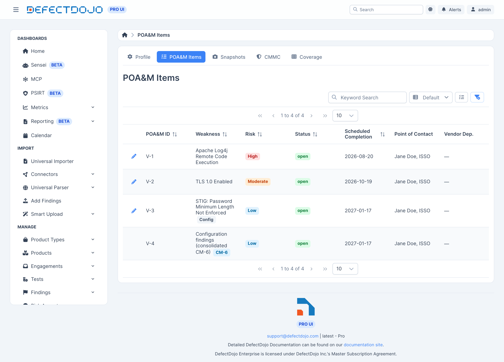
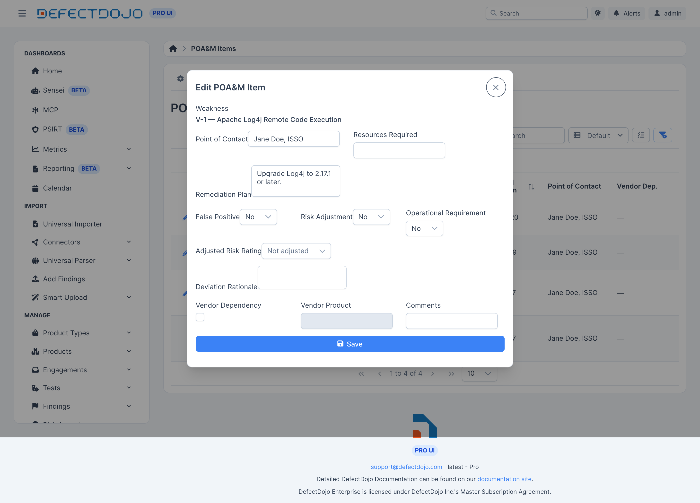

POA&M 条目会根据发现项自动创建和更新。同步会在导入和发现项变更后不久运行，每晚还会执行一次扫尾任务，捕获遗漏的内容。对于没有任何扫描器报告的弱点，您也可以手动添加条目。

## 台账约定

该台账遵循 FedRAMP 的约定：

* **编号稳定。** 每个条目在其所属系统内都保留一个序号，且编号永不重复使用。
* **同类发现项合并。** 同一个 CVE 出现在多台主机上时会合并为一个条目，其中列出每个受影响的资产。
* **配置类发现项可以合并到 CM-6 下**，而不是让台账中充斥着按每条基准规则各生成一个条目的情况。在上方截图中，`V-4` 就是这样一个合并后的条目。
* **已结条目不会重新打开。** 如果同一弱点再次出现，台账会打开一个引用旧条目的新条目，从而保持您的整改历史完整无缺。

## 编辑条目

点击任意一行上的铅笔图标，即可打开该条目进行编辑。

在这里，您可以设置联系人、所需资源和整改计划，并记录任何偏差。

### 偏差

每个条目上的偏差以三个独立状态进行跟踪：

| 偏差类型 | 取值 |
| --- | --- |
| False Positive（误报） | No、Pending 或 Yes |
| Risk Adjustment（风险调整） | No、Pending 或 Yes |
| Operational Requirement（运营需求） | No、Pending 或 Yes |

每种偏差都共用一个 **Deviation Rationale**（偏差说明）字段。风险调整还会在原始评级之外额外记录 **Adjusted Risk Rating**（调整后风险评级），两者都会出现在生成的交付物中。

### 供应商依赖

对于您无法直接整改的弱点，条目可以带有 **Vendor Dependency**（供应商依赖）标记和 **Vendor Product**（供应商产品）名称。您上次与供应商沟通的日期也会随条目一起被记录。

## KEV 跟踪

与 CISA 已知被利用漏洞（Known Exploited Vulnerability）相关联的条目会带有 KEV 截止日期。该日期同时也是整改截止时间的上限——参见[整改截止时间](../remediation_slas)。

## 里程碑

里程碑带有描述信息以及计划日期和完成日期，会同时出现在 Excel 和 OSCAL 输出中。它们通过合规 API 进行管理，而不是在条目表单上管理。

## 手动添加条目

为没有任何扫描器报告的弱点添加条目。手动创建的条目与同步生成的条目行为一致：它们会获得下一个序号，可以设置偏差和里程碑，并出现在下一份快照中。

## 可审计性

POA&M 条目、里程碑和偏差记录均处于审计历史之下。每次变更都会记录操作人、操作内容和操作时间。
