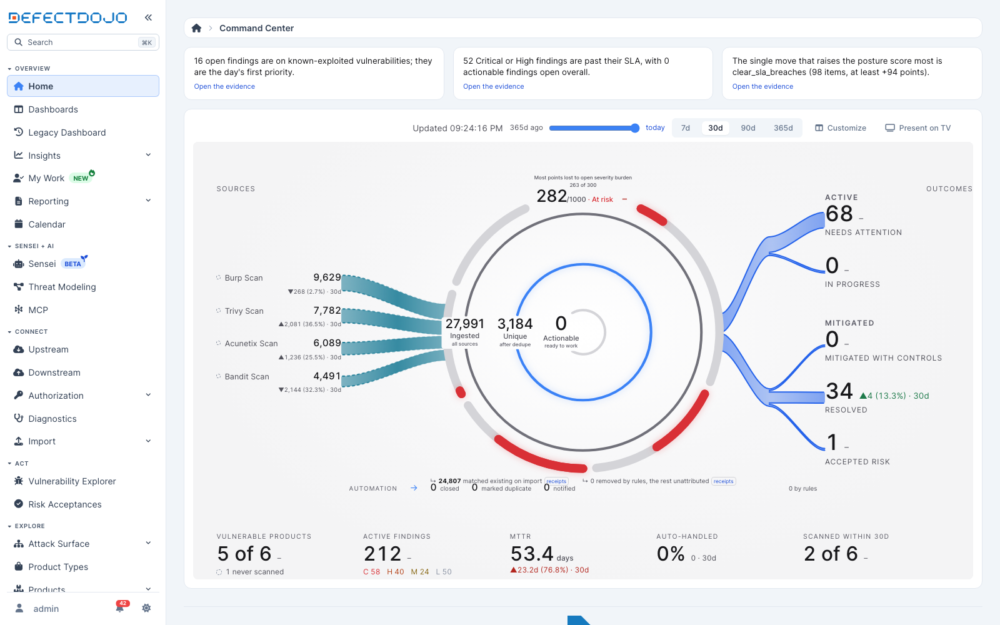

Note: the Command Center is a DefectDojo Pro feature in beta. It builds on [Customizable Dashboards](../custom-dashboards/) and is off by default. A superuser can turn on the <b>command_center</b> flag from <b>Settings &gt; Feature Flags</b> (it requires the <b>dashboard_v2</b> flag).

The Command Center is one composed screen that answers, in fixed zones, **what's on fire**, **are we winning**, and **is the machine healthy**. Sources stream in from the left, the flow narrows through three numbers wrapped in the posture score, and the outcomes fan out on the right, with the numbers a leader asks for along the bottom. Behind it sits the same dashboard system as [Customizable Dashboards](../custom-dashboards/): a customizable grid preset, new widget types, and the [dashboards REST API](../custom-dashboards-api/), so everything the scene shows can also be laid out, shared, cloned and exported your own way.

> **💡 Tip:** In DefectDojo Pro, **Assets** were formerly called **Products** and **Organizations** were formerly **Product Types**. The UI follows your instance's naming setting.

## The scene

With the flag on, **Home** lands on the scene at **Dashboards > Command Center**. It is read left to right:

* **The brief**: up to three grounded sentences as outlined cards across the top of the scene itself, every card a door to its evidence. When nothing changed since the previous snapshot, the row says so.
* **Sources**: one row per scanner or connector with its volume in the window, its state, and its change against the previous window. Each row stacks its volume over the tool's name, right-aligned to a gap before its ribbon, inside a faint dashed, unfilled box under a bold **Top sources** title (the rail keeps the twelve largest sources and folds the rest into one row), mirroring the two family boxes on the right. Each ribbon is a dashed line of short, rounded dashes, every line the same weight (volume is carried by the beam's glow, below), dim neutral gray on the sources side (raw volume is not a signal), the accent blue on the outcomes side. A source that has stopped reporting draws as dashes that fade along their length; a source whose last run failed fades in the down color, and a source with failed imports draws in the warning color. The screen shows when it is blind rather than letting silence read as clean.
* **The flow**: three nested rings for **ingested**, **unique after dedupe** and **actionable now**, sized by the square root of their counts so a dominant stage does not blank the others, with the 0 to 1000 [posture score](../posture-score/) as the outer ring. The score ring is split into its five published components, each a band outlined at full strength over a translucent fill (the way the Insights charts draw a bar), gray for the component's full weight and the band color for the points it earned, with the value and its 30-day change on the rim. Each component's caption follows its arc just outside the ring, points earned over weight then its name ("37/300 open severity burden"), so the whole formula reads around the ring. The screen carries two continuous motions and no more: the slow breath of that ring (its glow and the ground behind it swell and settle with it), and a beam through the ribbons, from the sources into the ring and out to the outcomes, the way the data itself moves. The beam is a lit window that sweeps the stage left to right once every few seconds: as it passes, each line's own dashes brighten (white on the sources side, the accent's bright tone on the outcomes side) under a glow, then settle back to dim. Nothing is added to the line; the line itself lights up. Volume is the glow: the line carrying the most on its side burns widest and brightest as the beam passes, a line carrying a tenth of that barely warms, and a source with nothing in the window, or one whose last run failed, carries none. Each ring carries a second line saying what it counts: **all sources**, **after dedupe**, **ready to work**. A ring whose count is zero draws quiet in the track color rather than glowing as if it carried volume, and hovering a source in the rail lights that source's share of the ingested ring as an arc. The score names its band next to the value (Strong, Needs attention, At risk) and, above it, the component costing it the most points. When the scene arrives, and whenever the window, scope or replayed day changes, the counts ease to their values and the rings and ribbons grow into shape rather than jumping (a source that leaves the window counts down and goes, one that arrives counts up, and a window with no imports says so in the sources rail); the heartbeat and the flow are the only continuous motion, and a reduced motion preference snaps the transitions and turns both off.
* **Receipts**: the two gaps in the flow are itemized under the rings. "Matched existing on import" is the importer's own dedupe and opens the import receipts export; "removed by rules" opens the rules receipts. When the ledgers describe different populations the remainder reads "unattributed", never an invented number.
* **Automation**: a card in the strip. Its number is the share of work the rules handled; under it, what the rules engine did in the window, by action (closed, marked duplicate, status changed, updated, created, reopened, notified), each a door to the rules receipts for that action, and the total by rules. "Marked duplicate" counts rules that marked a finding as a duplicate; the importer's dedupe is not a rule action and shows under the rings as matched existing on import, so the two numbers are different ledgers and are not expected to agree.
* **Outcomes**: **Needs attention** (open, past SLA, Critical or High, plus any open known-exploited finding), **In progress** (under review, with a claimed review, or with a ticket), **Mitigated with controls** (risk acceptances with a Mitigate decision), **Resolved** (mitigated in the window), and **Accepted risk**, which carries a clock: how many acceptances expire within 30 days and how many are already past their date and unhandled, in the warning color, never severity red. The five read as two families first, **Active** (Needs attention, In progress) and **Mitigated** (Mitigated with controls, Resolved, Accepted risk): each bucket has its own ribbon from the ring, and each family sits in its own dashed, unfilled box on the stack, headed, with the ribbons ending where the box begins, and with the family's findings by severity as a row of tags gathered at the foot of the box (a union counted once, so a finding that is both past SLA and under review counts one). Severity is always drawn the same way on this screen: the first letter in a small tag of the severity's color (Low in the blue the rest of the app gives it), the count beside it in plain text. Counts start a gap after the ribbons end, under an Outcomes title centred on the stack. The headings carry no number, because a sum would mix findings with acceptances and would have no single list to open.
* **The strip**: five outlined cards: vulnerable assets (with never-scanned assets as their own hollow segment, never green and never merged with zero findings), active findings with severity chips, median time to remediate, automation (above), and assets scanned within 30 days.

Every number on the screen carries a delta against the previous equivalent window, and every number is a door. Every delta names its window. A number the ledgers cannot support is a dash, never a zero.

### Every number is a door

Clicking a number lands on the matching list with the filter chips visible, so what you see is exactly what the number counted. Hovering (or focusing with the keyboard) shows how a number is made up; the parts are doors too. The rings are one keyboard group: up and down move between them, Enter opens.

| Door | Lands on | With these chips |
|---|---|---|
| A source | Findings | the tool, the window's discovery dates |
| Ingested, Unique | Findings | the window's discovery dates (Unique adds not duplicate) |
| Actionable | Findings | active, not duplicate, not false positive, not out of scope, not risk accepted, not mitigated; risk Urgent or Needs Action; the window |
| Matched existing, removed by rules, the automation counts | Receipts export | the scene's window, over what you can see (a rule action narrows the rules receipts) |
| The score ring | Why this score | the component breakdown and the counterfactual levers |
| Needs attention | Findings | active, past SLA, severity Critical or High (the known-exploited half is its own door) |
| In progress | Findings | active, under review (claimed and ticketed are their own doors) |
| Mitigated with controls, Accepted risk | Risk acceptances | decision Mitigate or Accept; the expiry clock adds the expiration dates |
| Resolved, MTTR | Findings | mitigated, with the window's mitigation dates |
| Vulnerable assets, never scanned, scanned within 30 days | Assets | findings count at least one; never scanned; last scanned after the window start |
| Active findings and its severity chips | Findings | active, not duplicate (plus the severity) |

### Window and history

The scene always shows what you are authorized to see, so every door lands on a list that adds up to its number. The list's breadcrumb says where you came from and what you are looking at: **Command Center** (a link back to the scene) then the door's own words, with the scene's window spelled out ("New findings in the last 30 days"). The window picker sets 7, 30, 90 or 365 days; every number and every delta follows it. The history scrubber replays any day in the last year from the daily snapshot ledger: drag it, or press left and right, and the whole scene re-renders as of that day with a badge saying so. A day the ledger reconstructed rather than observed is marked "reconstructed, no live state", and the parts of the screen the ledger did not carry that day read as dashes. Today is the live end stop. These settings are remembered per browser; they are never part of the page address.

### The customizable grid

The grid preset that used to be called Command Center is now **Command Center (custom)**: the same starter layout, with its widgets, that you can clone and rearrange. **Customize** in the scene header opens it, and it stays under **Dashboards** in the sidebar. Its "Within SLA" gauge has become a big KPI of the SLA breach count, in line with the design rule that the Command Center uses no gauges.

## The preset family

Turning the flag on publishes four seeded, cloneable layouts under the **Command Center** group of the Shared Templates picker:

* **Command Center (custom)** (the starter): the customizable grid behind the scene. Existing users keep their current dashboards and defaults, and can clone it whenever they like.
* **Exec Brief**: the board-facing view. The posture score with its why panel, the quarter's trajectory, risk acceptance debt, fix durability, and a fairness-normalized team scorecard.
* **Ops Triage**: queue first. Your work, what breaches next, this week's intake funnel, live activity, backlog aging.
* **Platform Health**: the machinery deep dive. The pipeline funnel at full width, the sensors rail, automation throughput, coverage freshness, license headroom.

With the flag on, the sidebar **Home** entry lands on the scene, **Dashboards** opens the customizable grids, and the classic dashboard stays reachable as **Legacy Dashboard** while your team migrates.

## The daily snapshot backbone

Every Command Center trend reads from an append-only daily snapshot table that the nightly rollup writes: open findings by severity, SLA state (a five-state model that distinguishes "resolved late" from "still open and late"), the dedupe funnel's flows, scan freshness, automation counts, and the posture score's full input vector. History is kept indefinitely, and a backfill command reconstructs what the ledgers can honestly support so trendlines are not empty on day one. Reconstructed periods are labeled as such; nothing is interpolated or fabricated. Trend charts also carry event markers (a scanner onboarded, an SLA policy change, a score model version change) so a step in a line is never mistaken for a posture change.

## The pipeline funnel, with receipts

The centerpiece widget shows what the platform did with everything your tools submitted, in five exact stages: **ingested**, **unique after dedupe**, **after rules and triage**, **prioritized**, and **actionable now**. Every gap between stages is itemized from a ledger (matched dedupe outcomes, rule actions, the manual remainder), every stage clicks through to the exact findings list behind it with the filter chips visible, and the **receipts export** downloads the raw evidence rows: which findings each stage dropped, and why. It is compliance evidence, not a marketing percentage.

## Honest coverage

The coverage freshness widget buckets assets by days since their last scan, with **never scanned** as its own visually distinct state. Never scanned is not zero findings, and neither is ever rendered green. An optional matrix breaks freshness down by scan type.

## TV / wall mode

The scene, any dashboard, or a playlist of several can run full screen on a wall monitor: open the **Present on TV** dialog from the scene header or the dashboard toolbar, pick what the wall should show (the scene is offered first) and the cadences, and bookmark the generated URL on the wall box. On the wall the scene fills the screen with the brief line above it, at a type size meant to be read from across a room. The kiosk auto-cycles with a dwell indicator, refreshes data on its own cadence, pins the wall for 90 seconds when a new Critical arrives, reloads itself every 8 hours, shows when its numbers were last true, and says so plainly when the connection is lost. Sign the wall box in as a dedicated read-only user: the screen shows exactly what that user is authorized to see, and nothing more.

## The scheduled executive pack

From the same toolbar you can schedule the **executive posture pack**: a server-rendered PDF (or HTML) of the score with its component breakdown, the funnel, current pressure numbers, and coverage honesty, generated on your cadence and delivered as a link to Generated Reports. Authorization is enforced again at download time, the pack's numbers come from the same snapshot ledger as the screen, and disabling the schedule is one toggle.

## New widget types

The Command Center adds thirteen widget types to the catalog, each wired to real tables and available on any layout: Big KPI, Posture Score, Pipeline Funnel, Coverage Freshness, Ingest Health, Automation Rate, Threat Pulse, Risk Acceptance Debt, Fix Durability, Top Fixes, Morning Brief, Team Scorecard, and Insights Plot. Four existing widgets gained modes: MTTR/MTTD (survival curve), SLA Burndown (five-state model), Recent Activity (live feed), and KPI/Trend (snapshot-backed deltas). Details and configuration schemas are discoverable at `GET /api/v2/dashboards/widget_catalog/`.

**Insights Plot** puts a chart from the Insights pages onto a dashboard. Pick the plot and a window in the widget's settings. Every chart in the report chart catalog is available, plus average EPSS score by tool, which is an Insights view with no report equivalent. These run the same aggregation as the matching Insights chart rather than a dashboard-side copy of it, so the two screens cannot report different numbers for the same window, and both are scoped to the findings you are authorized to see. Because the same catalog backs the [Report Builder](../../reports/report-builder/) chart blocks, a chart can also be copied between a dashboard and a report.

The posture score's scale, weights, and versioning policy are published: see [Posture Score](../posture-score/).
