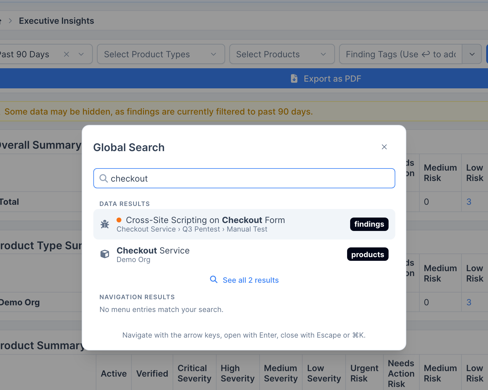

DefectDojo Pro includes a **global search** that looks across your Findings and related objects. It is backed by native Postgres full-text search with fuzzy, typo-tolerant matching, so you can find an object without remembering its exact wording.

The dialog has two modes, shown in the pill above it and switched with **Tab**:

- **Search** finds your records (findings, assets, engagements and the other types listed below) and ranks the strongest page matches in with them.
- **Navigate** finds pages only: every menu destination your account can reach, searchable by label, position and related vocabulary. It never queries your data. See [The Sidebar Menu](/navigation/pro__sidebar/) for how pages rank and what they cover.

The text you typed stays when you switch, so typing `risk`, pressing **Tab**, then **Enter** opens Risk Acceptances.

## Running a search

- **Open the dialog**: select the **Search** field at the top of the sidebar, press **Cmd+K** (Mac) or **Ctrl+K**, or (with the sidebar collapsed) the magnifying glass under the logo. It always opens in Search mode on the **All** tab.
- **Pick a type**: the tabs under the input narrow Search to one object type (Findings, Assets, Organizations, Engagements, Tests, and Locations or Endpoints). In Navigate mode the tabs are the sidebar's top-level sections. Typing `in:findings` (or `in:assets`, `in:tests` and so on) followed by a space sets the type the same way; press **Backspace** in an empty input to go back to All.
- **Read a row**: each result is one line with its icon, its title (matched words in bold), its context (for example the Asset a Finding belongs to) and how recently it changed (Today, Yesterday, Past week, Past month, Past year or Over a year; hover for the exact time). Findings also show their severity.
- **The All list**: exact hits come first (a title that is exactly the query, or `#123` for the Finding with ID 123), then the other matches, at most four of each object type, with up to three pages whose name matches.
- **Recent places**: with nothing typed, the dialog lists the places you went recently, both records opened from search and pages. In Navigate mode it lists your pinned pages first. Recents are kept in your browser, separately for each user, and cleared when you log out.
- **Full results page**: select **See All *N* Results** at the end of the list to open the full results page. This is a single, sortable, filterable table of every match across all object types.

### Keyboard and row actions

| Key | Action |
| --- | --- |
| **Up** / **Down** | Move through the results |
| **Left** / **Right** | Change the type tab |
| **Tab** | Switch between Search and Navigate |
| **Enter** | Open the selected result |
| **Cmd+Enter** / **Ctrl+Enter** | Open the selected result in a new browser tab |
| **Option+Enter** / **Alt+Enter** | Open the row actions menu |
| **Esc** | Close the dialog |

Results are ordinary links, so a middle-click or a **Cmd**/**Ctrl**-click also opens a new tab. The row actions menu (also on the **...** button of the selected row) offers **Open**, **Open in New Tab**, **Copy Link**, **Copy ID** for records, and **Pin to Sidebar** or **Remove Sidebar Pin** for pages.

Results are always **scoped to what you are authorized to view**: global search never surfaces objects you would not otherwise have access to. (Finding Templates are the one exception: like elsewhere in DefectDojo, they are visible to any signed-in user.)

## What you can search

Global search covers these object types:

| Object type | Notes |
| --- | --- |
| **Findings** | |
| **Assets** | (Assets) |
| **Organizations** | (Organizations) |
| **Engagements** | |
| **Tests** | |
| **Endpoints** *or* **Locations** | Whichever your instance uses. Instances with [Locations](/asset_modelling/locations/pro__locations_overview/) enabled search Locations; others search Endpoints. |
| **Finding Templates** | |
| **Technologies** | |
| **Vulnerability IDs** | e.g. CVEs |

For most types, search matches against the object's **name/title and description**. For Findings, Assets, Engagements, and Tests, it also matches **tags** (by prefix). Vulnerability IDs match on the ID value itself.

## Query syntax

### Free text

Type any keywords to search everything at once. Matches are ranked by relevance, with title/name hits ranked above description hits. Fuzzy matching (see below) means close-but-not-exact terms still match.

### Quoted phrases

Wrap a phrase in double quotes to keep it together: `"space inside"` is treated as one term rather than two keywords.

### Operators

Prefix a term with an operator (`operator:value`) to narrow the search. Supported operators:

| Operator | What it does |
| --- | --- |
| `finding:` `product:` `engagement:` `test:` `template:` `technology:` | Scope the search to a single object type and search it for the value (e.g. `finding:sqli`). |
| `id:` | Look up a Finding by its numeric ID (e.g. `id:12345`). |
| `endpoint:` | Find Findings whose endpoint/location host contains the value. |
| `vulnerability_id:` | Exact match on a Vulnerability ID. Accepts a comma-separated list, and can be repeated (e.g. `vulnerability_id:CVE-2020-1234,CVE-2018-7489`). |
| `tag:` / `tags:` | Match objects by tag. `tag:` matches a single tag by substring; `tags:` matches any tag in a list. |
| `test-tag:` `engagement-tag:` `product-tag:` (and their `-tags` plurals) | Match by a tag on the related Test, Engagement, or Asset rather than on the object itself. |
| `not-tag:` `not-tags:` (and the `not-…-tag` relation variants) | Negate any of the tag operators above to **exclude** matches. |

You can combine operators with free-text keywords in the same query.

Only the operators listed here are read as operators. Anything else containing a colon, such as a pasted URL or a `host:port` value like `db.internal:5432`, is searched as ordinary text.

### Fuzzy matching

For queries of **three or more characters**, global search also does trigram (word-similarity) matching. This tolerates typos and finds terms **inside** longer dotted or hyphenated values. For example, `internal` matches `api.internal.example.com`.

## Filtering and sorting the results page

On the full results page, the columns can be filtered and sorted independently of the query text. Filter by **object type**, **severity**, **title**, or **context**, and sort by any column. These are separate from the `operator:` syntax above and apply to the merged results table.

## Result limits

- The full results page is **paginated** (25 rows per page by default).
- Each object type contributes up to a **maximum number of matches** per search (**100** by default). When more matches exist than are shown, the results are flagged as truncated; narrow your query to see the most relevant hits.
- The dialog shows a smaller preview (at most 12 rows, and at most four per object type on the All tab) with the total count, so **See All *N* Results** always reflects the true totals.
