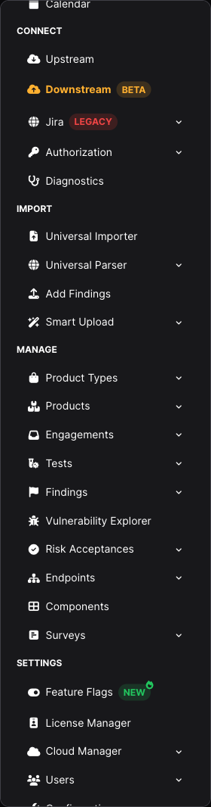
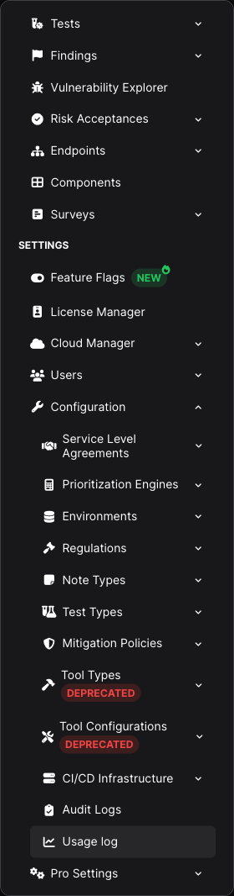

Le voci nella barra laterale di DefectDojo Pro possono avere un piccolo tag colorato. Ciascuno risponde a una domanda diversa sulla funzionalità accanto a cui si trova, e due di essi sono link.

| Badge | Colore | Significato | Cosa richiede |
| --- | --- | --- | --- |
| `NEW` | Verde | Rilasciato di recente | Niente — serve solo a far notare la funzionalità |
| `BETA` | Arancione | Funzionante, ma ancora in fase di completamento; il comportamento può cambiare tra una release e l'altra | Provarla, e aspettarsi qualche imperfezione |
| `LEGACY` | Rosso | Sostituita da una funzionalità più recente, senza una data di rimozione annunciata | Preferire la sostituzione per i nuovi lavori |
| `DEPRECATED` | Rosso | Prevista la rimozione in una release specifica | Effettuare la migrazione prima di quella release |

## LEGACY e DEPRECATED non sono la stessa cosa

La distinzione è intenzionale, perché i due stati richiedono risposte diverse.

**`DEPRECATED`** significa che è stata annunciata una rimozione. Passando il mouse sul badge viene indicata la release in cui la funzionalità verrà rimossa, e facendo clic su di esso si apre l'avviso di deprecazione:

> \<Feature\> is deprecated and will be removed by \<release\>. Click for the deprecation notice.

**`LEGACY`** significa che la funzionalità è stata sostituita, ma non è stata pianificata alcuna rimozione. Nel testo al passaggio del mouse non compare volutamente alcuna data, perché inventarne una sarebbe peggio che non dirne nessuna. Al suo posto viene indicato il nome della sostituzione, con un link alla relativa documentazione:

> \<Feature\> is superseded by \<replacement\> and will not receive new development. Click for its documentation.

Una funzionalità `LEGACY` continua a funzionare e a ricevere correzioni. Semplicemente non riceverà nuove capacità, quindi qualsiasi cosa si costruisca ora è meglio costruirla sulla sostituzione.

Entrambi i badge sono link, perché un tooltip si chiude nel momento in cui il puntatore lo lascia, e quindi non può contenere un link cliccabile. Facendo clic su uno dei due badge si apre il relativo avviso in una nuova scheda; non si naviga alla voce di menu sottostante.

## Cosa ha attualmente un badge

**`LEGACY`**

* **Connect > Jira** — l'integrazione Jira originale per singolo prodotto, sostituita dal connettore downstream per Jira. Vedere [Integrazioni Pro](/connectors/downstream/about/).

**`DEPRECATED`**

* **Settings > Configuration > Tool Types**
* **Settings > Configuration > Tool Configurations**

Entrambe verranno rimosse nella versione **3.5.0**, insieme ai parser basati su API (pull) che servono a configurare. Le [note di aggiornamento alla 3.2](/releases/os_upgrading/3.2/) spiegano verso cosa effettuare la migrazione ed entro quando.

Quando un'etichetta e il relativo badge non stanno affiancati nella barra laterale, il badge va a capo su una riga propria sotto l'etichetta, invece di essere troncato.

## Correlati

* [Note di aggiornamento alla 3.2](/releases/os_upgrading/3.2/) — le deprecazioni attuali e la relativa release di rimozione
* [Feature Flags](/admin/feature_flags/pro__feature_flags/) — attivare e disattivare le funzionalità opzionali, incluse quelle in beta
