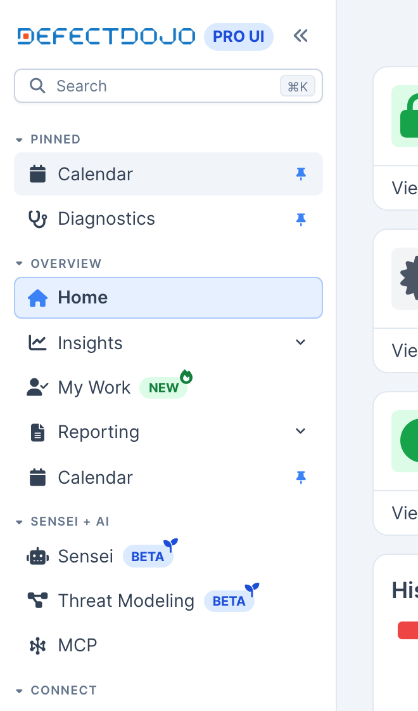
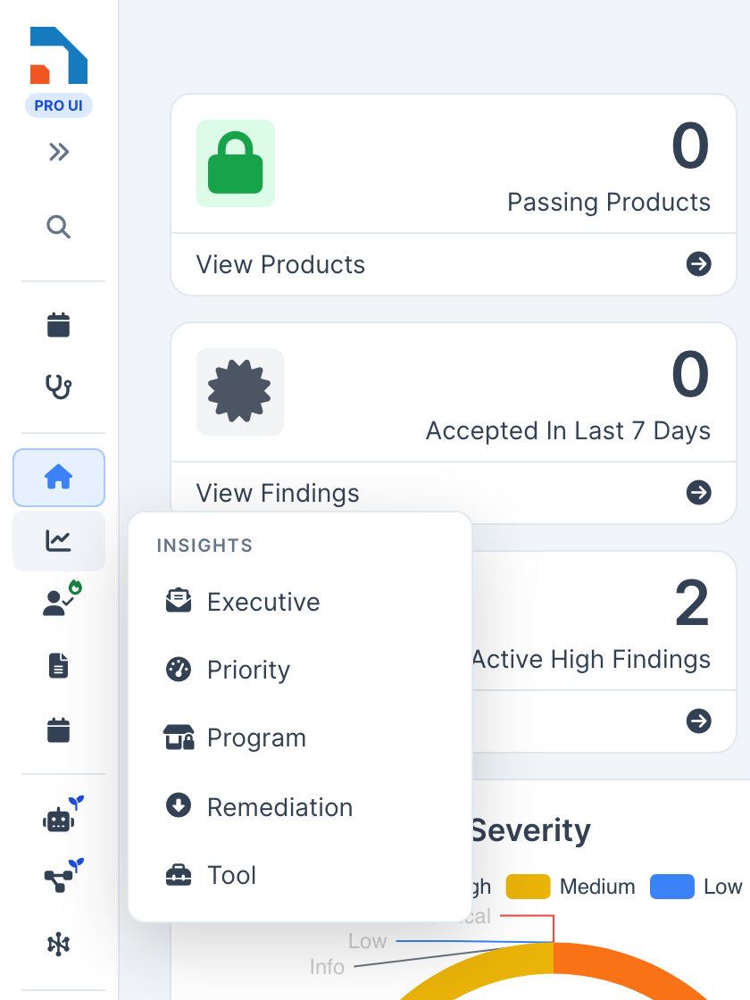

The DefectDojo Pro sidebar is the application shell: it runs the full height of the window and carries the brand, the search field, the menu, and (at the bottom) your account, alerts and the light/dark switch. There is no separate top bar on desktop; on phones and small windows the sidebar becomes a drawer behind a top-bar menu button.

The menu groups every page in the product into five sections, ordered by how the product is used rather than by how its data is structured. The views you open to find work come first; the record catalogs you drill into sit behind them. This layout is the default on every instance from DefectDojo Pro 3.2.200 onwards. An administrator can switch back to the previous layout at any time (see [Switching layouts](#switching-layouts)).

Either way, **every page keeps the same URL**. Bookmarks, saved links and anything in your own runbooks continue to work regardless of which layout is active.

## The five sections

| Section | What it holds |
| --- | --- |
| **Overview** | Dashboards, Insights, My Work, Reporting, Calendar |
| **Sensei + AI** | AppSec, CSPM, Threat Modeling, MCP, AI Model Settings |
| **Connect** | Upstream, Downstream, Jira, Authorization, Diagnostics, Import |
| **Act** | Triage Engine, Vulnerability Explorer, Root Causes, Risk Acceptances, PSIRT, Explore |
| **Settings** | All Settings, plus the eight groups described under [The Settings section](#the-settings-section) |

You only ever see the entries your account has permission to open, and a group disappears entirely when none of its pages are available to you.

## Searching

The **Search** field at the top of the sidebar, and **Cmd+K** (Mac) or **Ctrl+K** anywhere, open one **Global Search** dialog with two kinds of results:

- **Data Results**: your records (findings, assets, engagements and the rest), through the same engine as the full results page. **See all results** at the bottom opens that page. See [Global Search](/navigation/pro__global_search/).
- **Navigation Results**: every menu destination your account can currently reach.

Navigation results match more than the entry's label. Each destination is also searchable by its position in the menu and by related vocabulary, so `finding` surfaces **Findings > All** even though the entry itself is labelled "All", and `sso` surfaces the authorization providers. Each result shows where the entry lives in the menu and a one line description of the page.

Before you type anything, the dialog offers your **recent destinations**: the last few menu pages you visited (excluding the one you are on), one **Enter** away. Recents are remembered per browser.

Move through results with the arrow keys, open one with **Enter**, and close the search with **Escape**. Entries that open in the Classic UI are marked and open in a new tab. The search only ever lists pages you could also reach through the sidebar: permissions, feature flags, and license entitlements apply to it identically, and it follows whichever menu layout is active.

Three conventions run through the whole menu:

- **There are no separate "New" entries.** Each list page has a **New** button that opens the create form, so the menu carries one entry per catalog instead of two. If your account can create a record but not list them, the menu entry takes you straight to the create form.
- **Nothing nests more than one level below a section.** Reaching a page is at most section, group, page.
- **A feature occupies one entry, not one per screen.** PSIRT's nine pages, the Triage Engine's four and the record catalogs all sit behind a single entry each, instead of spreading across the menu.
- **An entry is not repeated inside itself.** Where a group already names the thing, its entries do not name it again: **Findings** holds Active, Mitigated and All rather than "All Findings", and **Attack Surface** holds Endpoints and Hosts rather than "All Endpoints".

## Pinned pages

Hover any page row (in the sidebar, in a collapsed-rail flyout, or in a Global Search result) and a pin appears at its end; on touch screens the pin always shows. Pinning a page adds it to a **Pinned** section at the very top of the menu, which exists only while you have pins. A pinned row is the real menu entry, so its badge, its permissions, and the active highlight all keep working, and a page you lose access to simply stops appearing without losing its pin. The pin stands upright on rows that are pinned; select it again to unpin.

Pins are stored per user on the server, so they survive a browser reset and follow you across machines. When the **Restrict Layout Customization** switch is on (see [UI Defaults](#ui-defaults)), pins count as layout customization: only superusers can change them, and everyone else sees their existing pins read-only.

## Your preferences follow you

The shape you give the shell is stored per user on the server, not just in the browser: pinned pages, folded sections, whether the rail is collapsed, and the light/dark choice (which is shared with the Classic UI, so the two interfaces always agree). Clearing your browser or signing in on a new machine brings it all back on the next sign-in. The first time you sign in on an instance that has this, whatever shape your browser already had is imported automatically, so nothing resets.

## Collapsing the sidebar

The chevron beside the logo, or **Cmd+B** (Mac) / **Ctrl+B**, collapses the sidebar to a slim icon rail and back. Your choice is remembered across reloads. On desktop windows narrower than 1200px the rail starts collapsed to leave room for content; widening the window brings your stored preference back. (Cmd+B is ignored while you are typing in an editor, where it means bold.)

While collapsed:

- Rows show only their icon. Hovering a page shows its name (and its badge, if it carries one) as a tooltip.
- Hovering or selecting a **section** opens its entries in a flyout panel beside the rail. The panel is fully keyboard-driven: selecting a section moves focus into it, the arrow keys walk the entries, **Enter** opens one, and **Escape** closes the panel and puts focus back where it was.
- The icon of the section holding your **current page** stays highlighted, and the flyout marks the exact row, so you never lose your place.
- Badges shrink to small marks on the row icon: the `NEW` flame, the `BETA` seedling, and a padlock for license-locked entries. See [Menu Badges](/navigation/pro__menu_badges/).
- The magnifying glass under the logo keeps a mouse path to [Global Search](#searching); the keyboard shortcut works as always.

The rail also follows your page as you navigate: opening a page that lives inside a menu group opens that group (expanded) or lights its section (collapsed), including when you arrive from a bookmark or a link.

## Sensei + AI

The AI capabilities sit together in their own section rather than being spread through the dashboards.

**AppSec** is the Sensei code security capability, and was previously listed simply as **Sensei**. The page and its URL are unchanged. The name changed because Sensei now covers more than one capability, so the entries beside it name what each one does.

**CSPM** carries a gold `SOON` badge. Cloud security posture management is not available yet, so the entry does not open a page. Selecting it explains that the capability is on the way. Nothing needs enabling, and no license unlocks it early. The entry starts working when the capability ships.

**Threat Modeling**, **MCP** and **AI Model Settings** are unchanged apart from where they live. AI Model Settings appears only on on-premise instances, because DefectDojo manages the model credentials on Cloud.

## Act

Act holds the work: the things you open to decide what matters, and the records behind them. The **Triage Engine**, the **Vulnerability Explorer**, **Root Causes**, **Risk Acceptances** and **PSIRT** come first, and the record catalogs sit behind a single **Explore** entry. That ordering is deliberate: the Organization to Finding chain is how DefectDojo stores your data, but it is not how most people navigate to the work in front of them.

### Triage Engine

One entry covering both rules engines, named for what it does rather than how it does it. It holds Rules, Runs and Deliveries. When both engines are turned on, the classic engine appears as **Classic Rules** with a `LEGACY` badge linking to the conversion guide; when only one is on, only its pages are listed and no badge appears.

### Risk Acceptances

A top-level entry rather than a page inside Findings. A risk acceptance is a decision with an owner, an expiry and an approval trail, so it is a record in its own right. **Risk Accepted**, inside Findings, is the separate thing: the state a finding is in once an acceptance covers it.

### PSIRT

Product Security Incident Response, with its nine pages in three groups, ordered the way the work is done:

| Group | Pages |
| --- | --- |
| **Sources & Inventory** | Import SBOM, Advisory Feeds, Components, Matching Rules |
| **Triage** | Feed Findings, Cases, Advisories |
| **Configuration** | SLA Policies, PSIRT Settings |

Setup leads because nothing reaches the triage queue until there is an inventory to match against: import an SBOM, choose the publishers to poll, look at what came in, then tune matching for advisories that publish nothing machine-readable to compare. The entry carries a `BETA` badge, or a `LOCKED` one if your licence does not include the PSIRT Advisory Engine. See [Menu Badges](/navigation/pro__menu_badges/).

### Explore

The record catalogs, behind one entry: **Attack Surface**, Organizations, Assets, Engagements, Tests, Findings and Surveys.

**Attack Surface** gathers the three entries that used to answer the same question, which is where a finding lives. It holds Components, plus either the endpoint pages or the location pages depending on whether your instance uses Locations.

## Connect

Connect answers what is connected to this instance and whether it is working. **Upstream** and **Downstream** are the connectors; **Import** now sits at the bottom, holding Add Findings, Smart Upload, Unassigned Findings, the Universal Importer and the Universal Parser. These were previously a separate Import section, which split scanning tools across two places depending on whether findings arrived by connector or by upload. It sits last because the connectors are the standing, automatic path, and a manual upload through the browser is the exception.

**Smart Upload** and **Unassigned Findings** can be removed from this group with the **Smart Upload** feature flag, which is on by default. Turning it off hides both entries and changes nothing else; findings already imported through Smart Upload are unaffected.

## The Settings section

Settings is divided into eight groups, named for what you are trying to do rather than for the part of the system involved.

| Group | What it holds |
| --- | --- |
| **System** | System Settings, Appearance, Announcement Banner, Login Banner, E-mail |
| **UI Defaults** | Form Configuration, Layout Defaults |
| **Users & Permissions** | Users, Groups, Roles |
| **Finding Workflow** | The three Deduplication pages, Finding Enrichment, Service Level Agreements, Prioritization Engines, Mitigation Policies |
| **Configuration** | Environments, Regulations, Note Types, Test Types, CI/CD Infrastructure, Tool Types, Tool Configurations |
| **Notifications** | Notification Events, Notification Webhooks |
| **Operations** | Audit Logs, Usage Logs, Schedules, Celery Status, and on DefectDojo Cloud, Message Portal, Firewall Rules, Maintenance Windows |
| **License & Support** | License Manager, Version Manager, Contact Support |

**Feature Flags sits above the groups**, directly under All Settings, rather than inside any of them. It is the page administrators open most often, and it reads alongside All Settings: one lists what exists, the other controls what is switched on. It is still filed under System in the All Settings directory.

### All Settings

The first entry in the section, **All Settings**, opens a directory of every settings page your account can reach, arranged in the same groups as the menu and searchable by name or by what the page does. Searching `deduplication` finds the three deduplication pages *and* System Settings, because System Settings holds deduplication options too.

The last category, **Elsewhere in the app**, lists pages that configure DefectDojo but live in other sidebar sections: the authorization providers, Login and MFA settings, Jira instances, the Upstream and Downstream connectors, and the Universal Parser. Each tile is chipped with the section it belongs to.

### UI Defaults

The **UI Defaults** group collects the settings that control how much of the interface each person can tailor:

- **[Form Configuration](/navigation/pro__form_configuration/)**: choose which fields the create and edit forms show and require, and whether the Optional Fields panel starts expanded.
- **Layout Defaults**: the **Restrict Layout Customization** switch, plus the global defaults designated for dashboards, [page layouts](/navigation/pro__page_layouts/), and table views. With the switch on, only superusers can create or change dashboards, page layouts, table views, and [pinned sidebar pages](#pinned-pages); everyone else is shown the designated defaults, or the built-in defaults when none are chosen. Personal layouts saved earlier are kept and reappear if the switch is turned back off. You choose each default from a dropdown of the layouts an administrator has shared, or designate one in context (a shared dashboard's Manage dialog, a view page's layout menu, or a table's Views menu).

## What moved

If you are used to the previous layout:

| Previously | Now |
| --- | --- |
| Dashboards | Overview |
| Dashboards → Sensei | Sensei + AI → AppSec |
| Dashboards → Threat Modeling / MCP / AI Model Settings | Sensei + AI |
| Dashboards → PSIRT Feeds, and the eight other PSIRT entries | The PSIRT section |
| Dashboards → Metrics | Overview → Insights |
| Dashboards → Reporting → Report Templates → All / New | Overview → Reporting → Report Templates |
| Import → *(whole section)* | Connect → Import *(last entry)* |
| Import → Smart Upload → Add Findings | Connect → Import → Smart Upload |
| Manage | Act |
| Manage → Endpoints / Locations / Components | Act → Explore → Attack Surface |
| Manage → Organizations / Assets / Engagements / Tests / Findings / Surveys | Act → Explore |
| Manage → Risk Acceptances | Act → Risk Acceptances |
| Manage → Root Causes / Vulnerability Explorer | Act *(unchanged, now near the top)* |
| Manage → Rules Engine and Rules Engine 2.0 | Act → Triage Engine |
| Manage → *(any)* → New *(record)* | The **New** button on the matching list page |
| Dashboards → Home | Overview → Dashboards *(when Dashboards 2.0 is on)* |
| Settings → *(top level)* → Feature Flags | Unchanged — still at the top level, below All Settings |
| Settings → Pro Settings → System Settings | Settings → System → System Settings |
| Settings → Pro Settings → Appearance | Settings → System → Appearance |
| Settings → Pro Settings → Banner Settings → Announcement Banner Settings | Settings → System → Announcement Banner |
| Settings → Pro Settings → Banner Settings → Login Banner Settings | Settings → System → Login Banner |
| Settings → Pro Settings → E-mail Settings | Settings → System → E-mail |
| Settings → Users → All Users / New User | Settings → Users & Permissions → Users |
| Settings → Users → All Groups / New Group | Settings → Users & Permissions → Groups |
| Settings → Users → Roles | Settings → Users & Permissions → Roles |
| Settings → Pro Settings → Deduplication Settings → *(three pages)* | Settings → Finding Workflow → Same Tool / Cross Tool / Reimport Deduplication |
| Settings → Pro Settings → Finding Enrichment Settings | Settings → Finding Workflow → Finding Enrichment |
| Settings → Configuration → Service Level Agreements | Settings → Finding Workflow → Service Level Agreements |
| Settings → Configuration → Prioritization Engines | Settings → Finding Workflow → Prioritization Engines |
| Settings → Configuration → Mitigation Policies | Settings → Finding Workflow → Mitigation Policies |
| Settings → Configuration → *(reference-data catalogs)* | Settings → Configuration → *(unchanged)* |
| Settings → Pro Settings → Notification Settings | Settings → Notifications |
| Settings → Configuration → Audit Logs | Settings → Operations → Audit Logs |
| Settings → Configuration → Usage log | Settings → Operations → Usage Logs |
| Settings → Configuration → All Schedules | Settings → Operations → Schedules |
| Settings → Pro Settings → Celery Status | Settings → Operations → Celery Status |
| Settings → Cloud Manager → *(cloud pages)* | Settings → Operations |
| Settings → License Manager / Version Manager / Contact Support | Settings → License & Support |

The group that was named after your license package, **Pro Settings** on a Pro instance and **Enterprise Settings** on an Enterprise one, no longer exists. Its pages are distributed across System, Finding Workflow, Notifications and Operations.

## Turning entries off

Three sidebar entries can be removed from [Feature Flags](/admin/feature_flags/pro__feature_flags/) by an administrator. All three are on by default, and turning one off removes the entry without changing any data behind it.

| Flag | Removes |
| --- | --- |
| **Calendar** | Calendar, from Overview |
| **Smart Upload** | Smart Upload and Unassigned Findings, from Connect > Import |
| **PSIRT** | the whole PSIRT section |

The Calendar toggle used to be **Enable Calendar** in System Settings. It moved so that the switches which add or remove a menu entry sit together in one place. Your existing choice is carried across on upgrade: an instance that had the calendar switched off keeps it off, and the System Settings checkbox disappears once the reorganized menu is on. Instances still on the previous layout keep using that checkbox.

## Switching layouts

**Menu 2.0** on the [Feature Flags](/admin/feature_flags/pro__feature_flags/) page controls which layout is active. Turning it on or off reshapes the sidebar immediately; no restart is needed and nothing else about your instance changes.

Menu 2.0 is on by default everywhere as of DefectDojo Pro 3.2.200. An instance that turned it off earlier keeps that choice through upgrades, and the toggle stays available if your team prefers the previous layout.

While it is off, the **All Settings** page is unavailable and its URL returns Not Found.

> **Menu 2.0 becomes the standard in the 3.3.0 release (September 8, 2026).** That release removes the classic sidebar and this toggle, so every instance moves to Menu 2.0. An instance still on the classic layout switches automatically on upgrade; turn Menu 2.0 on beforehand if you would rather move on your own schedule. In the patch releases leading up to 3.3.0, a banner in the app reminds anyone still on the classic layout.

## Related

* [Menu Badges](/navigation/pro__menu_badges/): what the `NEW`, `BETA`, `SOON`, `LEGACY` and `DEPRECATED` tags mean
* [Feature Flags](/admin/feature_flags/pro__feature_flags/): turning optional features on and off
