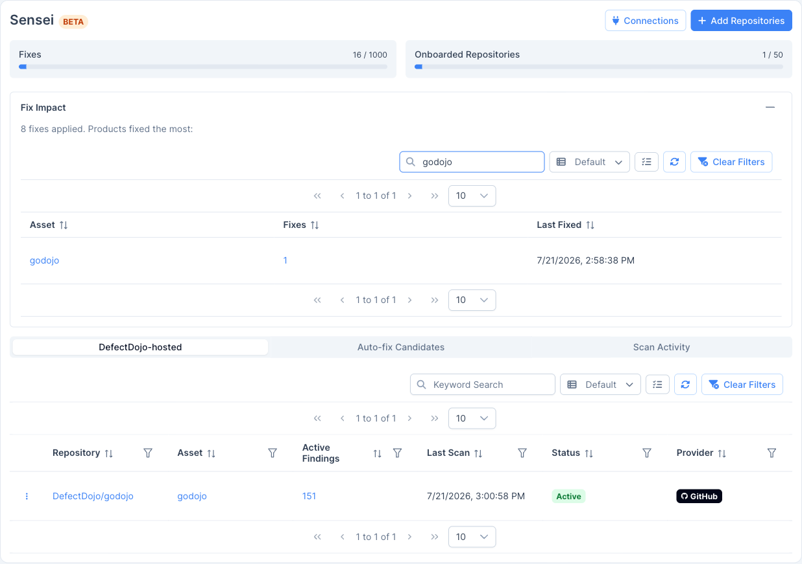

Note: Sensei is a DefectDojo Pro-only feature and is currently in BETA.

**Sensei** is DefectDojo's AI-powered **scan-and-fix** capability for source code repositories. Connect a repository (through a **GitHub App**, **GitLab**, **Bitbucket**, or **Azure DevOps**) and Sensei scans it, imports the results as DefectDojo findings, and then uses a large language model to **remediate those findings by opening pull/merge requests**, all without leaving DefectDojo.

> **🔀 Multiple providers:** Sensei supports **GitHub** (github.com and GitHub Enterprise Server), **GitLab** (gitlab.com and self-managed), **Bitbucket** (Cloud and Server/Data Center), and **Azure DevOps**, all with the same scan-and-fix flow. Where this guide says *pull request*, GitLab uses a **merge request**; the PR *status check* is posted as a GitLab/Azure **commit status** or a Bitbucket **build status**. Connection differs by provider (see [Set up Sensei](/sensei/setup_sensei/)); everything after onboarding is identical.

- **Scan-and-fix in one place:** repositories are scanned and remediated from the Sensei page and from your findings, using the same normalized, deduplicated finding data as the rest of DefectDojo.
- **Preview-first:** Sensei stages fix *candidates* for review. Nothing is sent to an LLM and no pull request is opened until you approve, so there is no surprise cost or unexpected PR.
- **Short-lived credentials:** Sensei runs entirely through a GitHub App and uses short-lived installation tokens. There is nothing to paste and nothing to rotate.
- **Metered and license-gated:** Sensei is a Pro feature with per-instance quotas for fixes and onboarded repositories.

> **🔎 BETA:** Sensei is under active development and is labeled **BETA** throughout the UI. Behavior and screens may change between releases.

> **📍 Where to find it:** open **Sensei** from the left-hand navigation.

## How DefectDojo-hosted scanning works

DefectDojo-hosted scanning is the recommended way to run Sensei. Scans run **inside DefectDojo**, and nothing is added to your repository:

1. **Connect a GitHub App** and install it on the organization (or account) that owns your repositories.
2. **Onboard a repository** for hosted scanning and choose how findings are reported and (optionally) auto-fixed.
3. **Sensei scans the repository** (on demand, or automatically when a pull request is opened) and imports the results into an engagement named after the branch.
4. **Sensei remediates findings** by generating a fix and opening a pull request against the repository's default branch.

Each onboarded repository is linked to a DefectDojo **asset** (product), so its findings, engagements, and fixes live alongside the rest of your data.

## The three ways a fix gets started

Sensei can remediate a finding in three ways:

- **The Fix button on a finding:** trigger a one-off fix directly from the findings table or a finding's detail page. See [Fixing findings with Sensei](/sensei/fixing_findings/).
- **Auto-fix candidates:** after each scan, Sensei stages the findings that match your criteria as candidates. You review them and approve the ones to fix (or let Sensei remediate them automatically). See [Auto-fix candidates](/sensei/fixing_findings/#auto-fix-candidate-triage).
- **A `/fix` comment on a pull request:** comment `/fix` on a pull request and Sensei pushes a remediation to that PR.

## Requirements

- A **DefectDojo Pro** license that includes the **Sensei** feature.
- A connected source-control provider (see [Set up Sensei](/sensei/setup_sensei/)): a **GitHub App** (github.com or Enterprise Server), a **GitLab** project/group access token (gitlab.com or self-managed), a **Bitbucket** connection (Cloud or Server/Data Center — OAuth, API token, or access token), or an **Azure DevOps** Personal Access Token.
- To **configure** Sensei (connect apps, onboard repositories): a global **Maintainer** or **Owner** role.
- To **trigger a fix** on a finding: at least **Writer** access to that finding's product.

## Quotas

Sensei is metered against your license. The Sensei hub shows two usage meters at the top of the page:

- **Fixes:** the number of remediations applied against your prepaid limit. Approving a candidate or triggering a fix consumes from this quota.
- **Onboarded Repositories:** the number of repositories onboarded against your repository limit.

When a quota is reached, Sensei blocks further fixes (or onboarding) until it is raised. See [Reference](/sensei/sensei_reference/#quotas-and-metering) for details.
