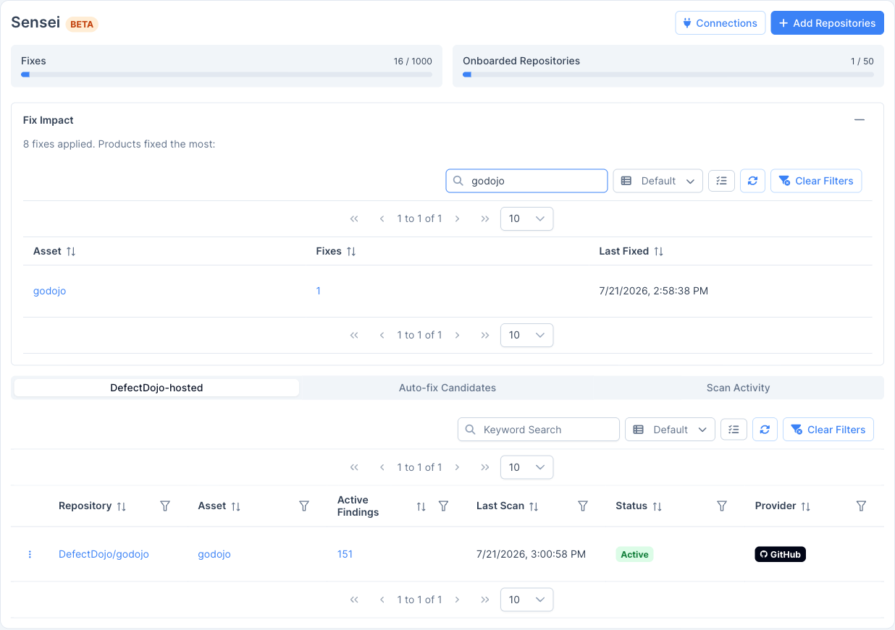

Nota: o Sensei é um recurso exclusivo do DefectDojo Pro e atualmente está em BETA.

**Sensei** é a capacidade de **verificação e correção (scan-and-fix)** do DefectDojo baseada em IA para repositórios de código-fonte. Conecte um repositório (por meio de um **GitHub App**, **GitLab**, **Bitbucket** ou **Azure DevOps**) e o Sensei o verifica, importa os resultados como achados do DefectDojo e, em seguida, usa um grande modelo de linguagem para **corrigir esses achados abrindo pull/merge requests**, tudo sem sair do DefectDojo.

> **🔀 Múltiplos provedores:** o Sensei oferece suporte a **GitHub** (github.com e GitHub Enterprise Server), **GitLab** (gitlab.com e self-managed), **Bitbucket** (Cloud e Server/Data Center) e **Azure DevOps**, todos com o mesmo fluxo de verificação e correção. Onde este guia diz *pull request*, o GitLab usa um **merge request**; a *verificação de status* do PR é publicada como um **commit status** do GitLab/Azure ou um **build status** do Bitbucket. A conexão varia conforme o provedor (veja [Configurar o Sensei](/sensei/setup_sensei/)); tudo após o onboarding é idêntico.

- **Verificação e correção em um só lugar:** os repositórios são verificados e corrigidos a partir da página do Sensei e dos seus achados, usando os mesmos dados de achados normalizados e deduplicados do restante do DefectDojo.
- **Prévia antes de tudo:** o Sensei prepara *candidatos* a correção para revisão. Nada é enviado a um LLM e nenhum pull request é aberto até que você aprove, portanto não há custo surpresa nem PR inesperado.
- **Credenciais de curta duração:** o Sensei funciona inteiramente por meio de um GitHub App e usa tokens de instalação de curta duração. Não há nada para colar nem para rotacionar.
- **Medido e limitado pela licença:** o Sensei é um recurso Pro com cotas por instância para correções e repositórios integrados (onboarded).

> **🧠 Antes que o código exista:** o Sensei também gera um modelo de ameaças, caminhos de ataque e requisitos de segurança a partir do *design* de uma funcionalidade, sem envolver nenhum repositório — veja [Modelagem de Ameaças](/sensei/threat_modeling/).

> **🔎 BETA:** o Sensei está em desenvolvimento ativo e é identificado como **BETA** em toda a interface. O comportamento e as telas podem mudar entre versões.

> **📍 Onde encontrar:** abra **Sensei** na navegação à esquerda.

## Como funciona a verificação hospedada pelo DefectDojo

A verificação hospedada pelo DefectDojo é a forma recomendada de executar o Sensei. As verificações são executadas **dentro do DefectDojo**, e nada é adicionado ao seu repositório:

1. **Conecte um GitHub App** e instale-o na organização (ou conta) proprietária dos seus repositórios.
2. **Integre um repositório (onboard)** para verificação hospedada e escolha como os achados são reportados e (opcionalmente) corrigidos automaticamente.
3. **O Sensei verifica o repositório** (sob demanda ou automaticamente quando um pull request é aberto) e importa os resultados para um engajamento nomeado a partir da branch.
4. **O Sensei corrige os achados** gerando uma correção e abrindo um pull request contra a branch padrão do repositório.

Cada repositório integrado é vinculado a um **ativo** (produto) do DefectDojo, de modo que seus achados, engajamentos e correções ficam junto com o restante dos seus dados.

## As três formas de iniciar uma correção

O Sensei pode corrigir um achado de três formas:

- **O botão Fix em um achado:** dispare uma correção pontual diretamente na tabela de achados ou na página de detalhes de um achado. Veja [Corrigindo achados com o Sensei](/sensei/fixing_findings/).
- **Candidatos a correção automática:** após cada verificação, o Sensei prepara como candidatos os achados que correspondem aos seus critérios. Você os revisa e aprova os que deseja corrigir (ou deixa o Sensei corrigi-los automaticamente). Veja [Candidatos a correção automática](/sensei/fixing_findings/#auto-fix-candidate-triage).
- **Um comentário `/fix` em um pull request:** comente `/fix` em um pull request e o Sensei enviará uma correção para esse PR.

## Requisitos

- Uma licença **DefectDojo Pro** que inclua o recurso **Sensei**.
- Um provedor de controle de versão conectado (veja [Configurar o Sensei](/sensei/setup_sensei/)): um **GitHub App** (github.com ou Enterprise Server), um token de acesso de projeto/grupo do **GitLab** (gitlab.com ou self-managed), uma conexão **Bitbucket** (Cloud ou Server/Data Center — OAuth, token de API ou token de acesso), ou um Personal Access Token do **Azure DevOps**.
- Para **configurar** o Sensei (conectar apps, integrar repositórios): uma função global de **Maintainer** ou **Owner**.
- Para **disparar uma correção** em um achado: acesso mínimo de **Writer** ao produto desse achado.

## Cotas

O uso do Sensei é medido em relação à sua licença. O hub do Sensei exibe dois medidores de uso na parte superior da página:

- **Fixes:** o número de correções aplicadas em relação ao seu limite pré-pago. Aprovar um candidato ou disparar uma correção consome dessa cota.
- **Onboarded Repositories:** o número de repositórios integrados em relação ao seu limite de repositórios.

Quando uma cota é atingida, o Sensei bloqueia novas correções (ou integrações) até que ela seja aumentada. Veja [Referência](/sensei/sensei_reference/#quotas-and-metering) para mais detalhes.
