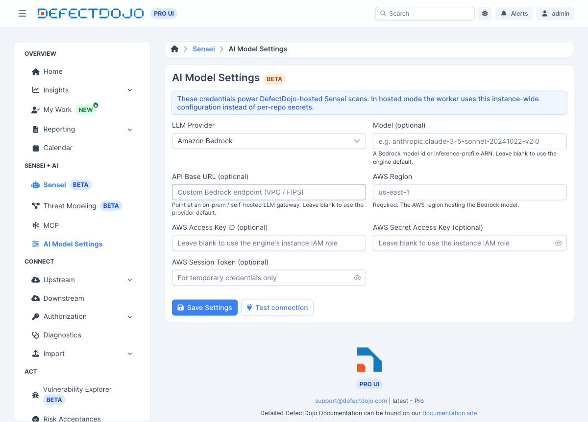

Note: Sensei is a DefectDojo Pro-only feature and is currently in BETA.

When Sensei runs a scan or applies a fix **DefectDojo-hosted** (server-side, rather than in
your own CI), it needs an LLM. **AI Model Settings** is where you choose that model and supply
its credentials, once, instance-wide — the hosted worker uses this configuration instead of any
per-repository secret.

You reach it from the sidebar under **Sensei + AI → AI Model Settings**. You need a global
**Maintainer** or **Owner** role to change it.

> **On-premise only.** This page exists only on **on-premise** ("local") deployments, where you
> bring your own model. On DefectDojo **Cloud** the LLM is managed for you and this page is not
> shown.

## Providers

Pick a provider from the **LLM Provider** dropdown. The fields below the dropdown change to
match the provider you choose.

| Provider | Authenticates with |
|----------|--------------------|
| **Claude (Anthropic)** | an Anthropic API key |
| **OpenAI** | an OpenAI API key |
| **Amazon Bedrock** | AWS credentials (see [How Bedrock access is determined](#how-bedrock-access-is-determined)) |

Every provider also accepts an optional **Model** override (leave blank to use the provider's
default) and an optional **API Base URL** to point at an on-prem or self-hosted gateway.

All secrets are **encrypted at rest** and are **write-only**: once saved, the form shows only
whether a secret is set, never its value. Leave a secret field blank when saving to keep the
stored value; type a new value to replace it.

### Claude (Anthropic) and OpenAI

These providers use a single API key:

1. **Model (optional)** — e.g. a specific Claude or OpenAI model. Blank uses the provider default.
2. **API Base URL (optional)** — point at a self-hosted gateway instead of the provider's public
   API. Blank uses the default (`https://api.anthropic.com` / `https://api.openai.com`).
3. **LLM API Key** — the provider API key.

### Amazon Bedrock

Amazon Bedrock hosts Anthropic Claude models in **your own AWS account**, and it authenticates
with AWS credentials rather than a single key, so its fields differ:

1. **Model (optional)** — a Bedrock model id or inference-profile ARN, e.g.
   `anthropic.claude-3-5-sonnet-20241022-v2:0`, or a cross-region inference profile like
   `us.anthropic.claude-sonnet-4-5-...`. Some newer models are only reachable through an
   inference profile. Blank uses the engine default.
2. **API Base URL (optional)** — a custom Bedrock endpoint (for a VPC endpoint or FIPS). Blank
   uses the default AWS endpoint for the region.
3. **AWS Region** — **required**. The region hosting the model, e.g. `us-east-1`.
4. **AWS Access Key ID / Secret Access Key / Session Token** — **optional** (see below).

#### How Bedrock access is determined

The region is always required, but the AWS credentials are optional because the Sensei engine
resolves them through the standard AWS credential chain, in this order:

1. **The static keys you enter here, if any.** Provide an **Access Key ID** and **Secret Access
   Key** (and a **Session Token** for temporary STS credentials) to authenticate as a specific
   IAM identity.
2. **Otherwise, the engine's ambient AWS identity.** With the key fields left blank, the engine
   uses whatever IAM role is attached to where it runs — an IRSA role on EKS, an EC2 instance
   profile, an ECS task role, or a Lambda execution role.

Leaving the keys blank is the recommended setup when the engine already runs inside AWS: the
workload's own IAM role grants Bedrock access, so there are no long-lived keys to store or
rotate. Either way, the identity used needs permission to invoke the Bedrock model
(`bedrock:InvokeModel`) in the chosen region.

## Test connection

**Test connection** validates the configuration before a scan relies on it:

- For **Claude** / **OpenAI**, it makes a minimal authenticated call to the provider.
- For **Amazon Bedrock with static keys**, it lists the region's foundation models to confirm the
  credentials work.
- For **Amazon Bedrock without static keys**, it reports that the engine's instance IAM role is
  used at runtime — DefectDojo can't validate that role on the engine's behalf, so confirm
  Bedrock access from the engine's own environment.

## Save

**Save Settings** stores the configuration for the whole instance. From then on, DefectDojo-hosted
Sensei scans and fixes use this model. See [Fixing Findings with Sensei](../fixing_findings/) for
how fixes run once a model is configured.
