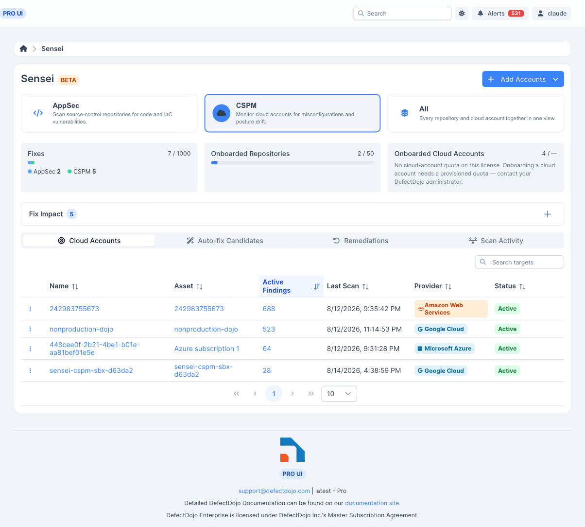
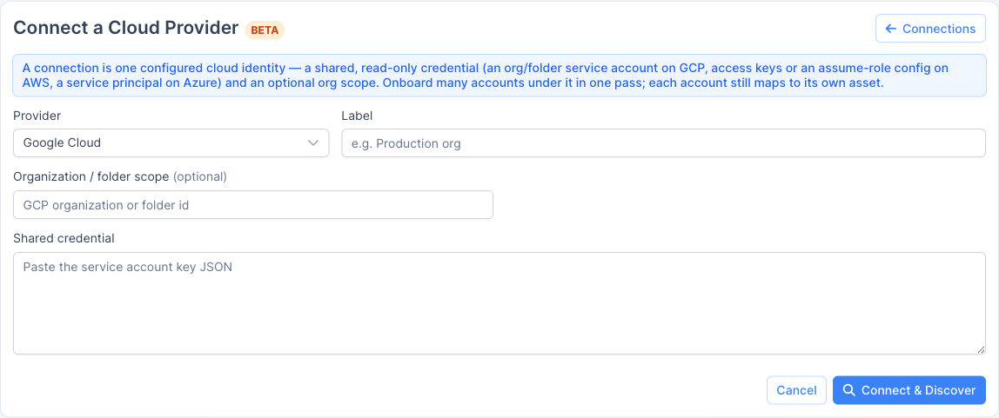
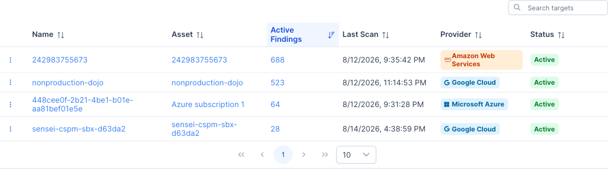
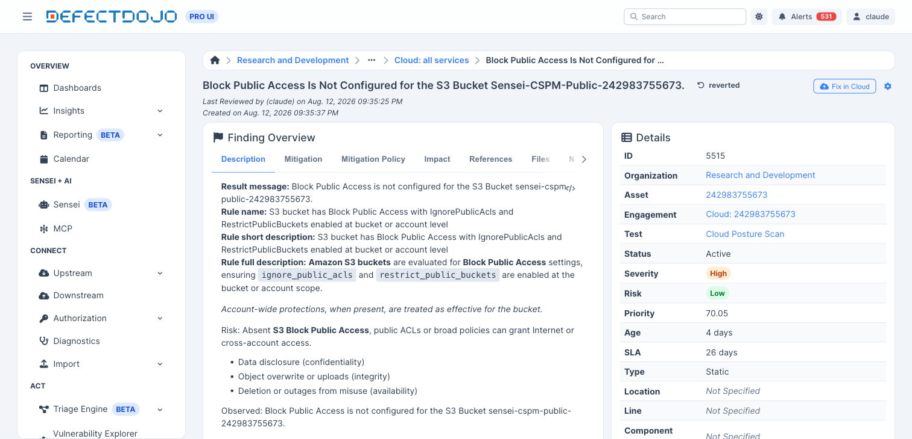
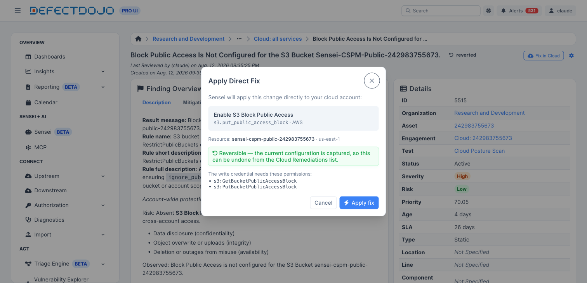
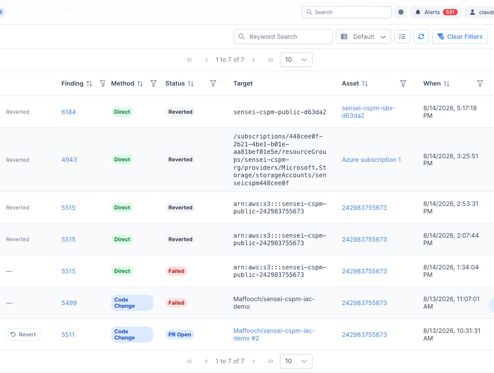

Note: Sensei is a DefectDojo Pro-only feature and is currently in BETA.

Sensei has two capabilities that share one hub. **AppSec** scans and fixes source-code repositories (see [About Sensei](/sensei/about_sensei/)). **Cloud Security Posture (CSPM)** does the same for **cloud accounts**: connect an AWS account, Azure subscription, or GCP project; Sensei scans it for misconfigurations with [Prowler](https://github.com/prowler-cloud/prowler), imports the results as DefectDojo findings, and remediates them — either by opening an infrastructure-as-code pull request or by applying a **reversible change to the live cloud resource**.

> **🧭 One hub, two capabilities.** Open **Sensei** from the left-hand navigation and choose the **CSPM** capability card (or **AppSec**, or **All** to see every target together). A cloud account is the CSPM analog of an onboarded repository: it is the thing you scan and fix, and it is linked to a DefectDojo **Asset** so its findings live alongside the rest of your data.

## How CSPM works

1. **Connect a cloud provider** with a read-only credential, either once per account or once for many accounts via a **Cloud Connection**.
2. **Onboard a cloud account** (an AWS account, an Azure subscription, or a GCP project) and link it to an Asset.
3. **Sensei scans the account** with Prowler, on demand from the hub, and imports each misconfiguration as a DefectDojo finding recorded against the **cloud resource** it concerns.
4. **Remediate a finding** two ways: open an **IaC pull request** on a linked repository, or apply a **direct, reversible fix** to the live resource ("Fix in Cloud").

## Requirements

- A **DefectDojo Pro** license that includes the **Sensei** feature, with a **cloud-account quota** (`sensei_cloud_account_limit`).
- The **Locations** feature enabled — a cloud finding is identified by the cloud *resource* it concerns rather than a file and line, and Locations is what records that. Without Locations, cloud onboarding is not offered (see [Troubleshooting](#troubleshooting)). CSPM itself needs no feature flag: it is part of Sensei, so the Sensei license unlocks it.
- A **read-only scan credential** for each provider (details below).
- To **onboard** accounts and **manage connections**: a global **Maintainer** or **Owner** role. To **run a direct fix or revert one**: at least **Writer** access to the finding's Asset — a direct fix mutates live cloud state, so it is an edit of the finding.

## Cloud connections

A **Cloud Connection** holds one shared credential and, optionally, an organization/folder scope. From a single connection Sensei can **discover** every account the credential can see and **onboard** many of them at once — the cloud analog of a source-control connection that lists many repositories. Reach connections from **Add Accounts → Manage Connections** in the hub header, or the **Connections** page.

The setup wizard walks three steps:

1. **Connect** — choose the provider (AWS, Azure, or GCP), give the connection a label, and paste the credential and (optionally) an org/folder scope.
2. **Discover** — Sensei enumerates the accounts the credential can reach (AWS Organizations member accounts, Azure subscriptions, or GCP projects) and proposes an Asset name for each, mapping to an existing Asset by name where one matches.
3. **Onboard** — pick which discovered accounts to onboard; each becomes a cloud account linked to its Asset.

> **🔑 One credential, many accounts.** A connection's credential is reused by every account onboarded under it (`effective_credential`). Onboarding a single account without a connection is also supported — see below — in which case the account carries its own credential.

## Onboard a cloud account

To onboard one account directly, use **Add Accounts → Onboard a single account** in the hub header, choose the provider, and supply the account identifier and its read-only scan credential.

The **Cloud Accounts** list mirrors the AppSec repository list: the account identifier links out to the provider console, and each row shows its provider, linked Asset, **Active Findings** (linking to that Asset's findings), last scan time, and a row menu (**Scan now**, **Configure**, **Remove**).

### Provider identity and scan credentials

The scan credential should be **read-only** — Sensei only needs to *read* posture to scan. (Applying a *direct* fix uses a separate write credential; see [Fix in Cloud](#fix-in-cloud-direct-remediation).)

| Provider | Account identity | Read-only scan credential |
|----------|------------------|---------------------------|
| **AWS** | The 12-digit **account ID** (resource ARNs derive from it). | Access keys for a principal with `SecurityAudit` + `ViewOnlyAccess`. Base access keys are required; organization-wide scanning additionally assumes a role (`role_arn` / `organizations_role_arn`) on top of those keys. |
| **Azure** | The **subscription ID**. | A **service principal** (client ID, client secret, tenant ID) with **Reader** + **Security Reader**, plus the Microsoft Graph read permissions Prowler needs (`Directory.Read.All`, `Policy.Read.All`, `UserAuthenticationMethod.Read.All`). |
| **GCP** | The **project ID**. | A **service-account key** for an SA with `roles/viewer` + `roles/iam.securityReviewer`. |

> **🔐 Credentials are encrypted at rest.** Every credential — connection or account, scan or write — is stored with DefectDojo's encrypted field storage. Enter it once; there is nothing to paste again.

## Scan a cloud account

Open a cloud account's row menu and choose **Scan now**. Sensei runs Prowler against the account and imports the results. A large account is scanned in **shards** (by service group) when a single scan would run long; the shards are reconciled into one set of findings.

Each imported finding is a **cloud-posture finding** recorded against the **cloud resource** it concerns (an S3 bucket, a security group, a storage account, and so on) rather than a file. Its identity comes from Prowler's own per-finding id, so re-scanning the account updates the same findings rather than duplicating them, and a resource that reports several distinct checks produces several distinct findings.

> **🕒 Scan activity.** Cloud scans appear on the hub's **Scan Activity** ledger alongside repository scans, with their status and duration.

## Fixing a cloud finding

A cloud finding has **two** remediation paths, and the right one depends on how the resource is managed:

- **IaC pull request** — when the resource is provisioned by infrastructure-as-code, Sensei can open a pull request on a linked IaC repository, exactly like an AppSec fix. This is the same **Fix with Sensei** flow described in [Fixing findings with Sensei](/sensei/fixing_findings/); for a cloud finding it opens the PR on the account's linked IaC repository. The finding stays open until the change is applied *and the next scan sees it*, because the scanner reads the account, not your repository.
- **Fix in Cloud (direct remediation)** — a live, **reversible** change applied straight to the cloud resource through the provider API, with no repository and no deploy. This is the fastest path for click-ops resources that no IaC provisions.

### Fix in Cloud (direct remediation)

When a finding is directly remediable and the account is set up for it, the fix button reads **Fix in Cloud** (with a cloud icon) instead of the AppSec **Fix** / **Configure Asset** label. Clicking it opens the **Apply Direct Fix** dialog.

The dialog is an **approval preview**: it states the exact action, the resource it will change, whether the change is reversible, and the **cloud permissions the action requires**, so you can confirm the write credential can perform it before anything runs. Approving dispatches the change; the finding's fix badge moves to **Applied in Cloud** once the provider confirms it.

Direct remediation is **v1-limited to non-destructive, reversible actions**. Destructive changes stay on the IaC-pull-request path. The v1 actions are:

| Provider | Action | What it does |
|----------|--------|--------------|
| **AWS** | Block S3 public access | Enables the bucket-level public-access block. |
| **AWS** | Revoke public security-group ingress | Removes an internet-facing (`0.0.0.0/0`) ingress rule. |
| **Azure** | Disable public blob access | Sets `allowBlobPublicAccess = false` on the storage account. |
| **GCP** | Remove public bucket IAM | Removes the `allUsers` / `allAuthenticatedUsers` binding from a GCS bucket. |

To enable direct remediation on an account, turn on **remediation** for it and supply a **write credential** — separate from, and never widening, the read-only scan credential:

- **AWS** — an assume-role or a scoped write principal with the action's permissions (for example `s3:PutBucketPublicAccessBlock` + `s3:GetBucketPublicAccessBlock`, or `ec2:RevokeSecurityGroupIngress` + `ec2:DescribeSecurityGroups` + `ec2:AuthorizeSecurityGroupIngress` for revert).
- **Azure** — a service principal with a write role scoped to the resource group (for example **Contributor** on the RG).
- **GCP** — a service-account key with `roles/storage.admin` on the project.

> **↩️ Every direct fix is reversible and human-approved.** Sensei captures the resource's prior state before it changes anything and records a revert plan, so a direct fix can be undone. It also fingerprints the resource before and after: if the live state has drifted since the fix, a revert refuses rather than clobbering an out-of-band change. There is always a human in the loop — nothing is applied without the approval dialog.

### Cloud Remediations ledger

The CSPM hub adds a **Cloud Remediations** tab (alongside Cloud Accounts, Auto-fix Candidates, and Scan Activity) — the audit ledger of every direct fix. Each row shows the action, the resource, the provider, its status, and who applied it. An **Applied in Cloud** row that is still reversible offers a **Revert** button.

Direct-remediation statuses:

| Status | Meaning |
|--------|---------|
| **In Progress** | The change has been dispatched to the provider and is being applied. |
| **Applied in Cloud** | The provider confirmed the change; the prior state and fingerprints are recorded. This is the direct-path analog of an AppSec fix's *PR open* — a landed fix, without a pull request. |
| **Revert in Progress** | A revert was requested and is being applied. |
| **Reverted** | The prior state was restored (drift-checked first). |
| **Failed** | The change could not be applied (or the revert refused because the resource drifted). |

## Quotas

CSPM meters against two quotas, both shown as cards at the top of the hub:

- **Onboarded Cloud Accounts** — the number of cloud accounts onboarded against your cloud-account limit (`sensei_cloud_account_limit`), the CSPM analog of the onboarded-repositories meter. Onboarding is blocked when the limit is reached.
- **Fixes** — the **shared** Sensei fix quota (`sensei_fix_limit`). A fix is a fix: a cloud remediation — whether an IaC pull request or a direct in-cloud change — consumes from the same fix pool as an AppSec fix. The Fixes card breaks the total down by capability (AppSec vs CSPM) so you can see the split against the one limit.

## Troubleshooting

- **Cloud onboarding is not offered.** CSPM requires the **Locations** feature. A cloud finding has no identity without a resource location, so with Locations off, onboarding is refused (the CSPM capability itself still appears). Enable Locations on the **Settings > Feature Flags** page — the Sensei hub links there from the prompt — then onboard a cloud account.
- **"No cloud-account quota is available."** Your license carries no `sensei_cloud_account_limit`, or it is used up. Contact your DefectDojo administrator to raise it.
- **The fix button shows "Fix" or "Configure Asset" on a cloud finding, not "Fix in Cloud."** The finding is not directly remediable — either the account has no write credential / remediation is not enabled, or the finding's check has no v1 direct action. It can still be fixed by an IaC pull request.
- **A revert failed with a drift error.** The live resource changed out-of-band since the fix was applied, so the recorded prior state no longer matches. Reconcile the resource manually; Sensei refuses to overwrite an unexpected state.
- **A direct fix says the credential lacks a permission.** The Apply Direct Fix dialog lists the permissions each action needs. Grant them to the account's write credential (not the read-only scan credential) and try again.
