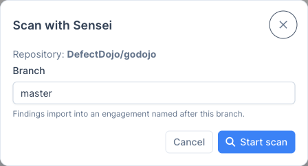
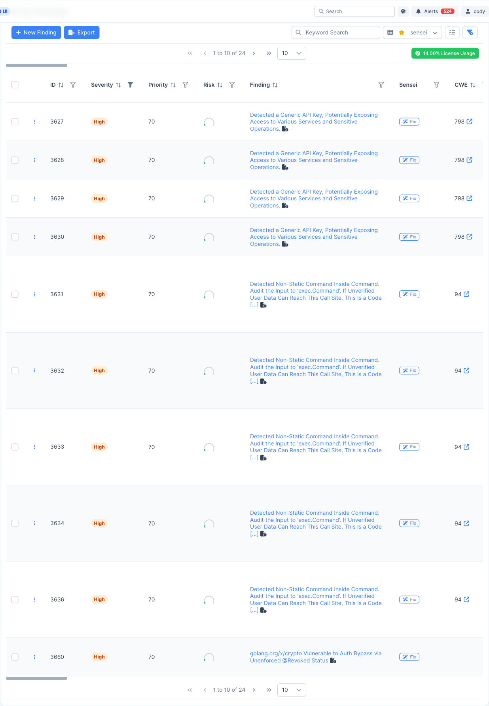
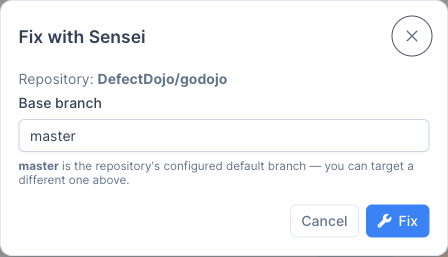
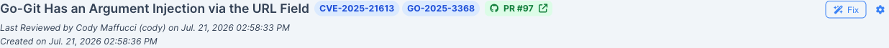
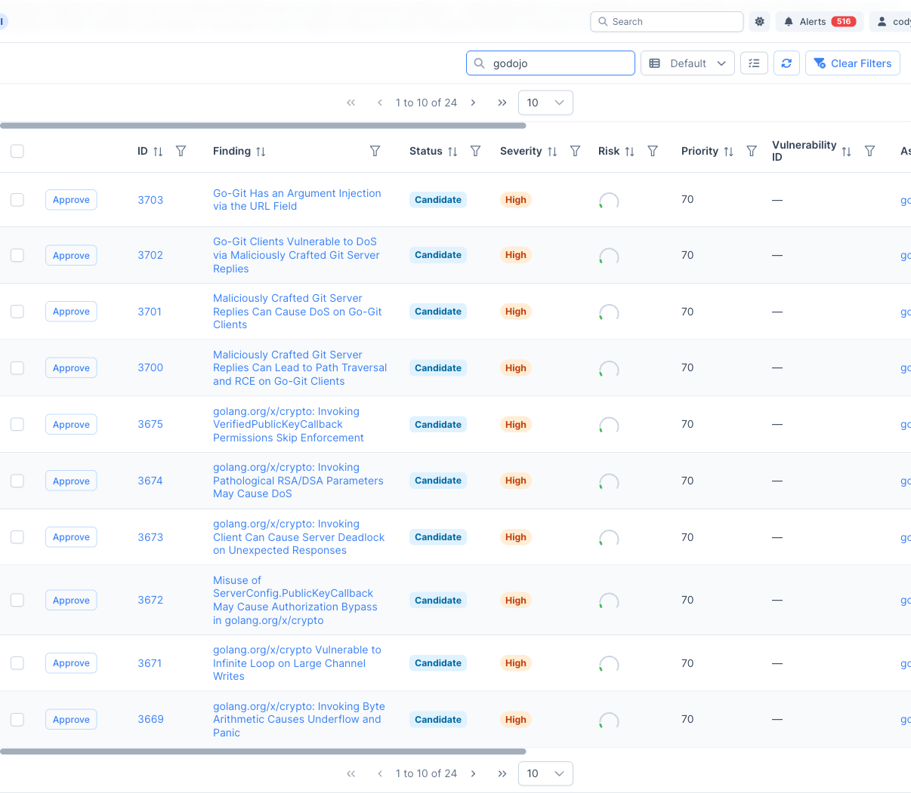
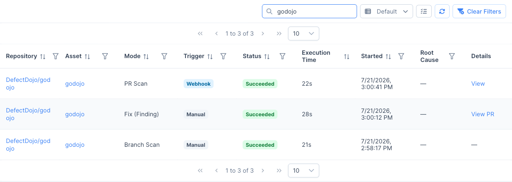
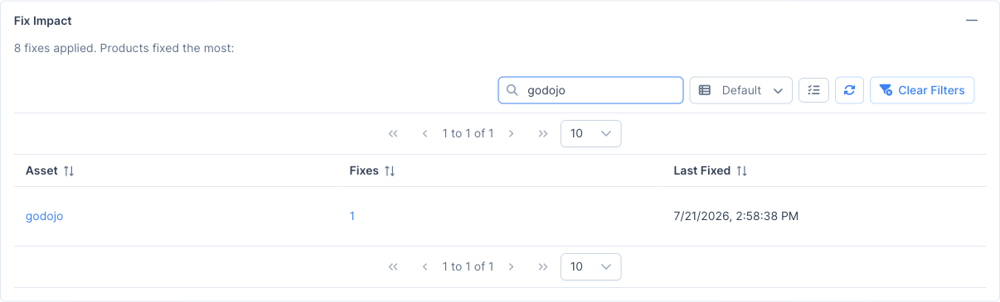

Note: Sensei is a DefectDojo Pro-only feature and is currently in BETA.

Once a repository is onboarded, Sensei surfaces directly on your findings and on the Sensei hub. This page covers scanning a repository, triaging auto-fix candidates, and remediating individual findings. You need at least **Writer** access to a finding's product to trigger a fix.

## Scan a repository

Scans import findings into an engagement named after the branch. You can trigger a scan on demand from the Sensei hub: open a repository's row actions and choose **Scan now**.

Pick the branch to scan (it defaults to the repository's default branch) and choose **Start scan**. In DefectDojo-hosted mode, scans also run automatically when a pull request is opened.

## The Sensei column on findings

Onboarded repositories add a **Sensei** column to the findings table. Each finding shows a **Fix** button (or its current fix status), so you can remediate without leaving your triage view.

The button has two states:

- **Fix:** the finding's product is onboarded to Sensei. Clicking it starts a remediation.
- **Configure Product:** the finding's product is **not** onboarded yet. Clicking it takes you to Sensei to onboard a repository for that product; once onboarded, the button becomes **Fix**.

## Fix a single finding

Clicking **Fix** (on the findings table or in a finding's detail header) opens the **Fix with Sensei** dialog. Choose the base branch the fix pull request should target, then click **Fix**.

Sensei generates a remediation and opens a pull request. The finding's fix status is shown as a badge that moves through *in progress* → *PR open* (or *failed*). Once the pull request is open, the badge links straight to it.

> **💡 One fix, one PR:** each approved fix consumes one fix from your quota and opens one pull request. Review and merge the PR in GitHub as you would any other.

## Auto-fix candidate triage

When a repository has automated fixes enabled, each scan stages matching findings as **candidates** on the **Auto-fix Candidates** tab of the Sensei hub. This is Sensei's preview-first model: findings are staged, but **nothing runs (no LLM cost) until you approve**. Approving opens fix pull requests and consumes fixes.

Each candidate shows the finding, its status, severity, risk, priority, target repository, and PR branch. To remediate:

- **Approve one:** click **Approve** on a row to open the branch picker and start that fix.
- **Approve several:** select multiple rows and use the bulk approve action.

Approved findings stay listed as **In Progress** (or **Failed**) until their pull request is attached, so an in-flight or failed fix never disappears before it produces a PR.

> **🔎 Hands-off remediation:** if you enabled *Automatically remediate candidates* on the repository, a background check opens fix PRs for staged candidates automatically, up to your fix quota, without manual approval.

## Track scans and impact

Two places on the Sensei hub help you follow what Sensei has done:

- **Scan Activity:** a ledger of every scan and fix run, with its mode (Branch Scan, PR Scan, Fix (Finding)), trigger (Manual, Webhook, Auto Remediated), status, execution time, and links to the engagement or the pull request it produced.

  

- **Fix Impact:** a summary of fixes applied, with the assets fixed most often, at the top of the hub.

  

Use the **Scan now**, **Scan history**, **Configure**, and **Re-stage candidates** row actions to manage each onboarded repository over time (see [Reference](/sensei/sensei_reference/#repository-row-actions)).
