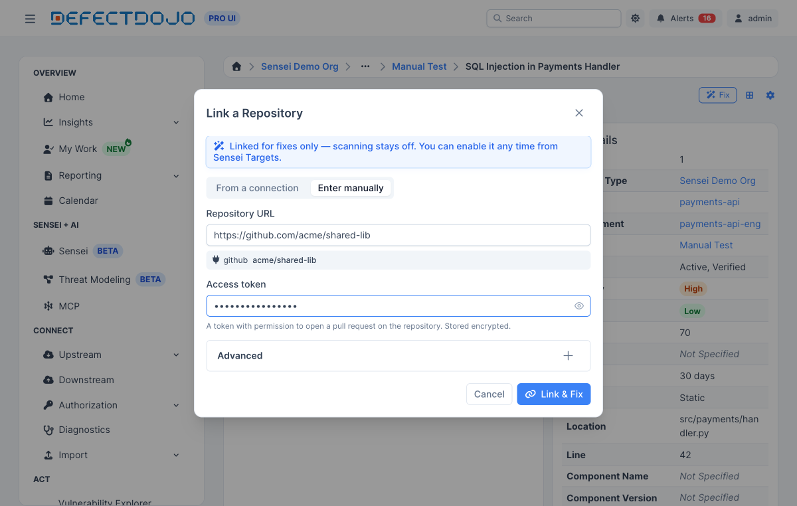
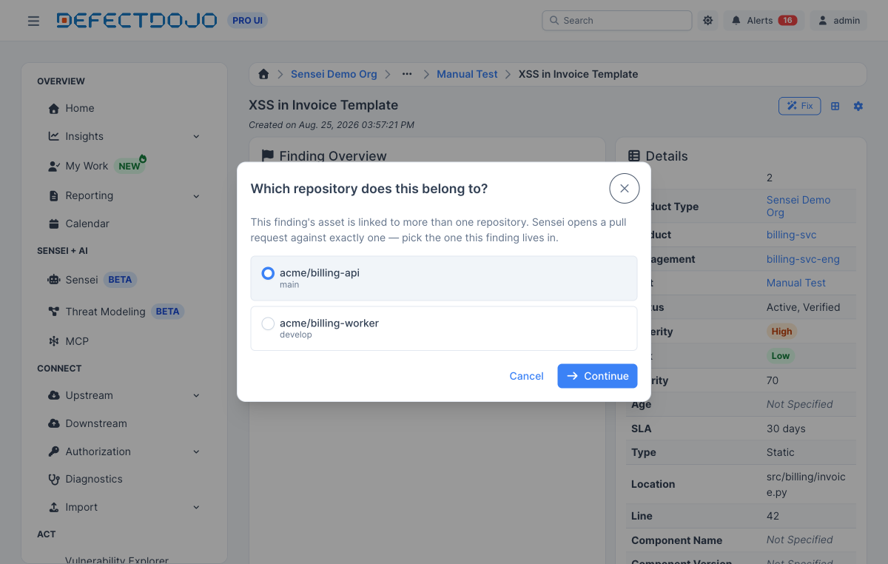
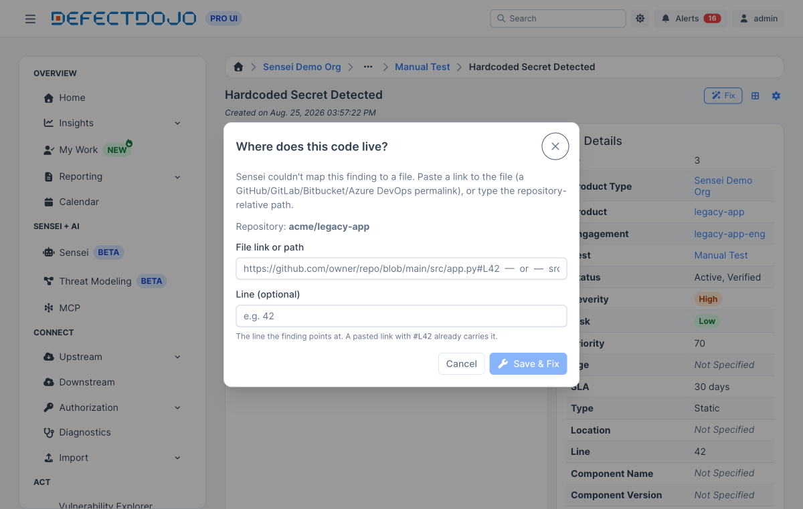
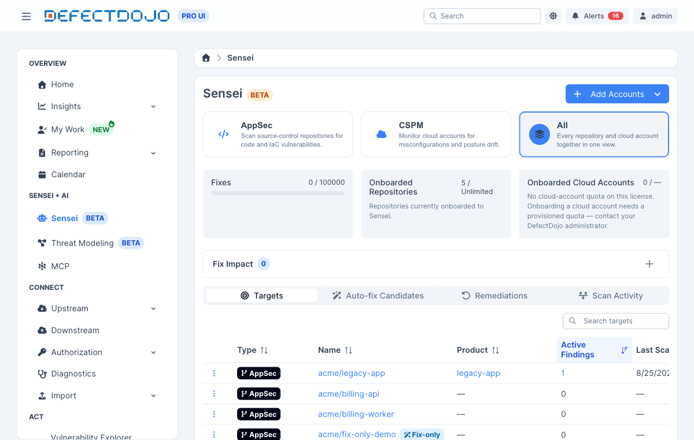
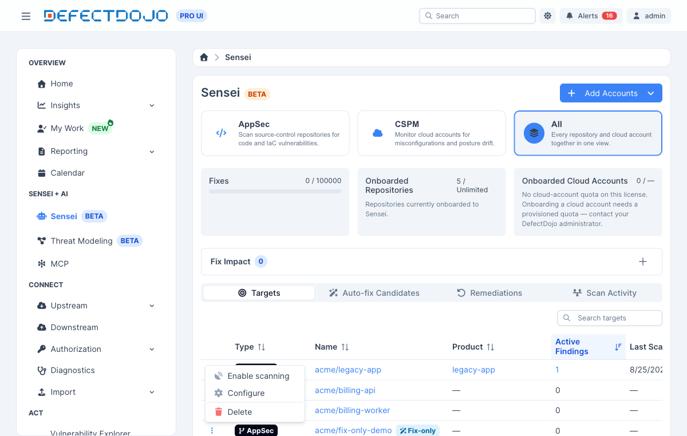

Note: Sensei is a DefectDojo Pro-only feature and is currently in BETA.

Sensei surfaces directly on your findings and on the Sensei hub. This page covers scanning a repository, triaging auto-fix candidates, and remediating individual findings. You need at least **Writer** access to a finding's Asset to trigger a fix. Linking a new repository to an Asset (below) needs the global **Maintainer** or **Owner** role, the same as onboarding.

## Finding your way around the Sensei hub

The hub's toggle selects which **view** you are looking at:

- **Repositories** — the repositories onboarded to Sensei, with their status and row actions.
- **Auto-fix Candidates** — findings staged for approval.
- **Scan Activity** — the ledger of every scan and fix run.

If an administrator enabled in-repo CI scanning, the Repositories view also offers a **Scanning** choice between **DefectDojo-hosted** and **In-repo CI**. This selects where scans run for the repositories listed; it is not a separate view, so auto-fix candidates and scan activity always cover every onboarded repository regardless of where its scans run. With CI mode off (the default) there is nothing to choose and the control is not shown.

## Scan a repository

Scans import findings into an engagement named after the branch. You can trigger a scan on demand from the Sensei hub: open a repository's row actions and choose **Scan now**.

Pick the branch to scan (it defaults to the repository's default branch) and choose **Start scan**. In DefectDojo-hosted mode, scans also run automatically when a pull request is opened.

## The Sensei column on findings

Sensei adds a **Sensei** column to the findings table. Each finding shows a **Fix** button (or its current fix status), so you can remediate without leaving your triage view.

Clicking **Fix** walks you through whatever Sensei still needs to open a pull request, so you no longer have to set up onboarding first. If the finding's Asset already has a linked repository, you go straight to the fix; if it does not, Sensei asks for one on the spot. The [next section](#fix-a-single-finding) covers the whole flow. On the findings table an Asset that is not linked yet may instead show **Configure {Asset}**; clicking it starts the same flow.

## Fix a single finding

Clicking **Fix** (on the findings table or in a finding's detail header) starts a short, guided flow. Sensei only asks for what it is missing, then opens the fix.

### Link a repository, if the Asset does not have one

Sensei fixes a finding by opening a pull request, so it needs to know which repository the finding's code lives in. If the finding's Asset is not linked to a repository yet, Sensei asks for one right there, rather than sending you off to set up onboarding first.

There are two ways to supply it:

- **From a connection:** pick a repository from a source-control connection you already have.
- **Enter manually:** paste the repository's URL and an access token. Sensei reads the provider and repository name from the link, so this is how you fix a repository Sensei has no connection for.

The link is remembered, so the next fix on the same Asset goes straight to the pull request. A repository you link this way is **fix-only**: it is available for fixes but does not start scanning until you enable it (see [Repositories linked at fix time](#repositories-linked-at-fix-time)).

### Choose the repository, if the Asset has several

An Asset can be linked to more than one repository. When it is, Sensei asks which one the finding belongs to before it opens the pull request.

### Point Sensei at the file, if the finding has no location

Sensei patches a file, so a finding needs a file path. Findings imported from some scanners arrive without one, or with a path that does not line up with your repository layout. When that happens, Sensei asks where the code lives.

Paste a link to the file (a GitHub, GitLab, Bitbucket, or Azure DevOps permalink, which fills in the path and line for you) or type the repository-relative path. Sensei records it on the finding and continues.

### Open the pull request

Once Sensei has a repository and a file, the **Fix with Sensei** dialog confirms the base branch the pull request should target. Choose the branch, then click **Fix**.

Sensei generates a remediation and opens a pull request. The finding's fix status is shown as a badge that moves through *in progress* → *PR open* → *PR merged* (or *failed*). Once the pull request is open, the badge links straight to it.

> **💡 One fix, one PR:** each approved fix consumes one fix from your quota and opens one pull request. Review and merge the PR in GitHub as you would any other.

### A fix does not close the finding on its own

The pull request changes your code; it does not change what is running. So the finding **stays open** after Sensei fixes it, and the badge says which step is still outstanding:

- **PR open** — the change is waiting to be reviewed and merged.
- **PR merged** — merged, but not yet deployed.

What closes the finding is the next scan that sees the fix in place. For code scanning that is the next scan of the branch you merged into. For findings that come from a cloud account, it is the next scan *after the infrastructure change is applied* — the scanner reads the account, not your repository, so merging Terraform does not change what it reports.

While a fix is outstanding, the same finding may keep being reported by each new scan. Sensei recognises those as the same underlying issue and will not stage another candidate or open a second pull request for it, so a slow review or deploy does not consume extra fixes.

## Repositories linked at fix time

A repository you link from a finding (the [Link a repository](#link-a-repository-if-the-asset-does-not-have-one) step above) is added for fixes only. It does not scan, and inbound webhooks do not trigger anything for it, until you turn scanning on. This keeps an ad-hoc fix from quietly enrolling a repository in scanning you did not ask for.

On the **Repositories** view of the Sensei hub, a fix-only repository is marked **Fix-only**.

To start scanning it, open its row actions and choose **Enable scanning**. From then on it behaves like any onboarded repository.

## Cloud findings: link the repository inline

A cloud posture finding (from a connected cloud account) is usually fixed by changing the infrastructure-as-code that provisions the resource, so Sensei opens a pull request against that repository rather than patching the finding's own file. Clicking **Fix** on such a finding follows the same gap-closing flow as a code finding.

If the finding's cloud account is not yet linked to an infrastructure-as-code repository, Sensei asks for one inline, in the same **Link a Repository** dialog used for code findings. The cloud account is detected from the finding automatically (its provider and account are already on the finding), so you only supply the repository, from a connection or by pasting its URL and a token. Sensei records the account, links the repository, and continues into the fix.

Once linked, the repository fixes that account's findings from then on, and if more than one repository is linked to the account Sensei asks which one a given finding belongs to before opening the pull request. Linking an infrastructure-as-code repository this way does not enable direct cloud remediation, which stays a separate, explicitly configured action.

## Auto-fix candidate triage

When a repository has automated fixes enabled, each scan stages matching findings as **candidates** on the **Auto-fix Candidates** tab of the Sensei hub. This is Sensei's preview-first model: findings are staged, but **nothing runs (no LLM cost) until you approve**. Approving opens fix pull requests and consumes fixes.

Each candidate shows the finding, its status, severity, risk, priority, target repository, and PR branch. To remediate:

- **Approve one:** click **Approve** on a row to open the branch picker and start that fix.
- **Approve several:** select multiple rows and use the bulk approve action.

Approved findings stay listed as **In Progress** (or **Failed**) until their pull request is attached, so an in-flight or failed fix never disappears before it produces a PR.

> **🔎 Hands-off remediation:** if you enabled *Automatically remediate candidates* on the repository, a background check opens fix PRs for staged candidates automatically, up to your fix quota, without manual approval.

## Track scans and impact

Two places on the Sensei hub help you follow what Sensei has done:

- **Scan Activity:** a ledger of every scan and fix run, with its mode (Branch Scan, PR Scan, Fix (Finding)), trigger (Manual, Webhook, Auto Remediated), status, execution time, and links to the engagement or the pull request it produced.

  

- **Fix Impact:** a summary of fixes applied, with the assets fixed most often, at the top of the hub.

  

Use the **Scan now**, **Scan history**, **Configure**, and **Re-stage candidates** row actions to manage each onboarded repository over time (see [Reference](/sensei/sensei_reference/#repository-row-actions)).
