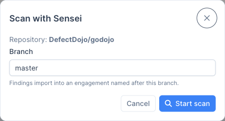
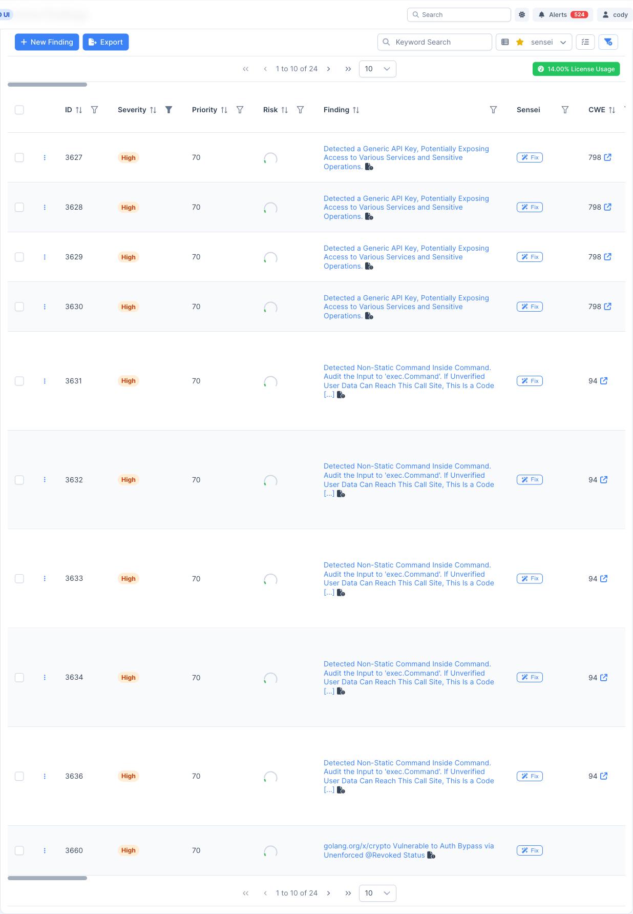
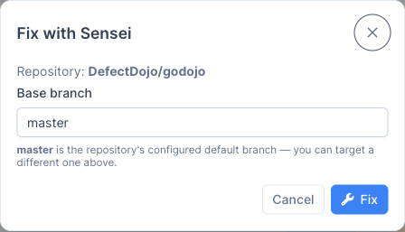
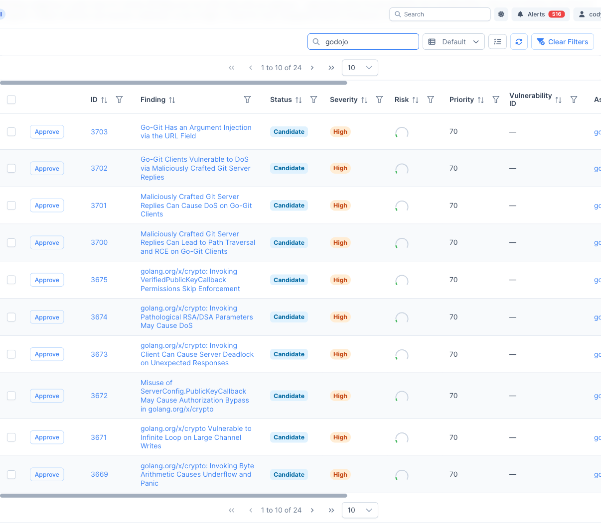
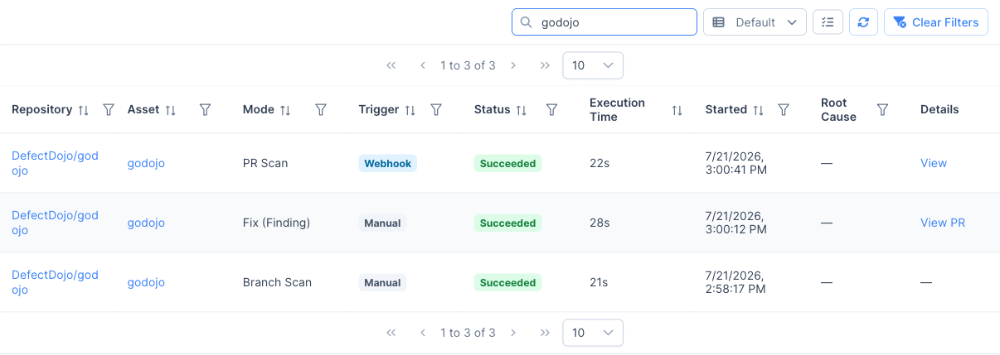
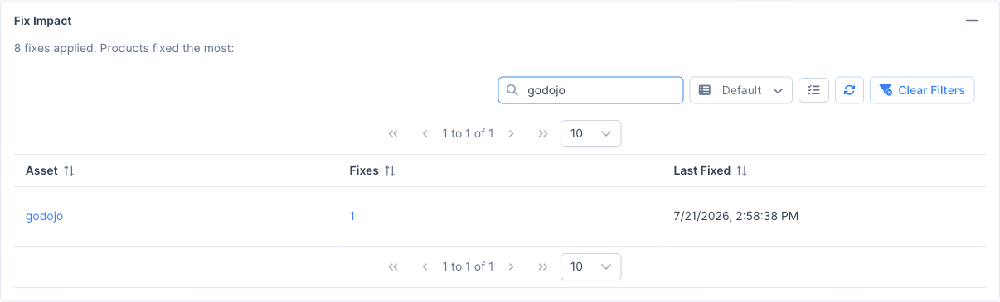

注意：Sensei 是 DefectDojo Pro 专属功能，目前处于 BETA（测试）阶段。

仓库接入后，Sensei 会直接显示在您的发现项和 Sensei 中心页面中。本页介绍如何扫描仓库、分诊自动修复候选项，以及修复单个发现项。触发修复至少需要对该发现项所属产品拥有 **Writer** 权限。

## 扫描仓库

扫描会将发现项导入以分支命名的测试活动中。您可以从 Sensei 中心页面按需触发扫描：打开某个仓库的行操作菜单，选择**立即扫描**。

选择要扫描的分支（默认为仓库的默认分支），然后选择**开始扫描**。在 DefectDojo 托管模式下，扫描也会在拉取请求发起时自动运行。

## 发现项上的 Sensei 列

已接入的仓库会在发现项表格中新增一个 **Sensei** 列。每个发现项都会显示一个 **Fix** 按钮（或其当前修复状态），让您无需离开分诊视图即可完成修复。

该按钮有两种状态：

- **Fix：** 该发现项所属产品已接入 Sensei。点击即可开始修复。
- **Configure Product：** 该发现项所属产品**尚未**接入。点击后会跳转到 Sensei，为该产品接入一个仓库；接入完成后，按钮会变为 **Fix**。

## 修复单个发现项

点击 **Fix**（在发现项表格或发现项详情页头部）会打开 **Fix with Sensei** 对话框。选择修复拉取请求要针对的基础分支，然后点击 **Fix**。

Sensei 会生成修复方案并发起拉取请求。发现项的修复状态会以徽章形式显示，依次经历 *进行中* → *PR 已开启*（或 *失败*）。拉取请求开启后，徽章会直接链接到该请求。

> **💡 一次修复，一个 PR：** 每次批准的修复都会消耗一次修复配额，并发起一个拉取请求。像审核和合并其他 PR 一样在 GitHub 中审核和合并它。

## 自动修复候选项分诊

当仓库启用了自动修复后，每次扫描都会在 Sensei 中心页面的**自动修复候选项**标签页中，将符合条件的发现项暂存为**候选项**。这正是 Sensei 的预览优先模式：发现项会被暂存，但**在您批准之前不会执行任何操作（不产生 LLM 费用）**。批准后会发起修复拉取请求并消耗修复配额。

每个候选项都会显示其发现项、状态、严重程度、风险、优先级、目标仓库和 PR 分支。要进行修复：

- **批准单个：** 点击某一行的**批准**，打开分支选择器并开始该项修复。
- **批准多个：** 选择多行，使用批量批准操作。

已批准的发现项会一直显示为**进行中**（或**失败**），直到其拉取请求关联完成，因此进行中或失败的修复不会在产生 PR 之前消失。

> **🔎 无人值守修复：** 如果您在仓库上启用了*自动修复候选项*，后台检查会自动为已暂存的候选项发起修复 PR，直至达到您的修复配额，无需手动批准。

## 跟踪扫描与影响

Sensei 中心页面上有两处可以帮助您跟踪 Sensei 已完成的工作：

- **扫描活动：** 记录每次扫描和修复运行的台账，包含其模式（Branch Scan、PR Scan、Fix (Finding)）、触发方式（Manual、Webhook、Auto Remediated）、状态、执行时间，以及指向其生成的测试活动或拉取请求的链接。

  

- **修复影响：** 已应用修复的汇总信息，包括中心页面顶部被修复次数最多的资产。

  

使用**立即扫描**、**扫描历史**、**配置**和**重新暂存候选项**行操作，随时间管理每个已接入的仓库（参见[参考](/sensei/sensei_reference/#repository-row-actions)）。
