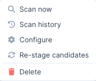

Nota: Sensei è una funzionalità esclusiva di DefectDojo Pro ed è attualmente in versione BETA.

Un riferimento rapido per gli stati, le azioni e i limiti che incontrerai utilizzando Sensei.

## Stati del repository

Lo stato mostrato per un repository sottoposto a onboarding nell'hub di Sensei:

| Stato | Significato |
|--------|---------|
| **Attivo** | Onboarding completato e pronto per la scansione. |
| **Pull Request aperta** | Sensei ha una pull request aperta sul repository. |
| **Pull Request chiusa** | Una pull request di Sensei è stata chiusa. |
| **Errore** | L'ultima operazione non è riuscita: controlla Scan Activity per la causa principale. |
| **Non configurato** | Il repository è connesso ma non ancora configurato. |

## Stati delle candidate e delle correzioni

Le candidate di correzione automatica e i record di correzione attraversano questi stati:

| Stato | Significato |
|--------|---------|
| **Candidata** | Messa in staging dai criteri di correzione automatica di una scansione. Non viene eseguito nulla finché non approvi. |
| **In corso** | Approvata: Sensei sta generando la correzione e aprirà una pull request. |
| **PR aperta** | Una pull request di correzione è aperta; il badge rimanda ad essa. |
| **Non riuscita** | La correzione non è stata completata; resta elencata per non scomparire silenziosamente. |

## Azioni di riga del repository

Ogni repository sottoposto a onboarding dispone di un menu delle azioni di riga nell'hub di Sensei:

- **Scan now:** avvia una scansione su richiesta (apre il selettore del branch).
- **Scan history:** visualizza le scansioni passate di questo repository.
- **Configure:** riapre il modulo di configurazione (segnalazione tramite PR, correzioni automatiche, collegamento al Prodotto).
- **Re-stage candidates:** rivaluta i riscontri del repository rispetto ai criteri di correzione automatica e mette in staging nuove candidate.
- **Delete:** rimuove il repository da Sensei. Questo interrompe la scansione; non elimina l'asset sottostante né i riscontri.

## Quote e misurazione

Sensei viene misurato in base alla tua licenza DefectDojo Pro, mostrata come indicatori nella parte superiore dell'hub:

- **Correzioni:** correzioni applicate rispetto al limite prepagato. L'approvazione di una candidata o l'avvio di una correzione consuma questa quota; quando è esaurita, ulteriori correzioni vengono bloccate (compare un banner di avviso) finché il limite non viene aumentato.
- **Repository sottoposti a onboarding:** repository sottoposti a onboarding rispetto al limite di repository. Quando viene raggiunto, l'onboarding di nuovi repository viene bloccato.

Per aumentare un limite, contatta il tuo team dell'account DefectDojo.

## Dettagli specifici di GitLab

GitLab è supportato insieme a GitHub (gitlab.com e self-managed). Il comportamento di scan-and-fix è identico; questi sono i dettagli specifici di GitLab:

- **Connessione:** un **token di accesso a progetto o gruppo** (ruolo **Developer**, oppure **Maintainer** se le push rules lo richiedono) con gli scope **`api`** e **`write_repository`**, non una GitHub App. Vedi [Configurare Sensei](/sensei/setup_sensei/#connect-gitlab).
- **Webhook:** ogni progetto sottoposto a onboarding necessita di un webhook verso `…/sensei/gitlab/webhooks` (con il secret della connessione) sottoscritto agli eventi **Push**, **Merge request** e **Comment**. L'aggiunta di un webhook richiede il ruolo **Maintainer**/**Owner** sul progetto.
- **Merge request, non pull request:** le correzioni aprono una **merge request** sul branch predefinito; il commento `/fix` funziona sulle note delle merge request.
- **Gate del commit status:** il controllo di stato della PR è un **commit status** di GitLab sul commit head della merge request: `running` durante la scansione, poi `success` o `failed` (fail-on-new). GitLab non ha uno stato *neutral*, quindi una scansione **non bloccante** che presenta comunque riscontri mostra uno stato **verde**; la nota di riepilogo riporta i dettagli del riscontro.
- **Self-managed:** imposta il campo **GitLab Base URL** sulla tua istanza; DefectDojo clona ed effettua chiamate API verso quell'host.

## Dettagli specifici di Bitbucket

Bitbucket **Cloud** e **Server/Data Center** sono supportati. Il comportamento di scan-and-fix è identico; questi sono i dettagli specifici di Bitbucket:

- **Connessione:** **OAuth** (consigliato), un **token API** Atlassian (utilizzato con l'email del tuo account), oppure un **token di accesso** a repository/workspace. Vedi [Configurare Sensei](/sensei/setup_sensei/#connect-bitbucket). Le app password sono deprecate e non sono supportate.
- **Ambito del workspace (Cloud):** i token API/di accesso sono vincolati a un workspace, quindi per Cloud è richiesto un **workspace**; OAuth opera nel contesto utente e rileva automaticamente i workspace accessibili.
- **Webhook:** ogni repository sottoposto a onboarding necessita di un webhook verso `…/sensei/bitbucket/webhooks` (con il secret della connessione, verificato tramite HMAC-SHA256 `X-Hub-Signature`) sottoscritto agli eventi **Push**, **Pull request** (created/updated/merged/declined) e **Pull request comment**.
- **Gate del build status:** il controllo di stato della PR viene pubblicato come **build status** di Bitbucket sul commit head (`INPROGRESS` → `SUCCESSFUL`/`FAILED`). Bitbucket non ha uno stato *neutral*, quindi una scansione non bloccante viene mappata su `SUCCESSFUL` e il commento di riepilogo riporta il dettaglio. Il link del build status deve essere un URL pubblico, quindi utilizza il tuo host DefectDojo.
- **Nomi dei repository:** `workspace/repo` (Cloud) oppure `PROJECTKEY/repo` (Server/Data Center).
- **Server/Data Center:** imposta il campo **Base URL** sul tuo host; DefectDojo utilizza la REST API v1.0 e i percorsi git `/scm/…`.

## Dettagli specifici di Azure DevOps

Azure DevOps Repos è supportato tramite un **Personal Access Token**. Il comportamento di scan-and-fix è identico; questi sono i dettagli specifici di Azure:

- **Connessione:** un **PAT** con lo scope **Code (Read, Write, & Manage)**, oltre all'**organizzazione**. Le app OAuth di Azure DevOps sono in fase di dismissione, quindi un PAT è la credenziale consigliata. Vedi [Configurare Sensei](/sensei/setup_sensei/#connect-azure-devops).
- **Webhook:** i **Service Hooks** di Azure si autenticano con HTTP **Basic** (non con un HMAC) e utilizzano **una sottoscrizione per evento**. Crea le sottoscrizioni verso `…/sensei/azure/webhooks` per **Code pushed** e **Pull request created/updated/merged**, con nome utente/password Basic della connessione.
- **Gate del commit status:** il controllo di stato della PR viene pubblicato come **commit status** Git sul commit head.
- **Nomi dei repository:** `project/repo` (l'organizzazione è memorizzata nella connessione).
- **Azure DevOps Server:** imposta il campo **Base URL** sull'URL della tua collection on-premise.

## Dettagli specifici di GitHub Enterprise Server

GitHub Enterprise Server utilizza lo **stesso modello di GitHub App** di github.com; cambia solo l'host:

- **Connessione:** poiché il flusso di creazione automatica tramite App-manifest è disponibile solo su github.com, crea l'App **manualmente** sul tuo host GHES e inserisci le sue credenziali insieme all'**Enterprise host** tramite **Set up manually**. Vedi [Connetti GitHub Enterprise Server](/sensei/setup_sensei/#connect-github-enterprise-server). DefectDojo deriva l'API (`/api/v3`) e le origin web dall'host.
- **Coesistenza:** una connessione App di github.com e una connessione App GHES possono essere configurate sulla stessa istanza; ogni repository fa riferimento alla connessione tramite cui è stato sottoposto a onboarding.
- **Raggiungibilità:** DefectDojo deve poter raggiungere l'host API di GHES, e GHES deve poter raggiungere l'endpoint `…/sensei/webhooks` di DefectDojo (gli host interni vanno bene se entrambe le parti riescono a connettersi).

## Risoluzione dei problemi

- **Il pulsante Sensei su un riscontro mostra "Configure Product".** Il Prodotto del riscontro non è stato sottoposto a onboarding. Fai clic per eseguire l'onboarding di un repository per quel Prodotto, poi torna al riscontro.
- **Una correzione mostra "Failed" in Auto-fix Candidates o Scan Activity.** Apri **Scan Activity** e controlla **Root Cause** / **Details** per quell'esecuzione. Le correzioni non riuscite restano elencate per non scomparire prima di produrre una PR; puoi rimetterle in staging e riprovare.
- **Un repository non compare durante l'onboarding.** Vengono mostrati solo i repository a cui la connessione può accedere. Su **GitHub**, verifica che l'App sia installata sull'organizzazione corretta e che il suo accesso ai repository includa il repository in questione. Su **GitLab**, verifica che lo scope del token di accesso copra il progetto. Su **Bitbucket Cloud**, verifica che il **workspace** sia impostato (i token sono vincolati al workspace). Su **Azure DevOps**, verifica che l'organizzazione del PAT corrisponda e che sia concesso lo scope **Code**.
- **Le scansioni o le correzioni non partono mai dopo un webhook.** Verifica che il webhook del repository punti al receiver del provider (`…/sensei/{gitlab,bitbucket,azure}/webhooks`, oppure `…/sensei/webhooks` per GitHub) con il secret/le credenziali corrette, e che sia sottoscritto agli eventi push + pull-request (+ comment). Le **recent deliveries** del provider dovrebbero mostrare `HTTP 200`. Le esecuzioni guidate da webhook si attivano solo per i repository sottoposti a onboarding in modalità **hosted**; un push su un branch non predefinito viene scansionato tramite la sua pull request, non autonomamente.
- **Non succede nulla dopo una scansione.** Verifica che le correzioni automatiche siano abilitate (e che le tue soglie di gravità/rischio corrispondano ai riscontri) nella configurazione del repository, e che la tua quota **Fixes** non sia esaurita.

> **🔎 Ancora in BETA:** Sensei si sta evolvendo rapidamente. Se il comportamento non corrisponde a questa guida, controlla il [changelog di Pro](/releases/pro/changelog/) per le modifiche recenti.
