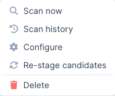

Note: Sensei is a DefectDojo Pro-only feature and is currently in BETA.

A quick reference for the statuses, actions, and limits you'll encounter while using Sensei.

## Repository statuses

The status shown for an onboarded repository on the Sensei hub:

| Status | Meaning |
|--------|---------|
| **Active** | Onboarded and ready to scan. |
| **Pull Request Open** | Sensei has an open pull request against the repository. |
| **Pull Request Closed** | A Sensei pull request was closed. |
| **Error** | The last operation failed: check Scan Activity for the root cause. |
| **Not Configured** | The repository is connected but not yet configured. |

## Candidate and fix statuses

Auto-fix candidates and fix records move through these states:

| Status | Meaning |
|--------|---------|
| **Candidate** | Staged by a scan's auto-fix criteria. Nothing runs until you approve. |
| **In Progress** | Approved: Sensei is generating the fix and will open a pull request. |
| **PR Open** | A fix pull request is open; the badge links to it. |
| **Failed** | The fix could not be completed; it stays listed so it doesn't disappear silently. |

## Repository row actions

Each onboarded repository has a row-actions menu on the Sensei hub:

- **Scan now:** start an on-demand scan (opens the branch picker).
- **Scan history:** view this repository's past scans.
- **Configure:** reopen the configuration form (PR reporting, automated fixes, product linkage).
- **Re-stage candidates:** re-evaluate the repository's findings against the auto-fix criteria and stage fresh candidates.
- **Delete:** remove the repository from Sensei. This stops scanning it; it does not delete the underlying asset or findings.

## Quotas and metering

Sensei is metered against your DefectDojo Pro license, shown as meters at the top of the hub:

- **Fixes:** remediations applied against your prepaid limit. Approving a candidate or triggering a fix consumes from this quota; when it is exhausted, further fixes are blocked (a warning banner appears) until the limit is raised.
- **Onboarded Repositories:** repositories onboarded against your repository limit. When it is reached, onboarding new repositories is blocked.

To raise a limit, contact your DefectDojo account team.

## GitLab specifics

GitLab is supported alongside GitHub (gitlab.com and self-managed). The scan-and-fix behavior is identical; these are the GitLab-specific details:

- **Connection:** a **project or group access token** (role **Developer**, or **Maintainer** if push rules require it) with the **`api`** and **`write_repository`** scopes, not a GitHub App. See [Set up Sensei](/sensei/setup_sensei/#connect-gitlab).
- **Webhook:** each onboarded project needs a webhook to `…/sensei/gitlab/webhooks` (with the connection's secret) subscribed to **Push**, **Merge request**, and **Comment** events. Adding a webhook requires **Maintainer**/**Owner** on the project.
- **Merge requests, not pull requests:** fixes open a **merge request** against the default branch; the `/fix` comment works on merge-request notes.
- **Commit-status gate:** the PR status check is a GitLab **commit status** on the merge request's head commit: `running` while scanning, then `success` or `failed` (fail-on-new). GitLab has no *neutral* state, so a **non-gating** scan that still has findings shows a **green** status; the summary note carries the finding details.
- **Self-managed:** point the **GitLab Base URL** at your instance; DefectDojo clones and calls the API against that host.

## Troubleshooting

- **The Sensei button on a finding says "Configure Product."** The finding's product isn't onboarded. Click it to onboard a repository for that product, then return to the finding.
- **A fix shows "Failed" in Auto-fix Candidates or Scan Activity.** Open **Scan Activity** and check the **Root Cause** / **Details** for that run. Failed fixes remain listed so they don't disappear before producing a PR; you can re-stage and retry.
- **A repository isn't listed when onboarding.** Only repositories the connection can access are shown. On **GitHub**, confirm the App is installed on the correct organization and its repository access includes the repository. On **GitLab**, confirm the access token's scope covers the project (a group token lists that group's projects; a project token lists only its own project).
- **GitLab: scans or fixes never start after a webhook.** Confirm the project's webhook points at `…/sensei/gitlab/webhooks` with the correct secret and has **Push/Merge request/Comment** events enabled; the webhook's **Recent events** in GitLab should show `HTTP 200`. Webhook-driven runs fire only for repositories onboarded in **hosted** mode.
- **Nothing is happening after a scan.** Check that automated fixes are enabled (and your severity/risk thresholds match findings) on the repository's configuration, and that your **Fixes** quota isn't exhausted.

> **🔎 Still in BETA:** Sensei is evolving quickly. If behavior doesn't match this guide, check the [Pro changelog](/releases/pro/changelog/) for recent changes.
