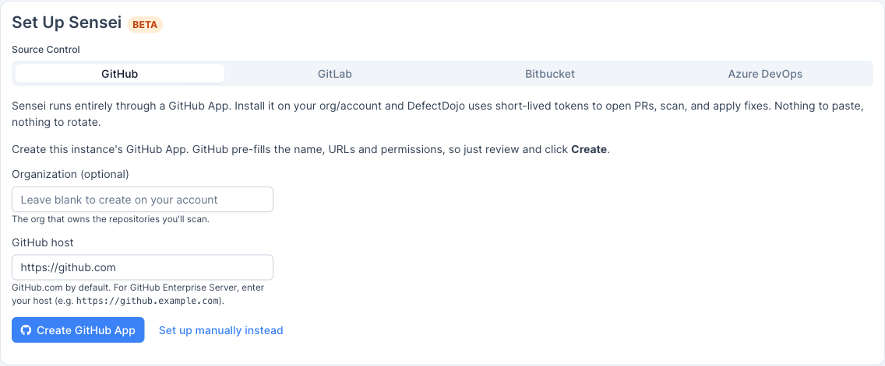

Note: Sensei is a DefectDojo Pro-only feature and is currently in BETA.

Setting up Sensei has two parts: **connect a source-control provider**, then **onboard the repositories** you want to scan. You need a global **Maintainer** or **Owner** role to do this. Sensei supports:

- **GitHub** — a GitHub App (github.com or **GitHub Enterprise Server**).
- **GitLab** — an access token (gitlab.com or self-managed).
- **Bitbucket** — Cloud or Server/Data Center, via OAuth (recommended), an Atlassian API token, or an access token.
- **Azure DevOps** — a Personal Access Token.

Onboarding, configuration, scanning, and fixing are the same for every provider; only the initial connection differs. This page covers [connecting a GitHub App](#connect-a-github-app), [GitHub Enterprise Server](#connect-github-enterprise-server), [GitLab](#connect-gitlab), [Bitbucket](#connect-bitbucket), and [Azure DevOps](#connect-azure-devops); the [Select repositories](#select-repositories) step onward is shared.

## Connections

A **connection** is one configured source-control identity — a GitHub App installation group, a GitLab token, a Bitbucket workspace, or an Azure DevOps organization. You onboard repositories from a connection, and manage or disconnect it, from the **Connections** page (the **Connections** button on the Sensei hub).

The table lists each connection's label, identity, number of onboarded repos, creation date, and provider. Use the row actions (the menu on the left of each row) to manage the connection on its provider, add repositories from that connection, or disconnect it.

> **⚠️ Disconnecting is destructive:** disconnecting a connection removes it **and every repository onboarded through it**. This cannot be undone.

## Choose a source-control provider

From the Sensei hub, choose **Add Repositories** (or **Connect** on the Connections page) to open **Set Up Sensei**, then pick your source-control provider — **GitHub** (including GitHub Enterprise Server), **GitLab**, **Bitbucket**, or **Azure DevOps**. Each provider's connect flow is described below.

## Connect a GitHub App

Sensei runs entirely through a GitHub App. Install it on your org/account and DefectDojo uses short-lived tokens to open PRs, scan, and apply fixes. Nothing to paste, nothing to rotate.

From the Sensei hub, choose **Add Repositories** (or **Connect** on the Connections page) to open **Set Up Sensei**.

### Step 1: Create the App

Enter the **organization** that owns the repositories you want to scan (leave blank to create the App on your personal account), then click **Create GitHub App**. GitHub pre-fills the app name, URLs, and permissions; you just review and confirm.

GitHub opens a confirmation page. Click **Create GitHub App for `<org>`** to register the app under that organization.

> **🔑 Tip:** Create the App on the same organization that owns the repositories you plan to scan. The App owner is set at creation time.

### Step 2: Install the App

Back in DefectDojo, the app shows as *configured*. Click **Install on GitHub** to install it on your organization.

On GitHub, confirm the installation location (your organization), choose **All repositories** or **Only select repositories**, and review the requested permissions. Sensei needs read access to actions, issues, and metadata, and read/write access to checks, code, pull requests, secrets, and workflows so it can scan and open fix PRs. Click **Install**.

## Connect GitLab

Sensei also supports **GitLab**, both **gitlab.com** and **self-managed** instances. Instead of a GitHub App, GitLab connects with a **project or group access token** plus a webhook; Sensei uses that token to scan, open merge requests, and apply fixes.

From the Sensei hub, choose **Add Repositories** (or **Connect** on the Connections page) to open **Set Up Sensei**, then select **GitLab** as the source-control provider.

### Step 1: Create an access token

In GitLab, open the project (or group) you want to scan and go to **Settings → Access tokens → Add new token**:

- **Role:** **Developer**, enough to push fix branches and open merge requests. Choose **Maintainer** if the project's push rules require it.
- **Scopes:** **`api`** and **`write_repository`**.

Create the token and copy the generated `glpat-…` value (GitLab shows it only once).

> **🔑 Tip:** A **group** access token onboards any project in that group; a **project** access token is scoped to the single project.

### Step 2: Connect

Back in **Set Up Sensei** with **GitLab** selected, fill in:

- **GitLab Base URL:** `https://gitlab.com`, or your self-managed instance URL (for example `https://gitlab.example.com`).
- **Access Token:** the `glpat-…` token from Step 1.
- **Webhook Secret:** leave blank to auto-generate (recommended). You'll add this secret to the webhook in the next step.

Click **Connect GitLab**. DefectDojo validates the token, stores it encrypted, and can then list projects, open merge requests, and run scans.

### Step 3: Add the webhook

So DefectDojo receives push, merge-request, and comment events, add a webhook to **each** GitLab project you plan to onboard (**Settings → Webhooks → Add new webhook**):

- **URL:** the webhook URL shown on the Set Up Sensei page (`https://<your-defectdojo-host>/sensei/gitlab/webhooks`).
- **Secret token:** the webhook secret from Step 2.
- **Trigger events:** enable **Push events**, **Merge request events**, and **Comments**.

Leave SSL verification enabled, click **Add webhook**, then use **Test → Push events** to confirm DefectDojo responds with **HTTP 200**.

After connecting, click **Choose projects** and continue with [Select repositories](#select-repositories); onboarding, configuration, and scanning work the same as GitHub.

> **GitLab equivalents:** where this guide says *pull request*, GitLab uses a **merge request**; the pull-request **status check** is posted as a GitLab **commit status** on the merge request's head commit.

## Connect GitHub Enterprise Server

Sensei works with **GitHub Enterprise Server (GHES)** using the same GitHub App model as github.com — only the host differs. Because the App-manifest auto-create flow is github.com-only, on GHES you **create the App manually** on your enterprise host and then enter its credentials plus the host in DefectDojo.

### Step 1: Create the App on your GHES host

On your GitHub Enterprise Server instance, go to **Settings → Developer settings → GitHub Apps → New GitHub App** and create an App with the same permissions Sensei uses on github.com: read for actions, issues, and metadata, and read/write for checks, code, pull requests, secrets, and workflows. Point its webhook at `https://<your-defectdojo-host>/sensei/webhooks`. Generate and download a **private key**, and note the **App ID** (and the OAuth **Client ID/Secret** if you set them).

### Step 2: Connect manually

In **Set Up Sensei** with **GitHub** selected, click **Set up manually instead** and fill in:

- **App ID** and **Private Key (PEM)** from Step 1 (plus Client ID/Secret and Webhook Secret if configured).
- **GitHub Enterprise host:** your instance host, for example `https://github.example.com`. DefectDojo derives the API (`/api/v3`) and web origins from it. Leave blank for github.com.

Click **Save App credentials**. DefectDojo validates them against your enterprise host, then install the App and continue with [Select repositories](#select-repositories).

> **🔑 Tip:** The host must be reachable from DefectDojo (and DefectDojo reachable from GHES for webhooks). Internal-only hosts are fine as long as both can reach each other on your network.

## Connect Bitbucket

Sensei supports **Bitbucket Cloud** (`bitbucket.org`) and **Bitbucket Server / Data Center** (self-hosted). Three non-deprecated auth methods are offered; **OAuth is recommended**.

From the Sensei hub, choose **Add Repositories** (or **Connect** on the Connections page), then select **Bitbucket** and your **deployment** (Cloud or Server/Data Center) and **authentication** type.

### Step 1: Create the credential

**OAuth (recommended)** — in Bitbucket, open **Workspace settings → OAuth consumers → Add consumer**:

- **Callback URL:** the one shown on the Set Up Sensei page (`https://<your-defectdojo-host>/sensei/bitbucket/oauth/callback`).
- **Permissions:** **Account: Read**, **Repositories: Read + Write**, **Pull requests: Read + Write** (add **Webhooks: Read + Write** if you'll manage webhooks via the API).

Save it, then copy the consumer's **Key** (Client ID) and **Secret**.

**API token** — create an Atlassian **API token** at `id.atlassian.com` (Account settings → Security → API tokens). Use it with your **Atlassian account email**.

**Access token** — create a repository or workspace **Access Token** in Bitbucket and use it as a bearer credential.

### Step 2: Connect

Back in **Set Up Sensei** with **Bitbucket** selected:

- **OAuth:** paste the **Client ID** and **Client Secret**, then click **Connect with Bitbucket**. Approve the consent screen; DefectDojo stores the resulting tokens encrypted and refreshes them automatically.
- **API token / Access token:** enter your **Workspace** (Cloud), your **email** (API-token auth only), and the **token**. For Server/Data Center, enter your host **Base URL**.

DefectDojo validates the credential and can then list repositories, open pull requests, and run scans.

### Step 3: Add the webhook

Add a webhook to **each** Bitbucket repository (**Repository settings → Webhooks → Add webhook**):

- **URL:** the webhook URL shown on the Set Up Sensei page (`https://<your-defectdojo-host>/sensei/bitbucket/webhooks`).
- **Secret:** the webhook secret shown on the page (used for HMAC-SHA256 `X-Hub-Signature` verification).
- **Triggers:** **Repository push**, **Pull request** (created, updated, merged, declined), and **Pull request comment created** (for `/fix` comments).

After connecting, click **Choose repositories** and continue with [Select repositories](#select-repositories).

> **Bitbucket specifics:** repositories are addressed as `workspace/repo` (Cloud) or `PROJECTKEY/repo` (Server). The pull-request **status check** is posted as a Bitbucket **build status** on the head commit. OAuth is the recommended method because it is user-context (no workspace/username quirks) and refreshes automatically; app passwords are deprecated and not supported.

## Connect Azure DevOps

Sensei supports **Azure DevOps Repos** using a **Personal Access Token (PAT)**. Repositories live in an **organization → project → repository** hierarchy.

From the Sensei hub, choose **Add Repositories** (or **Connect** on the Connections page), then select **Azure DevOps**.

### Step 1: Create a PAT

In Azure DevOps, open **User settings → Personal access tokens → New Token**:

- **Organization:** the organization whose repositories you want to scan.
- **Scopes:** **Code (Read, Write, & Manage)** — covers cloning, pushing fix branches, and opening pull requests.

Create the token and copy it (Azure DevOps shows it only once).

### Step 2: Connect

Back in **Set Up Sensei** with **Azure DevOps** selected, fill in:

- **Base URL:** `https://dev.azure.com`, or your Azure DevOps **Server** collection URL.
- **Organization:** your organization name.
- **Personal Access Token:** the token from Step 1.

Click **Connect**. DefectDojo validates the PAT against `…/_apis/projects`, stores it encrypted, and can then list repositories, open pull requests, and run scans.

### Step 3: Add the service hook

Azure DevOps authenticates its **Service Hooks** with HTTP Basic, and uses **one subscription per event type**. In **Project settings → Service hooks → Create subscription → Web Hooks**, create a subscription for each of **Code pushed**, **Pull request created**, **Pull request updated**, and **Pull request merged**, all with:

- **URL:** the webhook URL shown on the Set Up Sensei page (`https://<your-defectdojo-host>/sensei/azure/webhooks`).
- **Basic authentication username / password:** the values shown on the page.

After connecting, click **Choose repositories** and continue with [Select repositories](#select-repositories).

> **Azure DevOps specifics:** repositories are addressed as `project/repo` (the organization is stored on the connection). The pull-request **status check** is posted as a Git **commit status** on the head commit.

## Select repositories

After the App is installed, DefectDojo shows the repositories it can access. Only repositories Sensei has **push access** to are listed; remediation works by pushing a branch and opening a pull request, so repositories without push access are hidden. A pull request is opened against each repository's **default branch**.

Use **Add** to select one or more repositories, then click **Configure N repo(s)**.

## Configure a repository

The **Configure Repository** form controls how Sensei scans and reports on the repository.

- **Scanning Mode (DefectDojo-hosted):** scans run in DefectDojo. Nothing is added to your repository; trigger scans on demand or automatically via the GitHub App.
- **PR Reporting:** choose what Sensei posts back on pull requests:
  - Post a status check on the pull request.
  - Fail the check when net-new findings are introduced.
  - Post a results summary comment on each commit.
  - Auto-create the base-branch baseline on the first PR.
- **Automated Fixes:** enable *Stage matching findings for one-click auto-fix after each scan* to have Sensei stage candidates automatically (see below).

### Automated fix criteria

When automated fixes are enabled, findings that meet your criteria are staged as **candidates** on the Sensei page after each scan. Nothing runs (and no LLM cost is incurred) until you approve, unless you enable automatic remediation.

- **Severity threshold:** findings at or above this severity qualify (choose *Any* to gate on risk only).
- **Risk threshold:** findings at or above this risk level also qualify (combined with severity using OR).
- **Open fix PRs against branch:** the branch auto-fix pull requests target; overridable per fix when you approve individually.
- **Exclude findings tagged:** skip findings carrying the tags you list (e.g. `no-fix`).
- **Automatically remediate candidates:** when enabled, a background check (about every 5 minutes) opens fix pull requests for this repo's staged candidates without waiting for approval, until your fix quota is reached. Leave off to review and approve each candidate yourself.

Under **Advanced options** you can link the repository to an existing product/asset or create a new one, set the organization, and set a minimum severity below which findings are neither reported nor used in the merge gate.

## Onboard

Click **Onboard for hosted scanning**. The repository appears on the Sensei hub with a status of **Active**, ready to scan. From here, continue to [Fixing findings with Sensei](/sensei/fixing_findings/).
