注意：Sensei 是 DefectDojo Pro 专属功能，目前处于 BETA 测试阶段。

设置 Sensei 分为两部分：**连接源代码管理提供商**，然后**引入您要扫描的代码仓库**。执行此操作需要全局**维护者**或**所有者**角色。Sensei 支持：

- **GitHub**：GitHub App（github.com 或**GitHub Enterprise Server**）。
- **GitLab**：访问令牌（gitlab.com 或自托管实例）。
- **Bitbucket**：Cloud 或 Server/Data Center，通过 OAuth（推荐）、Atlassian API 令牌或访问令牌进行连接。
- **Azure DevOps**：个人访问令牌（Personal Access Token）。

每个提供商的引入、配置、扫描和修复流程都相同，只有初始连接方式不同。本页涵盖[连接 GitHub App](#connect-a-github-app)、[GitHub Enterprise Server](#connect-github-enterprise-server)、[GitLab](#connect-gitlab)、[Bitbucket](#connect-bitbucket)和[Azure DevOps](#connect-azure-devops)；[选择代码仓库](#select-repositories)及之后的步骤是所有提供商共用的。

Sensei 中心（hub）上的**添加代码仓库**是这两者的入口。它会打开一个按名称列出各个连接的菜单：选择其中一个即可从该连接中选取代码仓库，或选择**连接新来源**来设置尚未连接的提供商。如果尚未连接任何内容，则会直接进入连接流程。

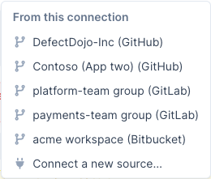

## 连接

**连接**是一个已配置的源代码管理身份：一个 GitHub App 注册、一个 GitLab 令牌、一个 Bitbucket 工作区，或一个 Azure DevOps 组织。您可以从**连接**页面（Sensei 中心上的**连接**按钮）引入连接中的代码仓库，并对连接进行管理或断开。

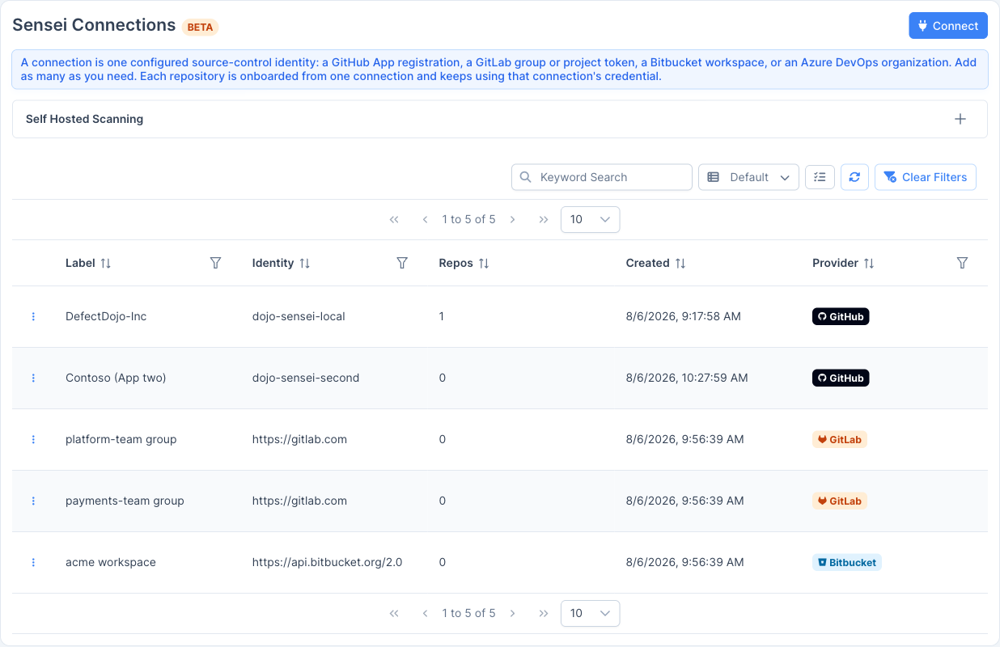

该表格列出每个连接的标签、身份、已引入的代码仓库数量、创建日期和提供商。使用行操作（每行左侧的菜单）可以在对应提供商上管理该连接、从该连接添加代码仓库、打开该连接进行编辑（**更新凭据**，对于 GitHub 则是**管理 App 与安装**），或断开该连接。

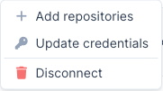 **添加连接**从不会显示已有连接的详情。关于您已有连接的一切内容都在其各自的界面中，可以从对应行进入。

### 每个提供商可有多个组织

一个实例可以为**每个提供商**保存**任意数量所需的连接**，每个组织、组或工作区一个连接：

- **GitHub：**在每个组织或用户账户上安装该 App（**在其他账户上安装**）。一个 App 注册即可覆盖所有账户。若要保留独立的注册，例如让 GitHub Enterprise Server 主机与 github.com 分开，请使用**注册另一个 GitHub App**。App 自身的状态（其安装情况、权限批准、**在其他账户上安装**和**断开此 App**）都位于该连接的界面中，可通过该行的**管理 App 与安装**进入。当存在多个注册时，该界面中的选择器可用于在它们之间切换。
- **GitLab：**每个组或项目令牌对应一个连接，即使在同一主机上（`gitlab.com` 加自托管实例）也可以有多个。
- **Bitbucket：**每个工作区对应一个连接。
- **Azure DevOps：**每个组织对应一个连接，因为 PAT 的作用范围限定在组织级别。

每次在连接页面点击**连接**都会**新增**一个连接，因此连接第二个组或工作区不会替换第一个。请为每个连接设置一个**连接标签**，以便在表格中区分它们。每个代码仓库都会记录其引入所用的连接，其扫描、拉取请求和修复也都会使用该连接的凭据。当某个提供商存在多个连接时，引入流程会询问要使用哪一个，而不会替您做出选择。

若要轮换令牌、PAT 或 App 密码，请使用该连接行上的**更新凭据**。打开的界面只针对单个连接：其标题为**编辑连接：\<label\>**，保存时会更新该连接而不是新增一个。若通过**连接**进入，则标题为**添加连接**。（GitHub App 的凭据在 GitHub 上管理。）

某个提供商的 **webhook URL 由其所有连接共享**，每个连接会验证各自的密钥，因此您不需要为每个组、工作区或组织使用不同的 URL。

> **⚠️ 断开连接具有破坏性：**断开一个连接会将其**以及通过该连接引入的所有代码仓库**一并移除。此操作无法撤销。

## 选择源代码管理提供商

在 Sensei 中心，选择**添加代码仓库 → 连接新来源**（或在连接页面点击**连接**）以打开**添加连接**，然后选择您的源代码管理提供商：**GitHub**（包括 GitHub Enterprise Server）、**GitLab**、**Bitbucket**或 **Azure DevOps**。下文将分别介绍每个提供商的连接流程。

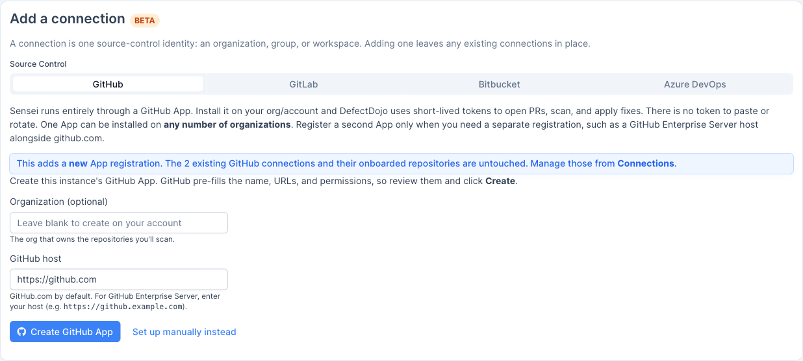

## 连接 GitHub App

Sensei 完全通过 GitHub App 运行。您只需在自己的组织/账户上安装该 App，DefectDojo 便会使用短期令牌来打开 PR、执行扫描并应用修复。无需粘贴任何内容，也无需轮换任何凭据。

在 Sensei 中心，选择**添加代码仓库 → 连接新来源**（或在连接页面点击**连接**）以打开**添加连接**。

### 步骤 1：创建 App

输入拥有您要扫描的代码仓库的**组织**（留空则会在您的个人账户上创建该 App），然后点击**创建 GitHub App**。GitHub 会预先填写 App 名称、URL 和权限，请检查并确认这些内容。

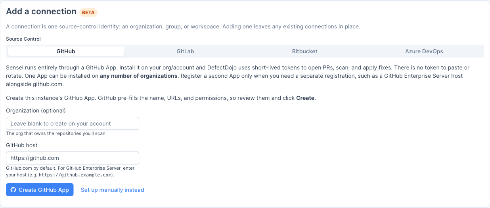

GitHub 会打开一个确认页面。点击**为 `<org>` 创建 GitHub App**，即可在该组织下注册此 App。

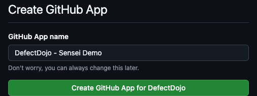

> **🔑 提示：**请在拥有您计划扫描的代码仓库的同一组织下创建该 App。App 的所有者在创建时即被设定。

### 步骤 2：安装 App

返回 DefectDojo 后，该 App 会显示为*已配置*。点击**在 GitHub 上安装**，将其安装到您的组织中。

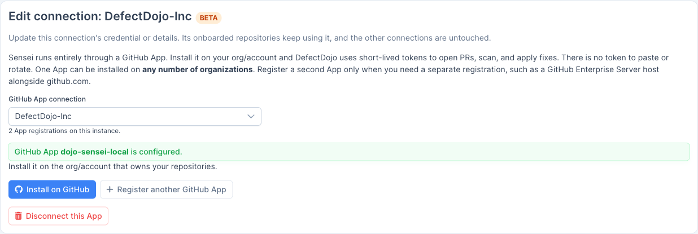

在 GitHub 上，确认安装位置（您的组织），选择**所有代码仓库**或**仅选定的代码仓库**，并检查所请求的权限。Sensei 需要对 Actions、Issues 和元数据的读取权限，以及对检查（checks）、代码、拉取请求、密钥（secrets）和工作流的读写权限，以便执行扫描并打开修复 PR。点击**安装**。

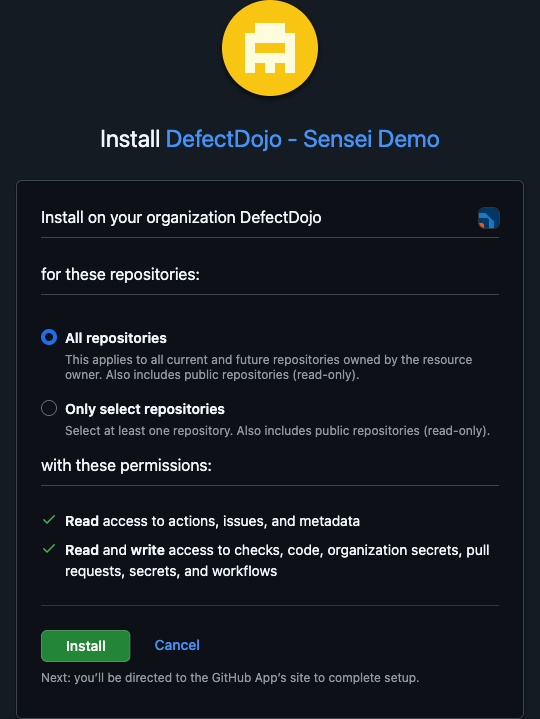

## 连接 GitLab

Sensei 同样支持 **GitLab**，包括 **gitlab.com** 和**自托管**实例。与 GitHub App 不同，GitLab 通过**项目或组访问令牌**加上一个 webhook 进行连接；Sensei 使用该令牌执行扫描、打开合并请求并应用修复。

在 Sensei 中心，选择**添加代码仓库 → 连接新来源**（或在连接页面点击**连接**）以打开**添加连接**，然后选择 **GitLab** 作为源代码管理提供商。

### 步骤 1：创建访问令牌

在 GitLab 中，打开您要扫描的项目（或组），然后进入**设置 → 访问令牌 → 添加新令牌**：

- **角色：****Developer**，足以推送修复分支和打开合并请求。如果项目的推送规则有要求，请选择**Maintainer**。
- **作用域：****`api`** 和 **`write_repository`**。

创建该令牌，并复制生成的 `glpat-…` 值（GitLab 只会显示一次）。

> **🔑 提示：****组**访问令牌可以引入该组中的任意项目；**项目**访问令牌的作用范围仅限于单个项目。

### 步骤 2：连接

回到已选择 **GitLab** 的**添加连接**界面，填写以下内容：

- **GitLab 基础 URL：**`https://gitlab.com`，或您的自托管实例 URL（例如 `https://gitlab.example.com`）。
- **访问令牌：**步骤 1 中获取的 `glpat-…` 令牌。
- **Webhook 密钥：**留空以自动生成（推荐）。您将在下一步把此密钥添加到 webhook 中。

点击**添加 GitLab 连接**。DefectDojo 会验证该令牌、以加密方式存储它，随后即可列出项目、打开合并请求并运行扫描。

### 步骤 3：添加 webhook

为了让 DefectDojo 接收推送、合并请求和评论事件，请为您计划引入的**每个** GitLab 项目添加一个 webhook（**设置 → Webhooks → 添加新 webhook**）：

- **URL：**连接界面上显示的 webhook URL（`https://<your-defectdojo-host>/sensei/gitlab/webhooks`）。
- **密钥令牌：**步骤 2 中的 webhook 密钥。
- **触发事件：**启用 **Push events**、**Merge request events** 和 **Comments**。

保持 SSL 验证处于启用状态，点击**添加 webhook**，然后使用**Test → Push events** 确认 DefectDojo 返回 **HTTP 200**。

连接完成后，点击**选择项目**并继续执行[选择代码仓库](#select-repositories)；引入、配置和扫描的流程与 GitHub 相同。

> **GitLab 对应术语：**本指南中提到*拉取请求*的地方，GitLab 使用的是**合并请求**；拉取请求的**状态检查**在 GitLab 中会作为 **commit status** 发布在合并请求的最新提交上。

## 连接 GitHub Enterprise Server

Sensei 使用与 github.com 相同的 GitHub App 模式支持 **GitHub Enterprise Server（GHES）**，唯一的区别在于主机地址。由于 App 清单自动创建流程仅适用于 github.com，因此在 GHES 上您需要在企业主机上**手动创建该 App**，然后在 DefectDojo 中输入其凭据以及主机地址。

### 步骤 1：在您的 GHES 主机上创建 App

在您的 GitHub Enterprise Server 实例上，进入**设置 → Developer settings → GitHub Apps → New GitHub App**，创建一个与 Sensei 在 github.com 上使用相同权限的 App：对 Actions、Issues 和元数据的读取权限，以及对检查、代码、拉取请求、密钥和工作流的读写权限。将其 webhook 指向 `https://<your-defectdojo-host>/sensei/webhooks`。生成并下载一个**私钥**，并记下 **App ID**（如果设置了 OAuth，也记下 **Client ID/Secret**）。

### 步骤 2：手动连接

在已选择 **GitHub** 的连接界面上，点击**改为手动设置**并填写：

- 步骤 1 中的 **App ID** 和**私钥（PEM）**（如已配置，还包括 Client ID/Secret 和 Webhook 密钥）。
- **GitHub Enterprise 主机：**您的实例主机地址，例如 `https://github.example.com`。DefectDojo 会据此推导出 API（`/api/v3`）和 Web 源地址。如为 github.com，请留空。

点击**保存 App 凭据**。DefectDojo 会针对您的企业主机验证这些凭据，然后安装该 App 并继续执行[选择代码仓库](#select-repositories)。

> **🔑 提示：**该主机必须可从 DefectDojo 访问（对于 webhook，DefectDojo 也必须可从 GHES 访问）。只要网络中双方可以互相访问，仅限内部使用的主机也没有问题。

## 连接 Bitbucket

Sensei 支持 **Bitbucket Cloud**（`bitbucket.org`）和 **Bitbucket Server / Data Center**（自托管）。系统提供三种未被弃用的身份验证方式；**推荐使用 OAuth**。

在 Sensei 中心，选择**添加代码仓库 → 连接新来源**（或在连接页面点击**连接**），然后选择 **Bitbucket**，并选择您的**部署类型**（Cloud 或 Server/Data Center）和**身份验证**方式。

### 步骤 1：创建凭据

**OAuth（推荐）：**在 Bitbucket 中，打开**工作区设置 → OAuth consumers → Add consumer**：

- **回调 URL：**连接界面上显示的地址（`https://<your-defectdojo-host>/sensei/bitbucket/oauth/callback`）。
- **权限：****Account: Read**、**Repositories: Read + Write**、**Pull requests: Read + Write**（如果您要通过 API 管理 webhook，还需添加 **Webhooks: Read + Write**）。

保存后，复制该 consumer 的 **Key**（Client ID）和 **Secret**。

**API 令牌**：在 `id.atlassian.com` 上创建一个 Atlassian **API 令牌**（Account settings → Security → API tokens），并配合您的 **Atlassian 账户邮箱**使用。

**访问令牌**：在 Bitbucket 中创建一个代码仓库或工作区级别的**访问令牌**，并将其用作 bearer 凭据。

### 步骤 2：连接

回到已选择 **Bitbucket** 的连接界面：

- **OAuth：**粘贴 **Client ID** 和 **Client Secret**，然后点击**通过 Bitbucket 连接**。批准授权确认界面；DefectDojo 会以加密方式存储所得到的令牌，并自动刷新它们。
- **API 令牌 / 访问令牌：**输入您的**工作区**（Cloud）、**邮箱**（仅 API 令牌验证需要）和**令牌**。对于 Server/Data Center，请输入主机的**基础 URL**。

DefectDojo 会验证该凭据，随后即可列出代码仓库、打开拉取请求并运行扫描。

### 步骤 3：添加 webhook

为**每个** Bitbucket 代码仓库添加一个 webhook（**Repository settings → Webhooks → Add webhook**）：

- **URL：**连接界面上显示的 webhook URL（`https://<your-defectdojo-host>/sensei/bitbucket/webhooks`）。
- **密钥：**页面上显示的 webhook 密钥（用于 HMAC-SHA256 `X-Hub-Signature` 验证）。
- **触发条件：****Repository push**、**Pull request**（created、updated、merged、declined）以及 **Pull request comment created**（用于 `/fix` 评论）。

连接完成后，点击**选择代码仓库**并继续执行[选择代码仓库](#select-repositories)。

> **Bitbucket 特有说明：**代码仓库以 `workspace/repo`（Cloud）或 `PROJECTKEY/repo`（Server）的形式标识。拉取请求的**状态检查**在 Bitbucket 中会作为 **build status** 发布在最新提交上。推荐使用 OAuth，因为它基于用户上下文（不存在工作区/用户名方面的问题）且能自动刷新；App 密码已被弃用，不再受支持。

## 连接 Azure DevOps

Sensei 使用**个人访问令牌（PAT）**支持 **Azure DevOps Repos**。代码仓库位于**组织 → 项目 → 代码仓库**的层级结构中。

在 Sensei 中心，选择**添加代码仓库 → 连接新来源**（或在连接页面点击**连接**），然后选择 **Azure DevOps**。

### 步骤 1：创建 PAT

在 Azure DevOps 中，打开**用户设置 → Personal access tokens → New Token**：

- **组织：**您要扫描其代码仓库的组织。
- **作用域：****Code (Read, Write, & Manage)**，涵盖克隆、推送修复分支和打开拉取请求。

创建该令牌并复制它（Azure DevOps 只会显示一次）。

### 步骤 2：连接

回到已选择 **Azure DevOps** 的连接界面，填写：

- **基础 URL：**`https://dev.azure.com`，或您的 Azure DevOps **Server** 集合 URL。
- **组织：**您的组织名称。
- **个人访问令牌：**步骤 1 中的令牌。

点击**连接**。DefectDojo 会通过 `…/_apis/projects` 验证该 PAT，以加密方式存储它，随后即可列出代码仓库、打开拉取请求并运行扫描。

### 步骤 3：添加服务钩子

Azure DevOps 使用 HTTP Basic 对其**服务钩子（Service Hooks）**进行身份验证，并且**每种事件类型使用一个订阅**。在**Project settings → Service hooks → Create subscription → Web Hooks**中，分别为 **Code pushed**、**Pull request created**、**Pull request updated** 和 **Pull request merged** 创建订阅，全部使用：

- **URL：**连接界面上显示的 webhook URL（`https://<your-defectdojo-host>/sensei/azure/webhooks`）。
- **Basic authentication 用户名/密码：**页面上显示的值。

连接完成后，点击**选择代码仓库**并继续执行[选择代码仓库](#select-repositories)。

> **Azure DevOps 特有说明：**代码仓库以 `project/repo` 的形式标识（组织信息存储在连接中）。拉取请求的**状态检查**会作为 Git **commit status** 发布在最新提交上。

## 选择代码仓库

App 安装完成后，DefectDojo 会显示它可以访问的代码仓库。只有 Sensei 拥有**推送权限**的代码仓库才会显示；修复功能是通过推送分支并打开拉取请求实现的，因此没有推送权限的代码仓库会被隐藏。拉取请求会针对每个代码仓库的**默认分支**打开。

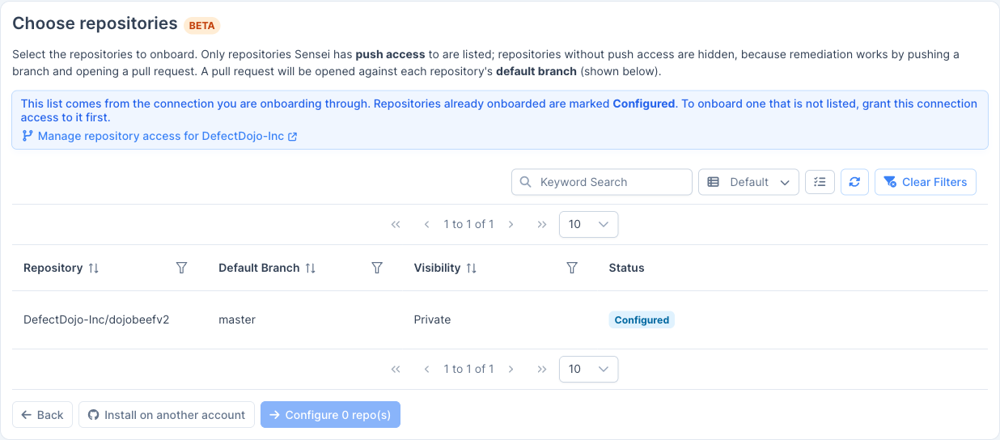

使用**添加**选择一个或多个代码仓库，然后点击**配置 N 个代码仓库**。已引入的代码仓库会标记为**已配置**，不能重复添加。

### 找不到某个代码仓库

选择器只会显示该连接已被授权访问的代码仓库。您从未授予 Sensei 访问权限的代码仓库不会出现。如果该连接仅覆盖一个已经引入的代码仓库，列表看起来就会像是没有可添加的内容。请扩大该连接的可见范围，然后返回此步骤：

- **GitHub：**使用**管理 \<account\> 的代码仓库访问权限**打开该安装在 GitHub 上的页面，您可以在该页面中为此安装添加代码仓库。使用**在其他账户上安装**可将该 App 安装到第二个组织或用户账户上。
- **GitLab、Bitbucket、Azure DevOps：**列表的范围由您所连接的凭据决定。请为该令牌、App 密码或 PAT 授予对相应项目的访问权限（GitLab 的**组**令牌可覆盖该组中的每个项目），或为另一个组、工作区或组织添加第二个连接。

## 配置代码仓库

**配置代码仓库**表单控制 Sensei 如何扫描该代码仓库并报告结果。

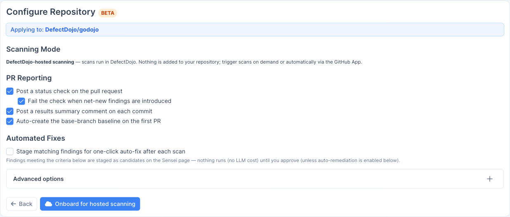

- **扫描模式（DefectDojo 托管）：**扫描在 DefectDojo 中运行。不会向您的代码仓库添加任何内容；可以按需触发扫描，也可以通过 GitHub App 自动触发。
- **PR 报告：**选择 Sensei 在拉取请求上回写的内容：
  - 在拉取请求上发布状态检查。
  - 当引入净新增发现项时，将该检查标记为失败。
  - 在每次提交上发布结果摘要评论。
  - 在首个 PR 上自动创建基准分支的基线。
- **自动修复：**启用*在每次扫描后为符合条件的发现项暂存一键自动修复*，让 Sensei 自动暂存候选项（见下文）。

### 自动修复条件

启用自动修复后，每次扫描后符合您所设条件的发现项都会在 Sensei 页面上被暂存为**候选项**。在您批准之前不会执行任何操作（也不会产生任何 LLM 费用），除非您启用了自动修复。

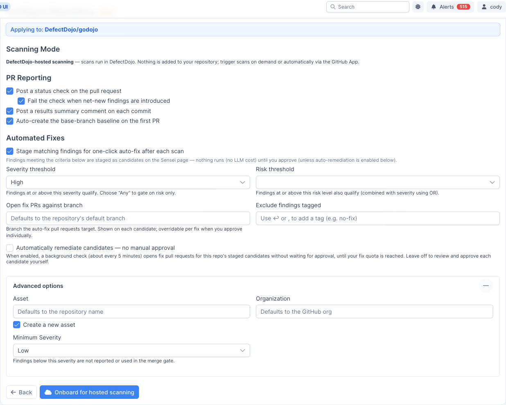

- **严重程度阈值：**达到或超过此严重程度的发现项符合条件（选择*任意*可仅按风险进行筛选）。
- **风险阈值：**达到或超过此风险级别的发现项也符合条件（与严重程度以“或”的关系组合）。
- **针对分支打开修复 PR：**自动修复拉取请求所针对的分支；您单独批准某个修复时可以覆盖此设置。
- **排除带有以下标签的发现项：**跳过带有您所列标签的发现项（例如 `no-fix`）。
- **自动修复候选项：**启用后，后台检查（大约每 5 分钟一次）会在不等待批准的情况下，为该代码仓库已暂存的候选项打开修复拉取请求，直至达到您的修复配额。关闭此选项则需要您自行审核并批准每个候选项。

在**高级选项**下，您可以将该代码仓库关联到现有的产品/资产，或创建一个新的产品/资产，设置组织，并设置一个最低严重程度阈值，低于该阈值的发现项既不会被报告，也不会用于合并门禁（merge gate）。

## 引入

点击**引入以进行托管扫描**。该代码仓库会出现在 Sensei 中心，状态为**活动**，可供扫描。接下来，请继续阅读[使用 Sensei 修复发现项](/sensei/fixing_findings/)。
